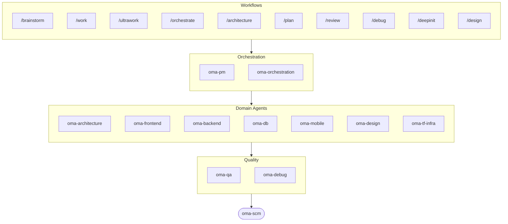

# oh-my-agent: The Multi-Agent Harness That Checks the Work

[](https://www.npmjs.com/package/oh-my-agent) [](https://www.npmjs.com/package/oh-my-agent) [](https://github.com/first-fluke/oh-my-agent) [](https://github.com/first-fluke/oh-my-agent/blob/main/LICENSE) [](https://github.com/first-fluke/oh-my-agent/commits/main)

[한국어](https://github.com/first-fluke/oh-my-agent/blob/main/docs/README.ko.md) | [中文](https://github.com/first-fluke/oh-my-agent/blob/main/docs/README.zh.md) | [Português](https://github.com/first-fluke/oh-my-agent/blob/main/docs/README.pt.md) | [日本語](https://github.com/first-fluke/oh-my-agent/blob/main/docs/README.ja.md) | [Français](https://github.com/first-fluke/oh-my-agent/blob/main/docs/README.fr.md) | [Español](https://github.com/first-fluke/oh-my-agent/blob/main/docs/README.es.md) | [Nederlands](https://github.com/first-fluke/oh-my-agent/blob/main/docs/README.nl.md) | [Polski](https://github.com/first-fluke/oh-my-agent/blob/main/docs/README.pl.md) | [Русский](https://github.com/first-fluke/oh-my-agent/blob/main/docs/README.ru.md) | [Deutsch](https://github.com/first-fluke/oh-my-agent/blob/main/docs/README.de.md) | [Tiếng Việt](https://github.com/first-fluke/oh-my-agent/blob/main/docs/README.vi.md) | [ภาษาไทย](https://github.com/first-fluke/oh-my-agent/blob/main/docs/README.th.md)

**Agents narrate success. oh-my-agent checks the artifacts.**

Spawning parallel agents is the easy part. The hard part is knowing whether they actually did the work. "Tests pass, all criteria met" costs an agent nothing to say, and nothing inside that same session can contradict it.

oh-my-agent makes the claim falsifiable. A Stop hook refuses to end your session until your project's own `typecheck` / `test` / `lint` script exits 0. A gate command decides whether a workflow really ran by looking for the artifacts it must have left behind — and its JSON verdict, not the agent's summary, is the result. An independent judge with a fresh context re-verifies every criterion each round, including the ones that already passed. Every gate decision lands on an append-only event log you can read after the fact. Then it runs that same discipline across a dozen agent runtimes from one portable `.agents/` directory.


[Watch the full video (35s)](https://github.com/first-fluke/oh-my-agent/blob/main/docs/assets/video/oh-my-agent-explainer.mp4)

## Quick Start

The install scripts below auto-install bun, uv, and serena if they're missing.

```bash
# macOS / Linux — auto-installs bun, uv & serena if missing
curl -fsSL https://raw.githubusercontent.com/first-fluke/oh-my-agent/main/cli/install.sh | bash
```

```powershell
# Windows (PowerShell) — auto-installs bun, uv & serena if missing
irm https://raw.githubusercontent.com/first-fluke/oh-my-agent/main/cli/install.ps1 | iex
```

```bash
# Or manual (any OS, requires bun + uv + serena)
bunx oh-my-agent@latest
```

<details>
<summary>Or install skills with Microsoft's <a href="https://github.com/microsoft/apm">Agent Package Manager</a> (APM). Click to expand.</summary>

> Not to be confused with `oma-observability`'s APM (Application Performance Monitoring).

```bash
# All skills, deployed to every detected runtime
# (.claude, .cursor, .codex, .opencode, .github, .agents)
apm install first-fluke/oh-my-agent

# A single skill
apm install first-fluke/oh-my-agent/.agents/skills/oma-frontend
```

APM ships skills only. For workflows, rules, `oma-config.yaml`, keyword-detection hooks, and the `oma agent spawn` CLI, use `bunx oh-my-agent@latest`. Pick one distribution per project to avoid drift.

</details>

Pick a preset and you're ready:

| Preset | What You Get |
|--------|-------------|
| **All** | **Every agent and skill** |
| Backend | architecture + backend + brainstorm + db + debug + dev-workflow + pm + qa + scm |
| Content | academic-writer + design + image + scm + translator + voice |
| DevOps | architecture + brainstorm + debug + dev-workflow + observability + pm + qa + scm + tf-infra |
| Frontend | architecture + brainstorm + debug + design + frontend + pm + qa + scm |
| Fullstack | architecture + backend + brainstorm + db + debug + design + dev-workflow + frontend + mobile + pm + qa + scm + tf-infra |
| Fullstack Mobile | architecture + backend + brainstorm + db + debug + design + dev-workflow + mobile + pm + qa + scm |
| Fullstack Web | architecture + backend + brainstorm + db + debug + design + dev-workflow + frontend + pm + qa + scm |
| Mobile | architecture + brainstorm + debug + mobile + pm + qa + scm |
| Research | academic-writer + hwp + market + pdf + scholar + scm + search + translator |

## Works With Every Agent

Verification is worth little if it's locked to one vendor. `oh-my-agent` keeps `.agents/` as the single source of truth and projects it into each runtime's native layout, so every supported tool shares the same skills, workflows, rules, and gates — and switching vendors is a config change, not a migration.

<table>
<colgroup>
<col span="6" style="width:16.67%" />
</colgroup>
<tr>
<td align="center">
<a href="https://claude.com/product/claude-code"></a><br/>
<strong>Claude Code</strong><br/>
<sub>native + adapter</sub>
</td>
<td align="center">
<a href="https://github.com/openai/codex"></a><br/>
<strong>Codex CLI</strong><br/>
<sub>native + adapter</sub>
</td>
<td align="center">
<a href="https://antigravity.google"></a><br/>
<strong>Antigravity</strong><br/>
<sub>native SSOT</sub>
</td>
<td align="center">
<a href="https://cursor.com"></a><br/>
<strong>Cursor</strong><br/>
<sub>native + adapter</sub>
</td>
<td align="center">
<a href="https://github.com/QwenLM/qwen-code"></a><br/>
<strong>Qwen Code</strong><br/>
<sub>native dispatch</sub>
</td>
<td align="center">
<a href="https://github.com/esengine/DeepSeek-Reasonix"></a><br/>
<strong>Reasonix</strong><br/>
<sub>native-compatible</sub>
</td>
</tr>
<tr>
<td align="center">
<a href="https://pi.dev/"></a><br/>
<strong>Pi</strong><br/>
<sub>native-compatible</sub>
</td>
<td align="center">
<a href="https://github.com/anomalyco/opencode"></a><br/>
<strong>OpenCode</strong><br/>
<sub>native-compatible</sub>
</td>
<td align="center">
<a href="https://ampcode.com"></a><br/>
<strong>Amp</strong><br/>
<sub>native-compatible</sub>
</td>
<td align="center">
<a href="https://github.com/features/copilot"></a><br/>
<strong>GitHub Copilot</strong><br/>
<sub>symlinked skills</sub>
</td>
<td align="center">
<a href="https://grok.x.ai"></a><br/>
<strong>Grok Build</strong><br/>
<sub>native hooks</sub>
</td>
<td align="center">
<a href="https://kiro.dev"></a><br/>
<strong>Kiro CLI</strong><br/>
<sub>native hooks + agents</sub>
</td>
</tr>
</table>

<p align="center"><sub><a href="./docs/SUPPORTED_AGENTS.md">& more</a></sub></p>

## Your Engineering Team

Instead of one AI doing everything (and getting confused halfway through), oh-my-agent splits work across specialized agents. Each one knows its domain deeply, has its own tools and checklists, and stays in its lane.

| Agent | What They Do |
|-------|-------------|
| **oma-architecture** | Weighs architecture tradeoffs and draws module boundaries, with ADR/ATAM/CBAM analysis. |
| **oma-backend** | Builds and secures your APIs in Python, Node.js, or Rust. |
| **oma-brainstorm** | Explores ideas with you before you commit to building. |
| **oma-db** | Designs your schema, migrations, indexes, and vector stores. |
| **oma-debug** | Finds the root cause, fixes the bug, and writes a regression test. |
| **oma-deepsec** | Scans your code for security holes and blocks risky pull requests. |
| **oma-design** | Builds design systems with tokens, accessibility, and responsive layouts. |
| **oma-dev-workflow** | Automates your CI/CD, releases, and monorepo tasks. |
| **oma-docs** | Checks your docs for broken references and flags ones a code change touched. |
| **oma-explanation** | Turns a diff, PR, or branch into a self-contained interactive HTML explainer with a quiz. |
| **oma-frontend** | Builds your UI with React/Next.js, TypeScript, Tailwind CSS v4, and shadcn/ui. |
| **oma-mobile** | Builds cross-platform mobile apps with Flutter. |
| **oma-observability** | Routes observability work across metrics, logs, traces, SLOs, and incident forensics. |
| **oma-orchestration** | Runs multiple agents in parallel from the CLI. |
| **oma-pm** | Plans tasks, breaks down requirements, and defines API contracts. |
| **oma-qa** | Reviews your code for OWASP security, performance, and accessibility issues. |
| **oma-refactor** | Refactors code without changing its behavior, using hotspot targeting, characterization-test safety nets, and refactor-only commits. |
| **oma-scm** | Manages your branches, merges, worktrees, and Conventional Commits. |
| **oma-search** | Routes each query to the best source and scores how much you can trust the result. |
| **oma-tf-infra** | Provisions multi-cloud infrastructure with Terraform. |

<details>
<summary>Internal &amp; meta tools</summary>

| Agent | What They Do |
|-------|-------------|
| **oma-coordination** | Guides manual step-by-step coordination of PM, frontend, backend, mobile, and QA agents. |
| **oma-skill-creation** | Writes and audits new OMA skills in the SSL-lite format. |

</details>

## Beyond Code: Content & Research Pipelines

Separate from the engineering team, oma ships content and research pipelines built to the same engineering discipline: deterministic replay from fixtures, manifests for reproducibility, and honest degradation reporting when a source or vendor key is unavailable rather than a silently thinner result.

| Agent | What They Do |
|-------|-------------|
| **oma-academic-writing** | Drafts, revises, and audits academic prose to publication quality. |
| **oma-hwp** | Converts HWP, HWPX, and HWPML files to Markdown. |
| **oma-image** | Generates images through several AI providers at once. |
| **oma-market** | Researches your market from community signals and frames it with SWOT, 5F, and PESTEL. |
| **oma-pdf** | Converts PDF files to Markdown. |
| **oma-recap** | Recaps your conversation history into themed work summaries. |
| **oma-scholar** | Searches academic literature and helps you run peer review. |
| **oma-slide** | Generates distinctive, animation-rich HTML presentation decks and exports to PDF/PNG/PPTX. |
| **oma-translation** | Translates between languages so it reads like a native wrote it. |
| **oma-video** | Generates short-form, explainer, and demo videos through a key-optional Remotion pipeline. |
| **oma-voice** | Generates voiceovers and transcribes audio on-device, no cloud needed. |

## How It Works

Just chat. Describe what you want and oh-my-agent figures out which agents to use.

```
You: "Build a TODO app with user authentication"
→ PM plans the work
→ Backend builds auth API
→ Frontend builds React UI
→ DB designs schema
→ QA reviews everything
→ Done: coordinated, reviewed code
```

Or use slash commands for structured workflows:

| Step | Command | What It Does |
|------|---------|-------------|
| 0 | `/deepinit` | Maps your existing codebase into AGENTS.md, ARCHITECTURE.md, and docs |
| 1 | `/brainstorm` | Explores ideas with you before you commit to building |
| 2 | `/architecture` | Weighs your design tradeoffs and draws clean module boundaries |
| 2 | `/design` | Builds your design system with tokens, accessibility, and responsive layouts |
| 2 | `/plan` | Breaks your feature down into prioritized tasks |
| 3 | `/work` | Builds your feature step by step across multiple agents |
| 3 | `/orchestrate` | Runs multiple agents in parallel to build your feature faster |
| 3 | `/ultrawork` | Builds your feature through five gated quality phases; every review runs in a fresh, isolated reviewer session (cross-context review) |
| 3 | `/ralph` | Repeats `/ultrawork` until an independent verifier passes every criterion |
| 4 | `/review` | Reviews your code for security, performance, and accessibility issues |
| 4 | `/deepsec` | Runs a deep security scan and blocks risky pull requests |
| 5 | `/debug` | Finds the root cause, fixes the bug, and writes a regression test |
| 5 | `/docs` | Checks your docs for broken references and patches the ones your code changes touched |
| 6 | `/scm` | Manages your branches, merges, and Conventional Commits |
| - | `/schedule` | Schedules an agent job to run on a recurring interval |

**Auto-detection**: You don't even need slash commands — keywords like "architecture", "plan", "review", and "debug" in your message (in 11 languages!) auto-activate the right workflow. Detection accuracy is measured, not assumed: `oma verify triggers` scores the detector against a labeled 171-prompt corpus (currently **0% missed-fire**, under 10% false-fire) and gates CI on it.

### Per-Agent Models

Set `model_preset` in `.agents/oma-config.yaml` to choose which AI models each agent uses:

```yaml
language: en
model_preset: mixed   # antigravity | claude | codex | cursor | kiro | mixed | qwen

# Optional per-agent overrides
agents:
  backend: { model: openai/gpt-5.5, effort: high }
```

- `oma doctor --profile` — prints the per-role resolved model matrix
- Full guide: [`web/docs/guide/per-agent-models.md`](https://github.com/first-fluke/oh-my-agent/blob/main/web/docs/guide/per-agent-models.md)

## Verification, Not Narration

Each mechanism below is mechanical: a command exits 0 or it doesn't, a file is on disk or it isn't. No LLM is asked whether the work "looks correct."

| Mechanism | What it mechanically checks | Where it lives |
|-----------|------------------------------|----------------|
| **Stop-hook gate** | Blocks session termination while a persistent workflow is active, and runs the configured gate script before allowing a stop. Only `typecheck`, `test`, and `lint` are executable — an agent that writes anything else into the state file gets it ignored, never run. Capped at 5 reinforcements so a permanently red gate can't trap you. | [`.agents/hooks/core/persistent-mode.ts`](https://github.com/first-fluke/oh-my-agent/blob/main/.agents/hooks/core/persistent-mode.ts) |
| **Anti-Circumvention Gate** | `oma ralph verify --json` checks four artifacts a shortcut can't fake: ultrawork's phase records, the plan JSON, a **distinct QA agent's** result file, and a **distinct refactor agent's** result file. Missing artifacts mean the phase did not run, whatever the narration says. | [`.agents/workflows/ralph.md`](https://github.com/first-fluke/oh-my-agent/blob/main/.agents/workflows/ralph.md) |
| **Independent judge** | Spawned as a separate agent with fresh context, briefed on the criteria only — never on what the implementer claims it fixed. Re-verifies **every** criterion each iteration, including prior PASSes, because fixing C2 is how C1 silently regresses. | [`judge-protocol.md`](https://github.com/first-fluke/oh-my-agent/blob/main/.agents/workflows/ralph/resources/judge-protocol.md) |
| **Event-sourced state** | Every gate pass, gate failure, and decision appends one JSON line to `~/.oma/u/0/sessions/{sid}/events.jsonl`, stamped with vendor and runtime session id. Append-only, cross-vendor, auditable after the run. | [`event-spec.md`](https://github.com/first-fluke/oh-my-agent/blob/main/.agents/skills/_shared/runtime/event-spec.md) |
| **Per-agent check battery** | `oma verify <agent>` runs a shared core (scope violation, charter alignment, hardcoded secrets, TODO scan, declared outputs) plus type-specific checks (TypeScript strict, tests, raw SQL, Flutter analyze, inline styles). | `oma verify <agent>` |
| **Skill eval harness** | `oma skill eval` measures utility lift on held-out tasks — treatment vs. baseline — instead of assuming a skill helps. `oma skill optimize` keeps only edits that improve the measured lift. | [skill-eval guide](https://github.com/first-fluke/oh-my-agent/blob/main/web/docs/guide/skill-eval.md) |

Budgets are enforced the same way. `session.quota_cap` caps tokens, spawn count, and per-vendor spend; the orchestrator refuses the next spawn when a dimension is exceeded. When the wall-clock budget runs out, the Stop hook stops honestly with partial status recorded on the event log, rather than pretending completion.

### Control Boundary

oh-my-agent leaves open-ended planning and next-action selection to the host LLM. It does not replace that judgment with a universal workflow graph or policy engine. Instead, it externalizes the invariants that must hold regardless of the model: tool guardrails, permissions, budgets, retry and stop limits, durable events, and mechanically verified completion. Structured events record decisions and gate outcomes; they do not act as a second planner.

Deterministic SLM execution is therefore a separate, optional product direction rather than missing infrastructure in the current harness.

## Why oh-my-agent?

- **Role-based** — agents modeled like a real engineering team, not a pile of prompts
- **Token-efficient** — two-layer skill design saves ~75% of tokens ([how it works](https://github.com/first-fluke/oh-my-agent/blob/main/web/docs/guide/usage.md))
- **Recoverable** — after 2 failed retries, `orchestrate` spawns hypothesis variants in parallel and keeps the highest-scoring result instead of retrying a wrong approach forever
- **Monorepo-aware** — `detectWorkspace` reads pnpm / nx / turbo / lerna and routes each agent to its workspace
- **Multi-vendor** — mix Antigravity, Claude, Codex, Cursor, Kiro, and Qwen per agent type
- **Observable** — terminal and web dashboards for real-time monitoring

## Architecture



## Learn More

- **[Detailed Documentation](https://github.com/first-fluke/oh-my-agent/blob/main/docs/AGENTS_SPEC.md)** — Full technical spec and architecture
- **[Supported Agents](https://github.com/first-fluke/oh-my-agent/blob/main/docs/SUPPORTED_AGENTS.md)** — Agent support matrix across IDEs
- **[Benchmark Report](https://github.com/first-fluke/oh-my-agent/blob/main/benchmarks/README.md)** — Method, scores, screenshots, and caveats
- **[Web Docs](https://first-fluke.github.io/oh-my-agent/)** — Guides, tutorials, and CLI reference

## Sponsors

This project is maintained thanks to our generous sponsors.

> **Like this project?** Give it a star!
>
> ```bash
> gh api --method PUT /user/starred/first-fluke/oh-my-agent
> ```
>
> Try our optimized starter template: [fullstack-starter](https://github.com/first-fluke/fullstack-starter)

<a href="https://github.com/sponsors/first-fluke">
  
</a>
<a href="https://buymeacoffee.com/firstfluke">
  
</a>

### 🚀 Champion

<!-- Champion tier ($100/mo) logos here -->

### 🛸 Booster

<!-- Booster tier ($30/mo) logos here -->

### ☕ Contributor

<!-- Contributor tier ($10/mo) names here -->

[Become a sponsor →](https://github.com/sponsors/first-fluke)

See [SPONSORS.md](https://github.com/first-fluke/oh-my-agent/blob/main/SPONSORS.md) for a full list of supporters.

## Star History

[](https://star-history.dera.page/#first-fluke/oh-my-agent&type=date&legend=bottom-right)

## References

- Li, X., Liu, Y., Chen, W., You, B., Di, Z., He, Y., Zheng, S., Choe, K. W., Sun, J., Wang, S., Tao, C., Li, B., Zhao, X., Geng, H., Wu, X., Zhou, J., Chen, X., Xing, H., Li, Y., … Song, D. (2026). *SkillsBench: Benchmarking how well agent skills work across diverse tasks* (Version 4) [Preprint]. arXiv. https://doi.org/10.48550/arXiv.2602.12670
- Yu, G., & Wang, X. (2026). *Knows: Agent-native structured research representations* (Version 1) [Preprint]. arXiv. https://doi.org/10.48550/arXiv.2604.17309
- Liang, Q., Wang, H., Liang, Z., & Liu, Y. (2026). *From skill text to skill structure: The scheduling-structural-logical representation for agent skills* (Version 4) [Preprint]. arXiv. https://doi.org/10.48550/arXiv.2604.24026
- Chen, C., Yu, Q., Gu, Y., Huang, Z., Li, H., Liu, H., Liu, S., Liu, J., Peng, D., Wang, J., Yan, Z., Meng, F., Qin, E., Che, C., & Hu, M. (2026). *The scaling laws of skills in LLM agent systems* (Version 1) [Preprint]. arXiv. https://doi.org/10.48550/arXiv.2605.16508
- Tang, L., Rashtchian, C., Ferng, C.-S., Tomkins, A., Juan, D.-C., & Vu, T. (2026). *WikiSkill: Compiling agent experience into persistent knowledge for skill evolution* [Preprint]. arXiv. https://doi.org/10.48550/arXiv.2608.27454
- Huang, Z., Xu, J., Yang, Y., Gong, Z., Yang, Q., Tian, M., Wang, X., Lv, C., Gao, X., Dai, Q., Liu, B., Qiu, K., Yang, X., Chen, D., Zheng, X., & Luo, C. (2026). *From raw experience to skill consumption: A systematic study of model-generated agent skills* [Preprint]. arXiv. https://doi.org/10.48550/arXiv.2605.23899
- Hong, D. B., Imani, A., & Ahmed, I. (2026). *From anatomy to smells: An empirical study of SKILL.md in agent skills* (Version 2) [Preprint]. arXiv. https://doi.org/10.48550/arXiv.2607.01456


## License

MIT
