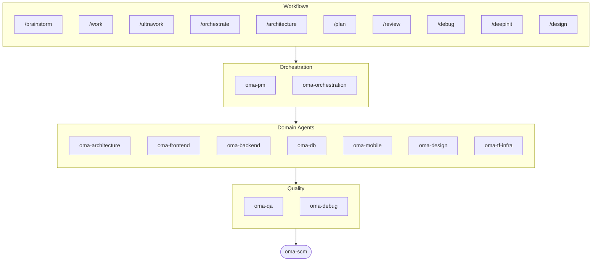

# oh-my-agent: Das Multi-Agenten-Harness, das die Arbeit überprüft

[](https://www.npmjs.com/package/oh-my-agent) [](https://www.npmjs.com/package/oh-my-agent) [](https://github.com/first-fluke/oh-my-agent) [](https://github.com/first-fluke/oh-my-agent/blob/main/LICENSE) [](https://github.com/first-fluke/oh-my-agent/commits/main)

[English](../README.md) | [한국어](./README.ko.md) | [中文](./README.zh.md) | [Português](./README.pt.md) | [日本語](./README.ja.md) | [Français](./README.fr.md) | [Español](./README.es.md) | [Nederlands](./README.nl.md) | [Polski](./README.pl.md) | [Русский](./README.ru.md) | [Tiếng Việt](./README.vi.md) | [ภาษาไทย](./README.th.md)

**Agenten erzählen vom Erfolg. oh-my-agent prüft die Artefakte.**

Parallele Agenten zu spawnen ist der einfache Teil. Schwierig wird die Frage, ob sie die Arbeit tatsächlich erledigt haben. „Tests bestanden, alle Kriterien erfüllt" kostet einen Agenten nichts, und innerhalb derselben Session kann ihm nichts widersprechen.

oh-my-agent macht diese Behauptung falsifizierbar. Ein Stop-Hook weigert sich, deine Session zu beenden, solange das projekteigene `typecheck`- / `test`- / `lint`-Skript nicht mit Exit-Code 0 durchläuft. Ein Gate-Command entscheidet anhand der Artefakte, die ein Workflow hinterlassen haben muss, ob er wirklich gelaufen ist — und maßgeblich ist sein JSON-Verdikt, nicht die Zusammenfassung des Agenten. Ein unabhängiger Judge mit frischem Kontext verifiziert in jeder Runde jedes Kriterium neu, auch die bereits bestandenen. Jede Gate-Entscheidung landet in einem Append-only-Event-Log, das du im Nachhinein lesen kannst. Und dieselbe Disziplin läuft über ein Dutzend Agenten-Runtimes hinweg, aus einem einzigen portablen `.agents/`-Verzeichnis.


[Watch the full video (35s)](./assets/video/oh-my-agent-explainer.mp4)

## Schnellstart

```bash
# macOS / Linux — installiert bun, uv & serena automatisch, falls nicht vorhanden
curl -fsSL https://raw.githubusercontent.com/first-fluke/oh-my-agent/main/cli/install.sh | bash
```

```powershell
# Windows (PowerShell) — installiert bun, uv & serena automatisch, falls nicht vorhanden
irm https://raw.githubusercontent.com/first-fluke/oh-my-agent/main/cli/install.ps1 | iex
```

```bash
# Oder manuell (beliebiges OS, benötigt bun + uv + serena)
bunx oh-my-agent@latest
```

### Installation via Agent Package Manager

<details>
<summary>Microsofts <a href="https://github.com/microsoft/apm">Agent Package Manager</a> (APM): nur Skills. Klick zum Ausklappen.</summary>

> Nicht zu verwechseln mit dem APM (Application Performance Monitoring) von `oma-observability`.

```bash
# Alle Skills, in jede erkannte Runtime ausgerollt
# (.claude, .cursor, .codex, .opencode, .github, .agents)
apm install first-fluke/oh-my-agent

# Ein einzelnes Skill
apm install first-fluke/oh-my-agent/.agents/skills/oma-frontend
```

APM liefert nur die Skills. Für Workflows, Regeln, `oma-config.yaml`, Keyword-Detection-Hooks und das `oma agent spawn`-CLI nimmst du `bunx oh-my-agent@latest`. Pro Projekt eine Distribution wählen, sonst läuft das auseinander.

</details>

Wähl ein Preset und los geht's:

| Preset | Was Du Bekommst |
|--------|-------------|
| **All** | **Alle Agenten und Skills** |
| Backend | architecture + backend + brainstorm + db + debug + dev-workflow + pm + qa + scm |
| Content | academic-writer + design + image + scm + translator + voice |
| DevOps | architecture + brainstorm + debug + dev-workflow + observability + pm + qa + scm + tf-infra |
| Frontend | architecture + brainstorm + debug + design + frontend + pm + qa + scm |
| Fullstack | architecture + backend + brainstorm + db + debug + design + dev-workflow + frontend + mobile + pm + qa + scm + tf-infra |
| Fullstack Mobile | architecture + backend + brainstorm + db + debug + design + dev-workflow + mobile + pm + qa + scm |
| Fullstack Web | architecture + backend + brainstorm + db + debug + design + dev-workflow + frontend + pm + qa + scm |
| Mobile | architecture + brainstorm + debug + mobile + pm + qa + scm |
| Research | academic-writer + hwp + market + pdf + scholar + scm + search + translator |

## Funktioniert mit jedem Agent

Verifikation nützt wenig, wenn sie an einen einzigen Anbieter gebunden ist. `oh-my-agent` behält `.agents/` als Single Source of Truth (SSOT) und projiziert es in das native Layout jeder Runtime. So teilen sich alle unterstützten Tools dieselben Skills, Workflows, Regeln und Gates — und ein Vendor-Wechsel ist eine Config-Änderung, keine Migration.

<table>
<colgroup>
<col span="6" style="width:16.67%" />
</colgroup>
<tr>
<td align="center">
<a href="https://claude.com/product/claude-code"></a><br/>
<strong>Claude Code</strong><br/>
<sub>nativ + Adapter</sub>
</td>
<td align="center">
<a href="https://github.com/openai/codex"></a><br/>
<strong>Codex CLI</strong><br/>
<sub>nativ + Adapter</sub>
</td>
<td align="center">
<a href="https://antigravity.google"></a><br/>
<strong>Antigravity</strong><br/>
<sub>natives SSOT</sub>
</td>
<td align="center">
<a href="https://cursor.com"></a><br/>
<strong>Cursor</strong><br/>
<sub>nativ + Adapter</sub>
</td>
<td align="center">
<a href="https://github.com/QwenLM/qwen-code"></a><br/>
<strong>Qwen Code</strong><br/>
<sub>natives Dispatch</sub>
</td>
<td align="center">
<a href="https://github.com/esengine/DeepSeek-Reasonix"></a><br/>
<strong>Reasonix</strong><br/>
<sub>nativ kompatibel</sub>
</td>
</tr>
<tr>
<td align="center">
<a href="https://pi.dev/"></a><br/>
<strong>Pi</strong><br/>
<sub>nativ kompatibel</sub>
</td>
<td align="center">
<a href="https://github.com/anomalyco/opencode"></a><br/>
<strong>OpenCode</strong><br/>
<sub>nativ kompatibel</sub>
</td>
<td align="center">
<a href="https://ampcode.com"></a><br/>
<strong>Amp</strong><br/>
<sub>nativ kompatibel</sub>
</td>
<td align="center">
<a href="https://github.com/features/copilot"></a><br/>
<strong>GitHub Copilot</strong><br/>
<sub>Skills per Symlink</sub>
</td>
<td align="center">
<a href="https://grok.x.ai"></a><br/>
<strong>Grok Build</strong><br/>
<sub>native Hooks</sub>
</td>
<td align="center">
<a href="https://kiro.dev"></a><br/>
<strong>Kiro CLI</strong><br/>
<sub>native Hooks + Agents</sub>
</td>
</tr>
</table>

<p align="center"><sub><a href="./SUPPORTED_AGENTS.md">& mehr</a></sub></p>

## Dein Engineering-Team

Statt dass eine einzige KI alles erledigt (und sich auf halbem Weg verheddert), verteilt oh-my-agent die Arbeit auf spezialisierte Agenten. Jeder kennt sein Fachgebiet in- und auswendig, hat eigene Tools und Checklisten und bleibt in seiner Spur.

| Agent | Was Er Macht |
|-------|-------------|
| **oma-architecture** | Wägt Architektur-Trade-offs ab und zieht Modulgrenzen — mit ADR/ATAM/CBAM-Analyse |
| **oma-backend** | Baut und sichert deine APIs in Python, Node.js oder Rust |
| **oma-brainstorm** | Erkundet Ideen gemeinsam mit dir, bevor du dich für einen Weg entscheidest |
| **oma-db** | Entwirft dein Schema, Migrationen, Indizes und Vector Stores |
| **oma-debug** | Findet die Ursache, behebt den Bug und schreibt einen Regressionstest |
| **oma-deepsec** | Scannt deinen Code auf Sicherheitslücken und blockiert riskante Pull Requests |
| **oma-design** | Baut Design-Systeme mit Tokens, Barrierefreiheit und Responsive Layouts |
| **oma-dev-workflow** | Automatisiert deine CI/CD, Releases und Monorepo-Aufgaben |
| **oma-docs** | Prüft deine Docs auf defekte Referenzen und markiert Stellen, die ein Code-Change berührt hat |
| **oma-explanation** | Verwandelt einen Diff, PR oder Branch in einen eigenständigen interaktiven HTML-Explainer mit Quiz |
| **oma-frontend** | Baut deine UI mit React/Next.js, TypeScript, Tailwind CSS v4 und shadcn/ui |
| **oma-mobile** | Baut plattformübergreifende Mobile-Apps mit Flutter |
| **oma-observability** | Routet Observability-Arbeit über Metriken, Logs, Traces, SLOs und Incident-Forensik |
| **oma-orchestration** | Führt mehrere Agenten parallel über die CLI aus |
| **oma-pm** | Plant Aufgaben, zerlegt Anforderungen und definiert API-Verträge |
| **oma-qa** | Überprüft deinen Code auf OWASP-Sicherheitslücken, Performance- und Barrierefreiheitsprobleme |
| **oma-refactor** | Refaktoriert Code ohne Verhaltensänderung mit Hotspot-Auswahl, Charakterisierungstests als Sicherheitsnetz und reinen Refactor-Commits |
| **oma-scm** | Verwaltet deine Branches, Merges, Worktrees und Conventional Commits |
| **oma-search** | Leitet jede Suchanfrage an die beste Quelle weiter und bewertet, wie vertrauenswürdig das Ergebnis ist |
| **oma-tf-infra** | Provisioniert Multi-Cloud-Infrastruktur mit Terraform |

<details>
<summary>Interne & Meta-Tools</summary>

| Agent | Was Er Macht |
|-------|-------------|
| **oma-coordination** | Führt Schritt für Schritt durch die manuelle Koordination von PM-, Frontend-, Backend-, Mobile- und QA-Agenten |
| **oma-skill-creation** | Schreibt und prüft neue OMA-Skills im SSL-lite-Format |

</details>

## Jenseits von Code: Content- und Research-Pipelines

Getrennt vom Engineering-Team liefert oma Content- und Research-Pipelines, die nach derselben Engineering-Disziplin gebaut sind: deterministisches Replay aus Fixtures, Manifeste für Reproduzierbarkeit und ehrliche Berichte über Einschränkungen, wenn eine Quelle oder ein Vendor-Key fehlt — statt eines stillschweigend dünneren Ergebnisses.

| Agent | Was Er Macht |
|-------|-------------|
| **oma-academic-writing** | Entwirft, überarbeitet und prüft akademische Prosa bis zur Publikationsreife |
| **oma-hwp** | Konvertiert HWP-, HWPX- und HWPML-Dateien in Markdown |
| **oma-image** | Generiert Bilder parallel über mehrere KI-Anbieter |
| **oma-market** | Recherchiert deinen Markt aus Community-Signalen und rahmt ihn mit SWOT, Porter's 5F und PESTEL |
| **oma-pdf** | Konvertiert PDF-Dateien in Markdown |
| **oma-recap** | Fasst deinen Gesprächsverlauf in thematische Arbeitsberichte zusammen |
| **oma-scholar** | Durchsucht akademische Literatur und unterstützt dich beim Peer-Review |
| **oma-slide** | Erzeugt markante, animationsreiche HTML-Präsentationsdecks und exportiert nach PDF/PNG/PPTX |
| **oma-translation** | Übersetzt zwischen Sprachen so, als hätte ein Muttersprachler geschrieben |
| **oma-video** | Erzeugt Kurzvideos, Erklärvideos und Demos über eine auch ohne Schlüssel nutzbare Remotion-Pipeline |
| **oma-voice** | Generiert Voiceovers und transkribiert Audio lokal — ganz ohne Cloud |

## So Funktioniert's

Einfach chatten. Beschreib, was du willst, und oh-my-agent sucht die passenden Agenten aus.

```
Du: "Bau eine TODO-App mit User-Authentifizierung"
→ PM plant die Arbeit
→ Backend baut die Auth-API
→ Frontend baut die React-UI
→ DB entwirft das Schema
→ QA prüft alles durch
→ Fertig: koordinierter, geprüfter Code
```

Oder nutz Slash Commands für strukturierte Workflows:

| Schritt | Befehl | Was Er Macht |
|---------|--------|-------------|
| 0 | `/deepinit` | Erfasst deine bestehende Codebasis in AGENTS.md, ARCHITECTURE.md und docs |
| 1 | `/brainstorm` | Erkundet Ideen mit dir, bevor du dich aufs Bauen festlegst |
| 2 | `/architecture` | Wägt deine Design-Trade-offs ab und zieht saubere Modulgrenzen |
| 2 | `/design` | Baut dein Design-System mit Tokens, Barrierefreiheit und responsiven Layouts |
| 2 | `/plan` | Zerlegt dein Feature in priorisierte Aufgaben |
| 3 | `/work` | Baut dein Feature Schritt für Schritt über mehrere Agenten hinweg |
| 3 | `/orchestrate` | Lässt mehrere Agenten parallel laufen, um dein Feature schneller zu bauen |
| 3 | `/ultrawork` | Baut dein Feature durch fünf gegatete Qualitätsphasen; jedes Review läuft in einer frischen, isolierten Reviewer-Session (Cross-Context-Review) |
| 3 | `/ralph` | Wiederholt `/ultrawork`, bis ein unabhängiger Prüfer jedes Kriterium besteht |
| 4 | `/review` | Prüft deinen Code auf Sicherheits-, Performance- und Barrierefreiheits-Probleme |
| 4 | `/deepsec` | Führt einen tiefen Security-Scan durch und blockiert riskante Pull Requests |
| 5 | `/debug` | Findet die Ursache, behebt den Bug und schreibt einen Regressionstest |
| 5 | `/docs` | Prüft deine Docs auf kaputte Verweise und patcht die, die deine Code-Änderungen betreffen |
| 6 | `/scm` | Verwaltet deine Branches, Merges und Conventional Commits |
| - | `/schedule` | Plant einen Agenten-Job, der in einem wiederkehrenden Intervall läuft |

**Auto-Erkennung**: Du brauchst nicht mal Slash Commands. Schlüsselwörter wie "Architektur", "plan", "review" und "debug" in deiner Nachricht (in 11 Sprachen!) aktivieren automatisch den richtigen Workflow. Die Erkennungsgenauigkeit wird gemessen, nicht angenommen: `oma verify triggers` bewertet den Detektor gegen ein annotiertes Korpus aus 171 Prompts (aktuell **0% Missed-Fire**, unter 10% False-Fire) und sichert die CI damit ab.

### Per-Agent-Modelle

Setze `model_preset` in `.agents/oma-config.yaml`, um festzulegen, welche AI-Modelle jeder Agent verwendet:

```yaml
language: en
model_preset: mixed   # antigravity | claude | codex | cursor | kiro | mixed | qwen

# Optional per-agent overrides
agents:
  backend: { model: openai/gpt-5.5, effort: high }
```

- `oma doctor --profile` — gibt die pro Rolle aufgelöste Modell-Matrix aus
- Vollständige Anleitung: [`web/docs/guide/per-agent-models.md`](../web/docs/guide/per-agent-models.md)

## Verifikation statt Narration

Jeder Mechanismus unten ist mechanisch: Ein Command endet mit Exit-Code 0 oder eben nicht, eine Datei liegt auf der Platte oder eben nicht. Kein LLM wird gefragt, ob die Arbeit „korrekt aussieht".

| Mechanismus | Was mechanisch geprüft wird | Wo es liegt |
|-------------|------------------------------|-------------|
| **Stop-Hook-Gate** | Blockiert das Beenden der Session, solange ein persistenter Workflow aktiv ist, und führt vor dem Stopp das konfigurierte Gate-Skript aus. Ausführbar sind nur `typecheck`, `test` und `lint` — schreibt ein Agent etwas anderes in die State-Datei, wird es ignoriert und nie ausgeführt. Auf 5 Reinforcements begrenzt, damit dich ein dauerhaft rotes Gate nicht einsperrt. | [`.agents/hooks/core/persistent-mode.ts`](../.agents/hooks/core/persistent-mode.ts) |
| **Anti-Circumvention-Gate** | `oma ralph verify --json` prüft vier Artefakte, die sich per Abkürzung nicht fälschen lassen: die Phasen-Records von ultrawork, das Plan-JSON, die Ergebnisdatei eines **eigenständigen QA-Agenten** und die eines **eigenständigen Refactor-Agenten**. Fehlende Artefakte heißen: Die Phase ist nicht gelaufen, was die Erzählung auch behauptet. | [`.agents/workflows/ralph.md`](../.agents/workflows/ralph.md) |
| **Unabhängiger Judge** | Läuft als separater Agent mit frischem Kontext, gebrieft ausschließlich auf die Kriterien — nie darauf, was der Implementierer behauptet behoben zu haben. Verifiziert in jeder Iteration **jedes** Kriterium neu, auch frühere PASSes, denn ein Fix an C2 ist genau der Weg, auf dem C1 stillschweigend regrediert. | [`judge-protocol.md`](../.agents/workflows/ralph/resources/judge-protocol.md) |
| **Event-basierter State** | Jeder bestandene Gate-Durchlauf, jeder Gate-Fehlschlag und jede Entscheidung hängt eine JSON-Zeile an `~/.oma/u/0/sessions/{sid}/events.jsonl` an, gestempelt mit Vendor und Runtime-Session-ID. Append-only, vendorübergreifend, nach dem Lauf auditierbar. | [`event-spec.md`](../.agents/skills/_shared/runtime/event-spec.md) |
| **Check-Batterie pro Agent** | `oma verify <agent>` führt einen gemeinsamen Kern aus (Scope-Verletzung, Charter-Alignment, hartkodierte Secrets, TODO-Scan, declared outputs) plus typspezifische Checks (TypeScript strict, Tests, raw SQL, Flutter analyze, Inline-Styles). | `oma verify <agent>` |
| **Skill-Eval-Harness** | `oma skill eval` misst den Utility-Lift auf zurückgehaltenen Tasks — Treatment gegen Baseline — statt anzunehmen, dass ein Skill hilft. `oma skill optimize` behält nur Änderungen, die den gemessenen Lift verbessern. | [skill-eval-Guide](../web/docs/guide/skill-eval.md) |

Budgets werden genauso durchgesetzt. `session.quota_cap` deckelt Tokens, Spawn-Anzahl und Ausgaben pro Vendor; der Orchestrator verweigert den nächsten Spawn, sobald eine Dimension überschritten ist. Läuft das Zeitbudget aus, stoppt der Stop-Hook ehrlich und hält den Teilstatus im Event-Log fest, statt Fertigstellung vorzutäuschen.

## Warum oh-my-agent?

- **Rollenbasiert**: Agenten wie ein echtes Engineering-Team modelliert, kein Haufen Prompts
- **Token-effizient**: Zwei-Schichten-Skill-Design spart ~75% der Tokens ([wie es funktioniert](../web/docs/guide/usage.md))
- **Wiederherstellbar**: nach 2 gescheiterten Retries spawnt `orchestrate` Hypothesen-Varianten parallel und behält das Ergebnis mit der höchsten Punktzahl, statt endlos einen falschen Ansatz zu wiederholen
- **Monorepo-fähig**: `detectWorkspace` liest pnpm / nx / turbo / lerna und routet jeden Agenten zu seinem Workspace
- **Multi-Vendor**: mische Antigravity, Claude, Codex, Cursor, Kiro und Qwen je nach Agententyp
- **Beobachtbar**: Terminal- und Web-Dashboards für Echtzeit-Monitoring

## Architektur



## Mehr Erfahren

- **[Detaillierte Dokumentation](./AGENTS_SPEC.md)**: vollständige technische Spec und Architektur
- **[Unterstützte Agenten](./SUPPORTED_AGENTS.md)**: Agenten-Support-Matrix nach IDE
- **[Benchmark-Report](../benchmarks/README.md)**: Methode, Scores, Screenshots und Vorbehalte
- **[Web-Docs](https://first-fluke.github.io/oh-my-agent/)**: Guides, Tutorials und CLI-Referenz

## Sponsors

Dieses Projekt wird dank unserer großzügigen Sponsors gepflegt.

> **Gefällt dir das Projekt?** Gib ihm einen Stern!
>
> ```bash
> gh api --method PUT /user/starred/first-fluke/oh-my-agent
> ```
>
> Probier unser optimiertes Starter-Template: [fullstack-starter](https://github.com/first-fluke/fullstack-starter)

<a href="https://github.com/sponsors/first-fluke">
  
</a>
<a href="https://buymeacoffee.com/firstfluke">
  
</a>

### 🚀 Champion

<!-- Champion tier ($100/mo) logos here -->

### 🛸 Booster

<!-- Booster tier ($30/mo) logos here -->

### ☕ Contributor

<!-- Contributor tier ($10/mo) names here -->

[Sponsor werden →](https://github.com/sponsors/first-fluke)

Siehe [SPONSORS.md](../SPONSORS.md) für die vollständige Liste der Unterstützer.


## Star History

[](https://star-history.dera.page/#first-fluke/oh-my-agent&type=date&legend=bottom-right)


## Literatur

- Li, X., Liu, Y., Chen, W., You, B., Di, Z., He, Y., Zheng, S., Choe, K. W., Sun, J., Wang, S., Tao, C., Li, B., Zhao, X., Geng, H., Wu, X., Zhou, J., Chen, X., Xing, H., Li, Y., … Song, D. (2026). *SkillsBench: Benchmarking how well agent skills work across diverse tasks* (Version 4) [Preprint]. arXiv. https://doi.org/10.48550/arXiv.2602.12670
- Yu, G., & Wang, X. (2026). *Knows: Agent-native structured research representations* (Version 1) [Preprint]. arXiv. https://doi.org/10.48550/arXiv.2604.17309
- Liang, Q., Wang, H., Liang, Z., & Liu, Y. (2026). *From skill text to skill structure: The scheduling-structural-logical representation for agent skills* (Version 4) [Preprint]. arXiv. https://doi.org/10.48550/arXiv.2604.24026
- Chen, C., Yu, Q., Gu, Y., Huang, Z., Li, H., Liu, H., Liu, S., Liu, J., Peng, D., Wang, J., Yan, Z., Meng, F., Qin, E., Che, C., & Hu, M. (2026). *The scaling laws of skills in LLM agent systems* (Version 1) [Preprint]. arXiv. https://doi.org/10.48550/arXiv.2605.16508
- Tang, L., Rashtchian, C., Ferng, C.-S., Tomkins, A., Juan, D.-C., & Vu, T. (2026). *WikiSkill: Compiling agent experience into persistent knowledge for skill evolution* [Preprint]. arXiv. https://doi.org/10.48550/arXiv.2608.27454
- Huang, Z., Xu, J., Yang, Y., Gong, Z., Yang, Q., Tian, M., Wang, X., Lv, C., Gao, X., Dai, Q., Liu, B., Qiu, K., Yang, X., Chen, D., Zheng, X., & Luo, C. (2026). *From raw experience to skill consumption: A systematic study of model-generated agent skills* [Preprint]. arXiv. https://doi.org/10.48550/arXiv.2605.23899
- Hong, D. B., Imani, A., & Ahmed, I. (2026). *From anatomy to smells: An empirical study of SKILL.md in agent skills* (Version 2) [Preprint]. arXiv. https://doi.org/10.48550/arXiv.2607.01456


## Lizenz

MIT
