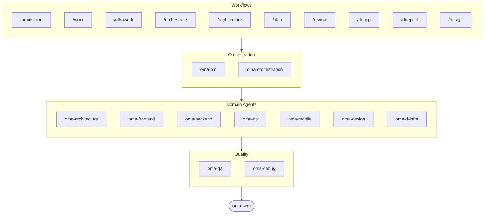

# oh-my-agent : Le Harnais Multi-Agents Qui Vérifie le Travail

[](https://www.npmjs.com/package/oh-my-agent) [](https://www.npmjs.com/package/oh-my-agent) [](https://github.com/first-fluke/oh-my-agent) [](https://github.com/first-fluke/oh-my-agent/blob/main/LICENSE) [](https://github.com/first-fluke/oh-my-agent/commits/main)

[English](../README.md) | [한국어](./README.ko.md) | [中文](./README.zh.md) | [Português](./README.pt.md) | [日本語](./README.ja.md) | [Español](./README.es.md) | [Nederlands](./README.nl.md) | [Polski](./README.pl.md) | [Русский](./README.ru.md) | [Deutsch](./README.de.md) | [Tiếng Việt](./README.vi.md) | [ภาษาไทย](./README.th.md)

**Les agents racontent leur succès. oh-my-agent vérifie les artefacts.**

Lancer des agents en parallèle, c'est la partie facile. La partie difficile, c'est de savoir s'ils ont vraiment fait le boulot. Dire « les tests passent, tous les critères sont remplis » ne coûte rien à un agent, et rien à l'intérieur de cette même session ne peut le contredire.

oh-my-agent rend l'affirmation falsifiable. Un Stop hook refuse de terminer ta session tant que le script `typecheck` / `test` / `lint` de ton propre projet ne sort pas avec le code 0. Une commande de gate décide si un workflow s'est vraiment exécuté en cherchant les artefacts qu'il a forcément dû laisser derrière lui — et c'est son verdict JSON, pas le résumé de l'agent, qui fait foi. Un juge indépendant, doté d'un contexte neuf, revérifie chaque critère à chaque tour, y compris ceux qui étaient déjà passés. Chaque décision de gate atterrit dans un event log en ajout seul que tu peux relire après coup. Puis il applique cette même discipline à une douzaine de runtimes d'agents depuis un seul répertoire `.agents/` portable.


[Watch the full video (35s)](./assets/video/oh-my-agent-explainer.mp4)

## Démarrage Rapide

```bash
# macOS / Linux — installe bun, uv & serena automatiquement si absents
curl -fsSL https://raw.githubusercontent.com/first-fluke/oh-my-agent/main/cli/install.sh | bash
```

```powershell
# Windows (PowerShell) — installe bun, uv & serena automatiquement si absents
irm https://raw.githubusercontent.com/first-fluke/oh-my-agent/main/cli/install.ps1 | iex
```

```bash
# Ou manuellement (n'importe quel OS, nécessite bun + uv + serena)
bunx oh-my-agent@latest
```

### Installation via Agent Package Manager

<details>
<summary>L'<a href="https://github.com/microsoft/apm">Agent Package Manager</a> (APM) de Microsoft : distribution skills uniquement. Clique pour déplier.</summary>

> À ne pas confondre avec l'APM (Application Performance Monitoring) d'`oma-observability`.

```bash
# Tous les skills, déployés sur chaque runtime détectée
# (.claude, .cursor, .codex, .opencode, .github, .agents)
apm install first-fluke/oh-my-agent

# Un seul skill
apm install first-fluke/oh-my-agent/.agents/skills/oma-frontend
```

APM ne livre que les skills. Pour les workflows, les règles, `oma-config.yaml`, les hooks de détection de mots-clés et la CLI `oma agent spawn`, utilise `bunx oh-my-agent@latest`. Une seule méthode de distribution par projet, sinon ça finit par diverger.

</details>

Choisis un preset et c'est parti :

| Preset | Ce Que Tu Obtiens |
|--------|-------------|
| **All** | **Tous les agents et skills** |
| Backend | architecture + backend + brainstorm + db + debug + dev-workflow + pm + qa + scm |
| Content | academic-writer + design + image + scm + translator + voice |
| DevOps | architecture + brainstorm + debug + dev-workflow + observability + pm + qa + scm + tf-infra |
| Frontend | architecture + brainstorm + debug + design + frontend + pm + qa + scm |
| Fullstack | architecture + backend + brainstorm + db + debug + design + dev-workflow + frontend + mobile + pm + qa + scm + tf-infra |
| Fullstack Mobile | architecture + backend + brainstorm + db + debug + design + dev-workflow + mobile + pm + qa + scm |
| Fullstack Web | architecture + backend + brainstorm + db + debug + design + dev-workflow + frontend + pm + qa + scm |
| Mobile | architecture + brainstorm + debug + mobile + pm + qa + scm |
| Research | academic-writer + hwp + market + pdf + scholar + scm + search + translator |

## Compatible avec Tous les Agents

La vérification ne vaut pas grand-chose si elle est verrouillée sur un seul vendor. `oh-my-agent` conserve `.agents/` comme source unique de vérité (SSOT) et la projette dans la disposition native de chaque runtime : tous les outils pris en charge partagent ainsi les mêmes skills, workflows, règles et gates — et changer de vendor devient un changement de config, pas une migration.

<table>
<colgroup>
<col span="6" style="width:16.67%" />
</colgroup>
<tr>
<td align="center">
<a href="https://claude.com/product/claude-code"></a><br/>
<strong>Claude Code</strong><br/>
<sub>natif + adaptateur</sub>
</td>
<td align="center">
<a href="https://github.com/openai/codex"></a><br/>
<strong>Codex CLI</strong><br/>
<sub>natif + adaptateur</sub>
</td>
<td align="center">
<a href="https://antigravity.google"></a><br/>
<strong>Antigravity</strong><br/>
<sub>SSOT natif</sub>
</td>
<td align="center">
<a href="https://cursor.com"></a><br/>
<strong>Cursor</strong><br/>
<sub>natif + adaptateur</sub>
</td>
<td align="center">
<a href="https://github.com/QwenLM/qwen-code"></a><br/>
<strong>Qwen Code</strong><br/>
<sub>dispatch natif</sub>
</td>
<td align="center">
<a href="https://github.com/esengine/DeepSeek-Reasonix"></a><br/>
<strong>Reasonix</strong><br/>
<sub>compatible nativement</sub>
</td>
</tr>
<tr>
<td align="center">
<a href="https://pi.dev/"></a><br/>
<strong>Pi</strong><br/>
<sub>compatible nativement</sub>
</td>
<td align="center">
<a href="https://github.com/anomalyco/opencode"></a><br/>
<strong>OpenCode</strong><br/>
<sub>compatible nativement</sub>
</td>
<td align="center">
<a href="https://ampcode.com"></a><br/>
<strong>Amp</strong><br/>
<sub>compatible nativement</sub>
</td>
<td align="center">
<a href="https://github.com/features/copilot"></a><br/>
<strong>GitHub Copilot</strong><br/>
<sub>skills via symlink</sub>
</td>
<td align="center">
<a href="https://grok.x.ai"></a><br/>
<strong>Grok Build</strong><br/>
<sub>hooks natifs</sub>
</td>
<td align="center">
<a href="https://kiro.dev"></a><br/>
<strong>Kiro CLI</strong><br/>
<sub>hooks natifs + agents</sub>
</td>
</tr>
</table>

<p align="center"><sub><a href="./SUPPORTED_AGENTS.md">& plus</a></sub></p>

## Ton Équipe d'Ingénierie

Au lieu qu'une seule IA fasse tout (et se perde en route), oh-my-agent répartit le boulot entre des agents spécialisés. Chacun connaît son domaine sur le bout des doigts, a ses propres outils et checklists, et reste dans sa voie.

| Agent | Ce Qu'il Fait |
|-------|-------------|
| **oma-architecture** | Évalue les arbitrages d'architecture et trace les frontières de modules avec une analyse ADR/ATAM/CBAM |
| **oma-backend** | Construit et sécurise tes APIs en Python, Node.js ou Rust |
| **oma-brainstorm** | Explore les idées avec toi avant de te lancer dans le code |
| **oma-db** | Conçoit tes schémas, migrations, index et vector stores |
| **oma-debug** | Identifie la cause racine, corrige le bug et écrit un test de régression |
| **oma-deepsec** | Scanne ton code pour détecter les failles de sécurité et bloque les pull requests à risque |
| **oma-design** | Construit des systèmes de design avec tokens, accessibilité et layouts responsive |
| **oma-dev-workflow** | Automatise ton CI/CD, tes releases et tes tâches monorepo |
| **oma-docs** | Vérifie les références cassées dans ta doc et signale les pages touchées par un changement de code |
| **oma-explanation** | Transforme un diff, une PR ou une branche en explicateur HTML interactif autonome avec quiz |
| **oma-frontend** | Construit ton UI avec React/Next.js, TypeScript, Tailwind CSS v4 et shadcn/ui |
| **oma-mobile** | Construit des apps multiplateformes avec Flutter |
| **oma-observability** | Route les tâches d'observabilité entre métriques, logs, traces, SLOs et forensique d'incidents |
| **oma-orchestration** | Lance plusieurs agents en parallèle depuis la CLI |
| **oma-pm** | Planifie les tâches, découpe les exigences et définit les contrats d'API |
| **oma-qa** | Passe ton code en revue pour détecter les failles OWASP, les problèmes de performance et d'accessibilité |
| **oma-refactor** | Refactorise le code sans changer son comportement grâce au ciblage des hotspots, aux tests de caractérisation et aux commits dédiés au refactor |
| **oma-scm** | Gère tes branches, fusions, worktrees et Conventional Commits |
| **oma-search** | Route chaque requête vers la meilleure source et évalue le niveau de confiance du résultat |
| **oma-tf-infra** | Provisionne une infrastructure multi-cloud avec Terraform |

<details>
<summary>Outils internes et méta</summary>

| Agent | Ce Qu'il Fait |
|-------|-------------|
| **oma-coordination** | Guide la coordination manuelle pas à pas des agents PM, frontend, backend, mobile et QA |
| **oma-skill-creation** | Rédige et audite les nouveaux skills OMA au format SSL-lite |

</details>

## Au-delà du Code : Pipelines de Contenu et de Recherche

En marge de l'équipe d'ingénierie, oma embarque des pipelines de contenu et de recherche construits avec la même discipline d'ingénierie : replay déterministe depuis des fixtures, manifestes pour la reproductibilité, et signalement honnête de la dégradation quand une source ou une clé vendor manque, plutôt qu'un résultat silencieusement appauvri.

| Agent | Ce Qu'il Fait |
|-------|-------------|
| **oma-academic-writing** | Rédige, révise et audite ta prose académique jusqu'à la qualité publication |
| **oma-hwp** | Convertit les fichiers HWP, HWPX et HWPML en Markdown |
| **oma-image** | Génère des images via plusieurs fournisseurs d'IA en parallèle |
| **oma-market** | Analyse ton marché à partir de signaux communautaires et le structure avec SWOT, Porter's 5F et PESTEL |
| **oma-pdf** | Convertit les fichiers PDF en Markdown |
| **oma-recap** | Résume ton historique de conversations en synthèses de travail organisées par thème |
| **oma-scholar** | Explore la littérature académique et t'aide à mener une évaluation par les pairs |
| **oma-slide** | Génère des decks de présentation HTML distinctifs riches en animations et exporte vers PDF/PNG/PPTX |
| **oma-translation** | Traduit entre les langues comme si un natif avait écrit le texte |
| **oma-video** | Génère des vidéos courtes, explicatives et de démo via un pipeline Remotion utilisable sans clés |
| **oma-voice** | Génère des voix off et transcrit de l'audio en local, sans cloud |

## Comment Ça Marche

Discute, tout simplement. Décris ce que tu veux et oh-my-agent choisit les bons agents.

```
Toi : "Construis une app TODO avec authentification"
→ PM planifie le travail
→ Backend construit l'API d'auth
→ Frontend construit l'UI React
→ DB conçoit le schéma
→ QA passe tout en revue
→ Terminé : code coordonné et vérifié
```

Ou utilise les slash commands pour des workflows structurés :

| Étape | Commande | Description |
|-------|----------|-------------|
| 0 | `/deepinit` | Cartographie ta base de code existante dans AGENTS.md, ARCHITECTURE.md et docs |
| 1 | `/brainstorm` | Explore les idées avec toi avant que tu te lances dans la construction |
| 2 | `/architecture` | Pèse les arbitrages de ta conception et trace des frontières de modules nettes |
| 2 | `/design` | Construit ton système de design avec tokens, accessibilité et mises en page responsive |
| 2 | `/plan` | Découpe ta feature en tâches priorisées |
| 3 | `/work` | Construit ta feature étape par étape sur plusieurs agents |
| 3 | `/orchestrate` | Lance plusieurs agents en parallèle pour construire ta feature plus vite |
| 3 | `/ultrawork` | Construit ta feature à travers cinq phases qualité à gates ; chaque revue s'exécute dans une session de relecteur neuve et isolée (revue à contexte croisé / cross-context review) |
| 3 | `/ralph` | Répète `/ultrawork` jusqu'à ce qu'un vérificateur indépendant valide chaque critère |
| 4 | `/review` | Revoit ton code pour les problèmes de sécurité, de performance et d'accessibilité |
| 4 | `/deepsec` | Lance un scan de sécurité profond et bloque les pull requests à risque |
| 5 | `/debug` | Trouve la cause racine, corrige le bug et écrit un test de régression |
| 5 | `/docs` | Vérifie tes docs pour les références cassées et corrige celles que touchent tes changements de code |
| 6 | `/scm` | Gère tes branches, tes merges et les Conventional Commits |
| - | `/schedule` | Planifie une tâche d'agent à exécuter sur un intervalle récurrent |

**Auto-détection** : Tu n'as même pas besoin des slash commands. Des mots-clés comme "architecture", "plan", "review" et "debug" dans ton message (en 11 langues !) activent automatiquement le bon workflow. La précision de détection se mesure, elle ne se suppose pas : `oma verify triggers` évalue le détecteur face à un corpus annoté de 171 prompts (actuellement **0% de missed-fire**, moins de 10% de false-fire) et le verrouille en CI.

### Modèles par agent

Définis `model_preset` dans `.agents/oma-config.yaml` pour choisir quels modèles AI chaque agent utilise :

```yaml
language: en
model_preset: mixed   # antigravity | claude | codex | cursor | kiro | mixed | qwen

# Optional per-agent overrides
agents:
  backend: { model: openai/gpt-5.5, effort: high }
```

- `oma doctor --profile` — affiche la matrice de modèles résolue par rôle
- Guide complet : [`web/docs/guide/per-agent-models.md`](../web/docs/guide/per-agent-models.md)

## Vérification, Pas Narration

Chaque mécanisme ci-dessous est mécanique : une commande sort avec le code 0 ou non, un fichier est sur le disque ou non. On ne demande à aucun LLM si le travail « a l'air correct ».

| Mécanisme | Ce qu'il vérifie mécaniquement | Où ça vit |
|-----------|------------------------------|----------------|
| **Stop-hook gate** | Bloque la fin de session tant qu'un workflow persistant est actif, et exécute le script de gate configuré avant d'autoriser l'arrêt. Seuls `typecheck`, `test` et `lint` sont exécutables : si un agent écrit autre chose dans le fichier d'état, c'est ignoré, jamais exécuté. Plafonné à 5 relances pour qu'un gate durablement rouge ne puisse pas te piéger. | [`.agents/hooks/core/persistent-mode.ts`](../.agents/hooks/core/persistent-mode.ts) |
| **Anti-Circumvention Gate** | `oma ralph verify --json` vérifie quatre artefacts qu'un raccourci ne peut pas falsifier : les enregistrements de phase d'ultrawork, le JSON du plan, le fichier de résultat d'un **agent QA distinct** et celui d'un **agent refactor distinct**. Des artefacts manquants signifient que la phase ne s'est pas exécutée, quoi qu'en dise la narration. | [`.agents/workflows/ralph.md`](../.agents/workflows/ralph.md) |
| **Juge indépendant** | Lancé comme un agent séparé avec un contexte neuf, briefé sur les seuls critères — jamais sur ce que l'implémenteur prétend avoir corrigé. Revérifie **chaque** critère à chaque itération, y compris les PASS précédents, parce que corriger C2 est précisément la façon dont C1 régresse en silence. | [`judge-protocol.md`](../.agents/workflows/ralph/resources/judge-protocol.md) |
| **État event-sourced** | Chaque gate passé, chaque gate échoué et chaque décision ajoutent une ligne JSON à `~/.oma/u/0/sessions/{sid}/events.jsonl`, estampillée avec le vendor et l'id de session du runtime. En ajout seul, cross-vendor, auditable après coup. | [`event-spec.md`](../.agents/skills/_shared/runtime/event-spec.md) |
| **Batterie de vérifications par agent** | `oma verify <agent>` exécute un socle commun (scope violation, charter alignment, secrets hardcodés, scan des TODO, declared outputs) plus des vérifications propres au type (TypeScript strict, tests, raw SQL, Flutter analyze, inline styles). | `oma verify <agent>` |
| **Harnais d'éval des skills** | `oma skill eval` mesure le gain d'utilité sur des tâches held-out — traitement contre baseline — au lieu de supposer qu'un skill aide. `oma skill optimize` ne garde que les modifications qui améliorent ce gain mesuré. | [guide skill-eval](../web/docs/guide/skill-eval.md) |

Les budgets sont appliqués de la même façon. `session.quota_cap` plafonne les tokens, le nombre de spawns et la dépense par vendor ; l'orchestrateur refuse le spawn suivant dès qu'une dimension est dépassée. Quand le budget de temps réel est épuisé, le Stop hook s'arrête honnêtement en consignant un statut partiel dans l'event log, plutôt que de faire semblant d'avoir terminé.

## Pourquoi oh-my-agent ?

- **Basé sur les rôles** : des agents modélisés comme une vraie équipe d'ingé, pas un tas de prompts
- **Économe en tokens** : le design de skills à deux couches économise ~75% de tokens ([comment ça marche](../web/docs/guide/usage.md))
- **Récupérable** : après 2 retries ratés, `orchestrate` spawn des variantes d'hypothèse en parallèle et conserve la meilleure note, au lieu de s'acharner indéfiniment sur une mauvaise approche
- **Conscient des monorepos** : `detectWorkspace` lit pnpm / nx / turbo / lerna et route chaque agent vers son workspace
- **Multi-vendor** : mélange Antigravity, Claude, Codex, Cursor, Kiro et Qwen par type d'agent
- **Observable** : dashboards terminal et web pour le monitoring en temps réel

## Architecture



## En Savoir Plus

- **[Documentation Détaillée](./AGENTS_SPEC.md)** : spec technique complète et architecture
- **[Agents Supportés](./SUPPORTED_AGENTS.md)** : matrice de support des agents par IDE
- **[Rapport de Benchmark](../benchmarks/README.md)** : méthode, scores, captures et limites
- **[Docs Web](https://first-fluke.github.io/oh-my-agent/)** : guides, tutoriels et référence CLI

## Sponsors

Ce projet est maintenu grâce à nos généreux sponsors.

> **Tu aimes ce projet ?** Mets-lui une étoile !
>
> ```bash
> gh api --method PUT /user/starred/first-fluke/oh-my-agent
> ```
>
> Essaie notre template starter optimisé : [fullstack-starter](https://github.com/first-fluke/fullstack-starter)

<a href="https://github.com/sponsors/first-fluke">
  
</a>
<a href="https://buymeacoffee.com/firstfluke">
  
</a>

### 🚀 Champion

<!-- Champion tier ($100/mo) logos here -->

### 🛸 Booster

<!-- Booster tier ($30/mo) logos here -->

### ☕ Contributor

<!-- Contributor tier ($10/mo) names here -->

[Devenir sponsor →](https://github.com/sponsors/first-fluke)

Voir [SPONSORS.md](../SPONSORS.md) pour la liste complète des supporters.


## Star History

[](https://star-history.dera.page/#first-fluke/oh-my-agent&type=date&legend=bottom-right)


## Références

- Li, X., Liu, Y., Chen, W., You, B., Di, Z., He, Y., Zheng, S., Choe, K. W., Sun, J., Wang, S., Tao, C., Li, B., Zhao, X., Geng, H., Wu, X., Zhou, J., Chen, X., Xing, H., Li, Y., … Song, D. (2026). *SkillsBench: Benchmarking how well agent skills work across diverse tasks* (Version 4) [Preprint]. arXiv. https://doi.org/10.48550/arXiv.2602.12670
- Yu, G., & Wang, X. (2026). *Knows: Agent-native structured research representations* (Version 1) [Preprint]. arXiv. https://doi.org/10.48550/arXiv.2604.17309
- Liang, Q., Wang, H., Liang, Z., & Liu, Y. (2026). *From skill text to skill structure: The scheduling-structural-logical representation for agent skills* (Version 4) [Preprint]. arXiv. https://doi.org/10.48550/arXiv.2604.24026
- Chen, C., Yu, Q., Gu, Y., Huang, Z., Li, H., Liu, H., Liu, S., Liu, J., Peng, D., Wang, J., Yan, Z., Meng, F., Qin, E., Che, C., & Hu, M. (2026). *The scaling laws of skills in LLM agent systems* (Version 1) [Preprint]. arXiv. https://doi.org/10.48550/arXiv.2605.16508
- Tang, L., Rashtchian, C., Ferng, C.-S., Tomkins, A., Juan, D.-C., & Vu, T. (2026). *WikiSkill: Compiling agent experience into persistent knowledge for skill evolution* [Preprint]. arXiv. https://doi.org/10.48550/arXiv.2608.27454
- Huang, Z., Xu, J., Yang, Y., Gong, Z., Yang, Q., Tian, M., Wang, X., Lv, C., Gao, X., Dai, Q., Liu, B., Qiu, K., Yang, X., Chen, D., Zheng, X., & Luo, C. (2026). *From raw experience to skill consumption: A systematic study of model-generated agent skills* [Preprint]. arXiv. https://doi.org/10.48550/arXiv.2605.23899
- Hong, D. B., Imani, A., & Ahmed, I. (2026). *From anatomy to smells: An empirical study of SKILL.md in agent skills* (Version 2) [Preprint]. arXiv. https://doi.org/10.48550/arXiv.2607.01456


## Licence

MIT
