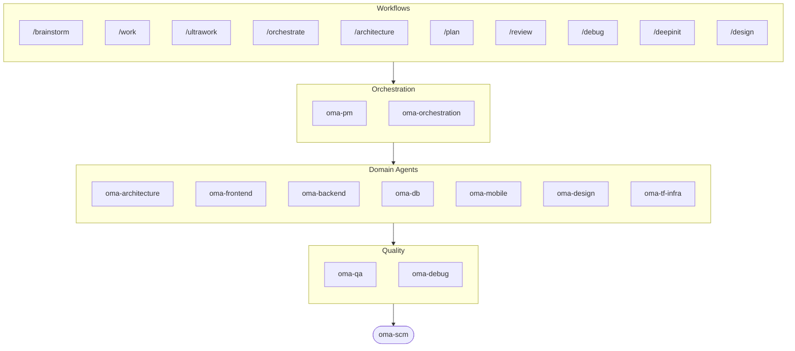

# oh-my-agent: 成果物を検証するマルチエージェント・ハーネス

[](https://www.npmjs.com/package/oh-my-agent) [](https://www.npmjs.com/package/oh-my-agent) [](https://github.com/first-fluke/oh-my-agent) [](https://github.com/first-fluke/oh-my-agent/blob/main/LICENSE) [](https://github.com/first-fluke/oh-my-agent/commits/main)

[English](../README.md) | [한국어](./README.ko.md) | [中文](./README.zh.md) | [Português](./README.pt.md) | [Français](./README.fr.md) | [Español](./README.es.md) | [Nederlands](./README.nl.md) | [Polski](./README.pl.md) | [Русский](./README.ru.md) | [Deutsch](./README.de.md) | [Tiếng Việt](./README.vi.md) | [ภาษาไทย](./README.th.md)

**エージェントは成功したと語ります。oh-my-agent は成果物を確認します。**

エージェントを並列で立ち上げるのは簡単なほうです。難しいのは、そのエージェントが本当に作業をやり切ったかどうかを知ることです。「テストは通過、すべての基準を満たした」と言うのにエージェントは何のコストも払わず、同じセッションの中にはその言葉に反証できるものが何もありません。

oh-my-agent はその主張を反証可能にします。Stop hook は、プロジェクト自身の `typecheck` / `test` / `lint` スクリプトが 0 で終了するまでセッションの終了を拒みます。ゲートコマンドは、ワークフローが本当に走ったかどうかを、走ったなら必ず残っているはずの成果物があるかどうかで判定します。結果になるのはエージェントの要約ではなく、このコマンドが返す JSON の判定です。独立した judge は毎ラウンド、まっさらなコンテキストですべての基準を検証し直します。すでに通過した基準も含めてです。ゲートの判定はひとつ残らず、あとから読める append-only のイベントログに積み上がります。そしてこの規律を、移植可能な `.agents/` ディレクトリひとつから十数種類のエージェントランタイムに同じように適用します。


[Watch the full video (35s)](./assets/video/oh-my-agent-explainer.mp4)

## クイックスタート

```bash
# macOS / Linux — bun & uv & serena がなければ自動インストール
curl -fsSL https://raw.githubusercontent.com/first-fluke/oh-my-agent/main/cli/install.sh | bash
```

```powershell
# Windows (PowerShell) — bun & uv & serena がなければ自動インストール
irm https://raw.githubusercontent.com/first-fluke/oh-my-agent/main/cli/install.ps1 | iex
```

```bash
# または手動で（任意の OS、bun + uv + serena が必要）
bunx oh-my-agent@latest
```

### Agent Package Manager でインストール

<details>
<summary>Microsoft の <a href="https://github.com/microsoft/apm">Agent Package Manager</a>（APM）はスキルだけを配布する仕組み。クリックで展開。</summary>

> `oma-observability` の APM（Application Performance Monitoring）とは別物です。

```bash
# 全スキルを検出されたすべてのランタイムに展開
# (.claude, .cursor, .codex, .opencode, .github, .agents)
apm install first-fluke/oh-my-agent

# スキル 1 つだけ
apm install first-fluke/oh-my-agent/.agents/skills/oma-frontend
```

APM が配るのはスキル一式だけです。ワークフロー、ルール、`oma-config.yaml`、キーワード検出フック、`oma agent spawn` CLI には `bunx oh-my-agent@latest` を使ってください。プロジェクトごとに配布方式は 1 つに絞り、ずれが出ないようにしましょう。

</details>

プリセットを選べばすぐ使えます:

| プリセット | 内容 |
|-----------|------|
| **All** | **すべてのエージェントとスキル** |
| Backend | architecture + backend + brainstorm + db + debug + dev-workflow + pm + qa + scm |
| Content | academic-writer + design + image + scm + translator + voice |
| DevOps | architecture + brainstorm + debug + dev-workflow + observability + pm + qa + scm + tf-infra |
| Frontend | architecture + brainstorm + debug + design + frontend + pm + qa + scm |
| Fullstack | architecture + backend + brainstorm + db + debug + design + dev-workflow + frontend + mobile + pm + qa + scm + tf-infra |
| Fullstack Mobile | architecture + backend + brainstorm + db + debug + design + dev-workflow + mobile + pm + qa + scm |
| Fullstack Web | architecture + backend + brainstorm + db + debug + design + dev-workflow + frontend + pm + qa + scm |
| Mobile | architecture + brainstorm + debug + mobile + pm + qa + scm |
| Research | academic-writer + hwp + market + pdf + scholar + scm + search + translator |

## あらゆるエージェントで動く

検証が 1 つのベンダーに縛られていては、たいした価値になりません。`oh-my-agent` は `.agents/` を唯一の真実の源（SSOT）として保ち、各ランタイムのネイティブレイアウトに投影します。だから対応するすべてのツールが同じスキル、ワークフロー、ルール、ゲートを共有でき、ベンダーの乗り換えは移行作業ではなく設定変更で済みます。

<table>
<colgroup>
<col span="6" style="width:16.67%" />
</colgroup>
<tr>
<td align="center">
<a href="https://claude.com/product/claude-code"></a><br/>
<strong>Claude Code</strong><br/>
<sub>ネイティブ + アダプター</sub>
</td>
<td align="center">
<a href="https://github.com/openai/codex"></a><br/>
<strong>Codex CLI</strong><br/>
<sub>ネイティブ + アダプター</sub>
</td>
<td align="center">
<a href="https://antigravity.google"></a><br/>
<strong>Antigravity</strong><br/>
<sub>ネイティブ SSOT</sub>
</td>
<td align="center">
<a href="https://cursor.com"></a><br/>
<strong>Cursor</strong><br/>
<sub>ネイティブ + アダプター</sub>
</td>
<td align="center">
<a href="https://github.com/QwenLM/qwen-code"></a><br/>
<strong>Qwen Code</strong><br/>
<sub>ネイティブディスパッチ</sub>
</td>
<td align="center">
<a href="https://github.com/esengine/DeepSeek-Reasonix"></a><br/>
<strong>Reasonix</strong><br/>
<sub>ネイティブ互換</sub>
</td>
</tr>
<tr>
<td align="center">
<a href="https://pi.dev/"></a><br/>
<strong>Pi</strong><br/>
<sub>ネイティブ互換</sub>
</td>
<td align="center">
<a href="https://github.com/anomalyco/opencode"></a><br/>
<strong>OpenCode</strong><br/>
<sub>ネイティブ互換</sub>
</td>
<td align="center">
<a href="https://ampcode.com"></a><br/>
<strong>Amp</strong><br/>
<sub>ネイティブ互換</sub>
</td>
<td align="center">
<a href="https://github.com/features/copilot"></a><br/>
<strong>GitHub Copilot</strong><br/>
<sub>シンボリックリンクのスキル</sub>
</td>
<td align="center">
<a href="https://grok.x.ai"></a><br/>
<strong>Grok Build</strong><br/>
<sub>ネイティブフック</sub>
</td>
<td align="center">
<a href="https://kiro.dev"></a><br/>
<strong>Kiro CLI</strong><br/>
<sub>ネイティブフック + エージェント</sub>
</td>
</tr>
</table>

<p align="center"><sub><a href="./SUPPORTED_AGENTS.md">& その他</a></sub></p>

## エンジニアリングチーム

1つのAIに全部やらせて途中で混乱する代わりに、oh-my-agentは作業を専門エージェントに分担します。各エージェントは自分の領域を深く理解し、専用ツールとチェックリストを持ち、担当範囲に集中します。

| エージェント | 役割 |
|-------------|------|
| **oma-architecture** | ADR/ATAM/CBAM分析でアーキテクチャのトレードオフを評価し、モジュール境界を定義する |
| **oma-backend** | Python、Node.js、RustでAPIを構築し、セキュリティを確保する |
| **oma-brainstorm** | 実装を決める前にアイデアをいっしょに探索する |
| **oma-db** | スキーマ、マイグレーション、インデックス、ベクトルストアを設計する |
| **oma-debug** | 根本原因を特定してバグを修正し、リグレッションテストを追加する |
| **oma-deepsec** | コードのセキュリティホールをスキャンし、危険なプルリクエストをブロックする |
| **oma-design** | トークン、アクセシビリティ、レスポンシブレイアウトを備えたデザインシステムを構築する |
| **oma-dev-workflow** | CI/CD、リリース、monorepoタスクを自動化する |
| **oma-docs** | ドキュメントの参照切れを検出し、コード変更の影響を受けた箇所を特定する |
| **oma-explanation** | diff/PR/ブランチをクイズ付きの自己完結型インタラクティブHTML解説書に変換する |
| **oma-frontend** | React/Next.js、TypeScript、Tailwind CSS v4、shadcn/uiでUIを構築する |
| **oma-mobile** | Flutterでクロスプラットフォームモバイルアプリを構築する |
| **oma-observability** | メトリクス、ログ、トレース、SLO、インシデント調査にまたがるオブザーバビリティ作業をルーティングする |
| **oma-orchestration** | CLIから複数のエージェントを並列で起動・管理する |
| **oma-pm** | タスクを計画し、要件を分解し、APIコントラクトを定義する |
| **oma-qa** | OWASPセキュリティ、パフォーマンス、アクセシビリティの観点でコードをレビューする |
| **oma-refactor** | ホットスポット選定と特性化テストの安全網で挙動を変えずにコードをリファクタリング |
| **oma-scm** | ブランチ、マージ、ワークツリー、Conventional Commitsを管理する |
| **oma-search** | クエリを最適なソースにルーティングし、結果の信頼スコアを付与する |
| **oma-tf-infra** | Terraformでマルチクラウドインフラをプロビジョニングする |

<details>
<summary>内部・メタツール</summary>

| エージェント | 役割 |
|-------------|------|
| **oma-coordination** | PM・フロントエンド・バックエンド・モバイル・QA エージェントの手動連携を段階的にガイド |
| **oma-skill-creation** | 新しいOMAスキルをSSL-liteフォーマットで作成・監査する |

</details>

## コードの先へ: コンテンツ & リサーチのパイプライン

エンジニアリングチームとは別に、oma は同じエンジニアリングの規律で作られたコンテンツ・リサーチのパイプラインも備えています。フィクスチャからの決定論的な再生、再現性のための manifest、そしてソースやベンダーキーが使えないときに黙って中身の薄い結果を返すのではなく、劣化を正直に報告する仕組みです。

| エージェント | 役割 |
|-------------|------|
| **oma-academic-writing** | アカデミック文章の起草・改稿・監査を通じ、出版品質に仕上げる |
| **oma-hwp** | HWP、HWPX、HWPMLファイルをMarkdownに変換する |
| **oma-image** | 複数のAIプロバイダーに並列で画像生成をリクエストする |
| **oma-market** | コミュニティシグナルから市場を調査し、SWOT/Porter's 5F/PESTELで整理する |
| **oma-pdf** | PDFファイルをMarkdownに変換する |
| **oma-recap** | 会話履歴をテーマ別の作業サマリーにまとめる |
| **oma-scholar** | 学術文献を検索し、ピアレビューを支援する |
| **oma-slide** | 特徴的でアニメーション豊かなHTMLプレゼンテーションデッキを生成し、PDF/PNG/PPTXへエクスポートする |
| **oma-translation** | ネイティブが書いたように自然な多言語翻訳を行う |
| **oma-video** | キー不要でも動く Remotion パイプラインでショート動画・解説動画・デモ動画を生成 |
| **oma-voice** | クラウド不要のオンデバイスでボイスオーバーを生成し、音声を文字起こしする |

## 仕組み

チャットするだけ。やりたいことを説明すれば、oh-my-agentが適切なエージェントを選びます。

```
You: "ユーザー認証付きのTODOアプリを作って"
→ PMが作業を計画
→ Backendが認証APIを構築
→ FrontendがReact UIを構築
→ DBがスキーマを設計
→ QAが全体をレビュー
→ 完了: 統制されたコード、レビュー済み
```

スラッシュコマンドで構造化されたワークフローも実行できます:

| 順 | コマンド | 説明 |
|---|---------|------|
| 0 | `/deepinit` | 既存コードベースを AGENTS.md、ARCHITECTURE.md、docs に整理 |
| 1 | `/brainstorm` | 着手前に一緒にアイデアを探る |
| 2 | `/architecture` | 設計のトレードオフを比較し、きれいなモジュール境界を引く |
| 2 | `/design` | トークン・アクセシビリティ・レスポンシブ対応のデザインシステムを構築 |
| 2 | `/plan` | 機能を優先度付きのタスクに分解 |
| 3 | `/work` | 複数エージェントで機能をステップごとに構築 |
| 3 | `/orchestrate` | 複数エージェントを並列実行して機能をより速く構築 |
| 3 | `/ultrawork` | 5つのゲート付き品質フェーズで機能を構築。すべてのレビューは新規の隔離されたレビューアーセッションで実行されます（cross-context review） |
| 3 | `/ralph` | 独立した検証担当がすべての基準を満たすまで `/ultrawork` を反復 |
| 4 | `/review` | コードのセキュリティ・パフォーマンス・アクセシビリティの問題をレビュー |
| 4 | `/deepsec` | 深層セキュリティスキャンを実行し、危険なプルリクエストをブロック |
| 5 | `/debug` | 根本原因を突き止め、バグを修正し、回帰テストを書く |
| 5 | `/docs` | ドキュメントの壊れた参照を確認し、コード変更が触れた箇所を更新 |
| 6 | `/scm` | ブランチ・マージ・Conventional Commits を管理 |
| - | `/schedule` | エージェントジョブを定期的な間隔で実行するようスケジュール |

**自動検出**: スラッシュコマンドがなくても、メッセージに「アーキテクチャ」「計画」「レビュー」「デバッグ」などのキーワードがあれば（11言語対応！）適切なワークフローが自動で起動します。検出精度は思い込みではなく計測します。`oma verify triggers` がラベル付きの171プロンプトのコーパスで検出器を採点し（現在 **見逃し 0%**、誤検出 10% 未満）、CI のゲートにします。

### エージェント別モデル

`.agents/oma-config.yaml` の `model_preset` を設定して、各エージェントが使う AI モデルを選べます:

```yaml
language: en
model_preset: mixed   # antigravity | claude | codex | cursor | kiro | mixed | qwen

# Optional per-agent overrides
agents:
  backend: { model: openai/gpt-5.5, effort: high }
```

- `oma doctor --profile` — ロール別に解決されたモデルマトリクスを出力します
- 完全ガイド: [`web/docs/guide/per-agent-models.md`](../web/docs/guide/per-agent-models.md)

## ナレーションではなく検証

以下のメカニズムはすべて機械的です。コマンドは 0 で終わるか終わらないか、ファイルはディスクにあるかないか、それだけです。作業が「正しそうに見えるか」を LLM に尋ねることはありません。

| メカニズム | 機械的に確認する内容 | 場所 |
|-----------|--------------------|------|
| **Stop hook ゲート** | persistent workflow が有効な間はセッションの終了をブロックし、終了を許可する前に設定されたゲートスクリプトを実行します。実行できるのは `typecheck`、`test`、`lint` の 3 つだけ。エージェントがそれ以外を状態ファイルに書き込んでも無視されるだけで、実行されることはありません。再強制は 5 回までなので、赤のままのゲートに閉じ込められることもありません。 | [`.agents/hooks/core/persistent-mode.ts`](../.agents/hooks/core/persistent-mode.ts) |
| **Anti-Circumvention ゲート** | `oma ralph verify --json` は、近道では偽装できない 4 つの成果物を確認します。ultrawork の phase 記録、plan JSON、**別個の QA エージェント**が残した result ファイル、**別個の refactor エージェント**が残した result ファイルです。成果物がなければ、ナレーションが何と言おうとその phase は実行されていません。 | [`.agents/workflows/ralph.md`](../.agents/workflows/ralph.md) |
| **独立した judge** | まっさらなコンテキストを持つ別エージェントとして起動し、基準だけを伝えます。実装側が何を直したと主張しているかは知らせません。毎 iteration、すでに PASS したものも含めて**すべての**基準を検証し直します。C2 を直した拍子に C1 が静かに壊れるのは、まさにそういう経路だからです。 | [`judge-protocol.md`](../.agents/workflows/ralph/resources/judge-protocol.md) |
| **イベントソースの状態管理** | ゲートの通過、ゲートの失敗、判定のひとつひとつが `~/.oma/u/0/sessions/{sid}/events.jsonl` に JSON 1 行として追記され、ベンダーとランタイムのセッション id が刻まれます。append-only、クロスベンダー、実行後も監査できます。 | [`event-spec.md`](../.agents/skills/_shared/runtime/event-spec.md) |
| **エージェント別チェックバッテリー** | `oma verify <agent>` は共通コア（スコープ違反、charter alignment、ハードコードされたシークレット、TODO スキャン、declared outputs）に、タイプ別チェック（TypeScript strict、テスト、raw SQL、Flutter analyze、インラインスタイル）を加えて実行します。 | `oma verify <agent>` |
| **スキル eval ハーネス** | `oma skill eval` は、スキルが役に立つと決めつける代わりに、ホールドアウトタスクで treatment と baseline を比較して有用性の向上幅を測定します。`oma skill optimize` は測定された向上幅を高める編集だけを残します。 | [skill-eval ガイド](../web/docs/guide/skill-eval.md) |

予算も同じやり方で強制されます。`session.quota_cap` はトークン、spawn 回数、ベンダー別の支出に上限をかけ、どれか 1 つでも超えればオーケストレーターが次の spawn を拒否します。実時間の予算が尽きたときも、Stop hook は完了したふりをせず、途中経過をイベントログに記録して正直に停止します。

## なぜ oh-my-agent？

- **ロールベース**: プロンプトの寄せ集めではなく、実際のエンジニアリングチームのように設計
- **トークン効率**: 2レイヤースキル設計でトークンを約75%節約 ([仕組み](../web/docs/guide/usage.md))
- **リカバリ可能**: リトライが2回失敗すると、`orchestrate` が hypothesis のバリアントを並列 spawn して最高スコアのものだけを残します。間違ったアプローチをいつまでもやり直し続けることはありません
- **モノレポ対応**: `detectWorkspace` が pnpm / nx / turbo / lerna を読み取り、各エージェントを担当 workspace にルーティングします
- **マルチベンダー**: エージェントタイプごとにAntigravity、Claude、Codex、Cursor、Kiro、Qwenを混在可能
- **可観測性**: ターミナルとWebダッシュボードでリアルタイムにモニタリング

## アーキテクチャ



## もっと詳しく

- **[詳細ドキュメント](./AGENTS_SPEC.md)**: 完全な技術仕様とアーキテクチャ
- **[対応エージェント](./SUPPORTED_AGENTS.md)**: IDE別エージェント対応状況
- **[ベンチマークレポート](../benchmarks/README.md)**: 方法論、スコア、スクリーンショット、注意点
- **[Webドキュメント](https://first-fluke.github.io/oh-my-agent/)**: ガイド、チュートリアル、CLIリファレンス

## スポンサー

このプロジェクトは素敵なスポンサーの皆さんのおかげで維持されています。

> **気に入りましたか？** スターをお願いします！
>
> ```bash
> gh api --method PUT /user/starred/first-fluke/oh-my-agent
> ```
>
> 最適化されたスターターテンプレートもどうぞ: [fullstack-starter](https://github.com/first-fluke/fullstack-starter)

<a href="https://github.com/sponsors/first-fluke">
  
</a>
<a href="https://buymeacoffee.com/firstfluke">
  
</a>

### 🚀 Champion

<!-- Champion tier ($100/mo) logos here -->

### 🛸 Booster

<!-- Booster tier ($30/mo) logos here -->

### ☕ Contributor

<!-- Contributor tier ($10/mo) names here -->

[スポンサーになる →](https://github.com/sponsors/first-fluke)

全サポーターの一覧は [SPONSORS.md](../SPONSORS.md) をご覧ください。


## Star History

[](https://star-history.dera.page/#first-fluke/oh-my-agent&type=date&legend=bottom-right)


## 参考文献

- Li, X., Liu, Y., Chen, W., You, B., Di, Z., He, Y., Zheng, S., Choe, K. W., Sun, J., Wang, S., Tao, C., Li, B., Zhao, X., Geng, H., Wu, X., Zhou, J., Chen, X., Xing, H., Li, Y., … Song, D. (2026). *SkillsBench: Benchmarking how well agent skills work across diverse tasks* (Version 4) [Preprint]. arXiv. https://doi.org/10.48550/arXiv.2602.12670
- Yu, G., & Wang, X. (2026). *Knows: Agent-native structured research representations* (Version 1) [Preprint]. arXiv. https://doi.org/10.48550/arXiv.2604.17309
- Liang, Q., Wang, H., Liang, Z., & Liu, Y. (2026). *From skill text to skill structure: The scheduling-structural-logical representation for agent skills* (Version 4) [Preprint]. arXiv. https://doi.org/10.48550/arXiv.2604.24026
- Chen, C., Yu, Q., Gu, Y., Huang, Z., Li, H., Liu, H., Liu, S., Liu, J., Peng, D., Wang, J., Yan, Z., Meng, F., Qin, E., Che, C., & Hu, M. (2026). *The scaling laws of skills in LLM agent systems* (Version 1) [Preprint]. arXiv. https://doi.org/10.48550/arXiv.2605.16508
- Tang, L., Rashtchian, C., Ferng, C.-S., Tomkins, A., Juan, D.-C., & Vu, T. (2026). *WikiSkill: Compiling agent experience into persistent knowledge for skill evolution* [Preprint]. arXiv. https://doi.org/10.48550/arXiv.2608.27454
- Huang, Z., Xu, J., Yang, Y., Gong, Z., Yang, Q., Tian, M., Wang, X., Lv, C., Gao, X., Dai, Q., Liu, B., Qiu, K., Yang, X., Chen, D., Zheng, X., & Luo, C. (2026). *From raw experience to skill consumption: A systematic study of model-generated agent skills* [Preprint]. arXiv. https://doi.org/10.48550/arXiv.2605.23899
- Hong, D. B., Imani, A., & Ahmed, I. (2026). *From anatomy to smells: An empirical study of SKILL.md in agent skills* (Version 2) [Preprint]. arXiv. https://doi.org/10.48550/arXiv.2607.01456


## ライセンス

MIT
