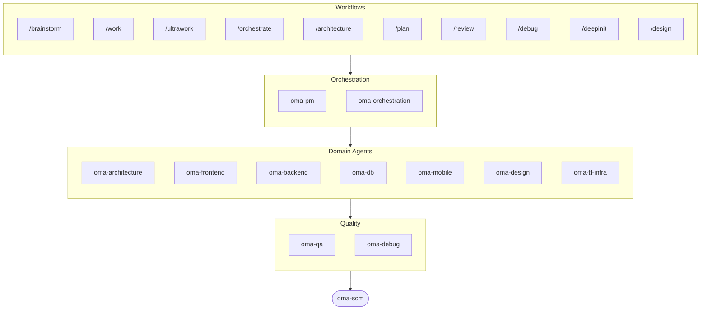

# oh-my-agent: 결과물을 직접 확인하는 멀티 에이전트 하네스

[](https://www.npmjs.com/package/oh-my-agent) [](https://www.npmjs.com/package/oh-my-agent) [](https://github.com/first-fluke/oh-my-agent) [](https://github.com/first-fluke/oh-my-agent/blob/main/LICENSE) [](https://github.com/first-fluke/oh-my-agent/commits/main)

[English](../README.md) | [中文](./README.zh.md) | [Português](./README.pt.md) | [日本語](./README.ja.md) | [Français](./README.fr.md) | [Español](./README.es.md) | [Nederlands](./README.nl.md) | [Polski](./README.pl.md) | [Русский](./README.ru.md) | [Deutsch](./README.de.md) | [Tiếng Việt](./README.vi.md) | [ภาษาไทย](./README.th.md)

**에이전트는 성공했다고 말합니다. oh-my-agent는 결과물을 확인합니다.**

에이전트를 병렬로 띄우는 건 쉬운 쪽입니다. 어려운 건 그 에이전트들이 실제로 일을 했는지 아는 것이죠. "테스트 통과, 모든 기준 충족"이라는 말은 에이전트에게 아무 비용도 들지 않고, 같은 세션 안에는 그 말을 반박할 수 있는 게 아무것도 없습니다.

oh-my-agent는 그 주장을 반증 가능하게 만듭니다. Stop hook은 프로젝트 자체의 `typecheck` / `test` / `lint` 스크립트가 0으로 종료되기 전까지 세션 종료를 거부합니다. 게이트 커맨드는 워크플로우가 정말 돌았는지를, 돌았다면 반드시 남아 있어야 할 산출물이 있는지로 판정합니다. 결과가 되는 것은 에이전트의 요약이 아니라 이 커맨드의 JSON 판정입니다. 독립 judge는 매 라운드마다 새 컨텍스트에서 모든 기준을 다시 검증합니다. 이미 통과한 기준까지 포함해서요. 모든 게이트 판정은 나중에 읽어볼 수 있는 append-only 이벤트 로그에 쌓입니다. 그리고 이 규율을 하나의 이식 가능한 `.agents/` 디렉터리에서 열 개가 넘는 에이전트 런타임에 똑같이 적용합니다.


[Watch the full video (35s)](./assets/video/oh-my-agent-explainer.mp4)

## 빠른 시작

```bash
# macOS / Linux — bun, uv, serena가 없으면 자동으로 설치됩니다
curl -fsSL https://raw.githubusercontent.com/first-fluke/oh-my-agent/main/cli/install.sh | bash
```

```powershell
# Windows (PowerShell) — bun, uv, serena가 없으면 자동으로 설치됩니다
irm https://raw.githubusercontent.com/first-fluke/oh-my-agent/main/cli/install.ps1 | iex
```

```bash
# 또는 직접 실행 (모든 OS, bun + uv + serena 필요)
bunx oh-my-agent@latest
```

### Agent Package Manager로 설치

<details>
<summary>Microsoft의 <a href="https://github.com/microsoft/apm">Agent Package Manager</a> (APM): 스킬 전용 배포. 클릭하면 펼쳐집니다.</summary>

> `oma-observability`의 APM(Application Performance Monitoring)과는 다릅니다.

```bash
# 스킬 전체를 감지된 모든 런타임에 배포
# (.claude, .cursor, .codex, .opencode, .github, .agents)
apm install first-fluke/oh-my-agent

# 스킬 하나만
apm install first-fluke/oh-my-agent/.agents/skills/oma-frontend
```

APM은 스킬만 제공합니다. 워크플로우, 규칙, `oma-config.yaml`, 키워드 감지 훅, `oma agent spawn` CLI는 `bunx oh-my-agent@latest`를 쓰세요. 드리프트를 피하려면 프로젝트당 한 가지 배포 방식만 고르는 게 좋습니다.

</details>

프리셋만 고르면 바로 시작할 수 있습니다:

| 프리셋 | 구성 |
|--------|------|
| **All** | **모든 에이전트와 스킬** |
| Backend | architecture + backend + brainstorm + db + debug + dev-workflow + pm + qa + scm |
| Content | academic-writer + design + image + scm + translator + voice |
| DevOps | architecture + brainstorm + debug + dev-workflow + observability + pm + qa + scm + tf-infra |
| Frontend | architecture + brainstorm + debug + design + frontend + pm + qa + scm |
| Fullstack | architecture + backend + brainstorm + db + debug + design + dev-workflow + frontend + mobile + pm + qa + scm + tf-infra |
| Fullstack Mobile | architecture + backend + brainstorm + db + debug + design + dev-workflow + mobile + pm + qa + scm |
| Fullstack Web | architecture + backend + brainstorm + db + debug + design + dev-workflow + frontend + pm + qa + scm |
| Mobile | architecture + brainstorm + debug + mobile + pm + qa + scm |
| Research | academic-writer + hwp + market + pdf + scholar + scm + search + translator |

## 모든 에이전트에서 동작

검증이 한 벤더에만 묶여 있다면 그 가치는 크지 않습니다. `oh-my-agent`는 `.agents/`를 단일 소스(SSOT)로 유지하면서 각 런타임의 네이티브 레이아웃으로 그대로 투영합니다. 덕분에 지원되는 도구 전부가 같은 스킬, 워크플로우, 규칙, 게이트를 공유하고, 벤더를 바꾸는 일은 마이그레이션이 아니라 설정 변경이 됩니다.

<table>
<colgroup>
<col span="6" style="width:16.67%" />
</colgroup>
<tr>
<td align="center">
<a href="https://claude.com/product/claude-code"></a><br/>
<strong>Claude Code</strong><br/>
<sub>네이티브 + 어댑터</sub>
</td>
<td align="center">
<a href="https://github.com/openai/codex"></a><br/>
<strong>Codex CLI</strong><br/>
<sub>네이티브 + 어댑터</sub>
</td>
<td align="center">
<a href="https://antigravity.google"></a><br/>
<strong>Antigravity</strong><br/>
<sub>네이티브 SSOT</sub>
</td>
<td align="center">
<a href="https://cursor.com"></a><br/>
<strong>Cursor</strong><br/>
<sub>네이티브 + 어댑터</sub>
</td>
<td align="center">
<a href="https://github.com/QwenLM/qwen-code"></a><br/>
<strong>Qwen Code</strong><br/>
<sub>네이티브 디스패치</sub>
</td>
<td align="center">
<a href="https://github.com/esengine/DeepSeek-Reasonix"></a><br/>
<strong>Reasonix</strong><br/>
<sub>네이티브 호환</sub>
</td>
</tr>
<tr>
<td align="center">
<a href="https://pi.dev/"></a><br/>
<strong>Pi</strong><br/>
<sub>네이티브 호환</sub>
</td>
<td align="center">
<a href="https://github.com/anomalyco/opencode"></a><br/>
<strong>OpenCode</strong><br/>
<sub>네이티브 호환</sub>
</td>
<td align="center">
<a href="https://ampcode.com"></a><br/>
<strong>Amp</strong><br/>
<sub>네이티브 호환</sub>
</td>
<td align="center">
<a href="https://github.com/features/copilot"></a><br/>
<strong>GitHub Copilot</strong><br/>
<sub>심볼릭 링크 스킬</sub>
</td>
<td align="center">
<a href="https://grok.x.ai"></a><br/>
<strong>Grok Build</strong><br/>
<sub>네이티브 훅</sub>
</td>
<td align="center">
<a href="https://kiro.dev"></a><br/>
<strong>Kiro CLI</strong><br/>
<sub>네이티브 훅 + 에이전트</sub>
</td>
</tr>
</table>

<p align="center"><sub><a href="./SUPPORTED_AGENTS.md">& 더 보기</a></sub></p>

## 엔지니어링 팀

AI 하나에 모든 걸 맡기면 중간에 헤매기 쉽지만, oh-my-agent는 작업을 전문 에이전트들에게 나눠 맡깁니다. 각 에이전트는 자기 영역을 깊이 알고, 전용 도구와 체크리스트를 갖춘 채 맡은 역할에만 집중합니다.

| 에이전트 | 하는 일 |
|----------|------|
| **oma-architecture** | 아키텍처 트레이드오프를 검토하고 모듈 경계를 정의하며 ADR/ATAM/CBAM 분석 수행 |
| **oma-backend** | Python, Node.js, Rust로 API를 구축하고 보안 강화 |
| **oma-brainstorm** | 구현을 결정하기 전에 함께 아이디어를 탐색 |
| **oma-db** | 스키마, 마이그레이션, 인덱스, vector store 설계 |
| **oma-debug** | 근본 원인을 찾아 버그를 수정하고 회귀 테스트 작성 |
| **oma-deepsec** | 코드의 보안 취약점을 스캔하고 위험한 PR을 차단 |
| **oma-design** | 토큰, 접근성, 반응형 레이아웃을 갖춘 디자인 시스템 구축 |
| **oma-dev-workflow** | CI/CD, 릴리스, monorepo 작업을 자동화 |
| **oma-docs** | 문서의 깨진 참조를 확인하고 코드 변경에 영향받은 문서를 식별 |
| **oma-explanation** | diff/PR/브랜치를 퀴즈가 포함된 self-contained 인터랙티브 HTML 설명서로 생성 |
| **oma-frontend** | React/Next.js, TypeScript, Tailwind CSS v4, shadcn/ui로 UI 구축 |
| **oma-mobile** | Flutter로 크로스플랫폼 모바일 앱 구축 |
| **oma-observability** | 메트릭, 로그, 트레이스, SLO, 인시던트 포렌식까지 아우르는 관측성 작업을 라우팅 |
| **oma-orchestration** | CLI에서 여러 에이전트를 병렬로 실행 |
| **oma-pm** | 태스크를 계획하고 요구사항을 분해하며 API 계약을 정의 |
| **oma-qa** | OWASP 보안, 성능, 접근성 관점에서 코드를 리뷰 |
| **oma-refactor** | 핫스팟 우선순위와 특성화 테스트 안전망으로 동작을 보존하면서 코드를 리팩토링 |
| **oma-scm** | 브랜치, 머지, 워크트리, Conventional Commits 관리 |
| **oma-search** | 각 쿼리를 최적 소스로 라우팅하고 결과의 신뢰 점수를 제공 |
| **oma-tf-infra** | Terraform으로 멀티 클라우드 인프라를 프로비저닝 |

<details>
<summary>내부 및 메타 도구</summary>

| 에이전트 | 하는 일 |
|----------|------|
| **oma-coordination** | PM, Frontend, Backend, Mobile, QA 에이전트의 단계별 수동 조율을 안내 |
| **oma-skill-creation** | SSL-lite 포맷으로 새로운 OMA 스킬을 작성하고 검증 |

</details>

## 코드 너머: 콘텐츠 & 리서치 파이프라인

엔지니어링 팀과는 별개로, oma는 같은 엔지니어링 규율로 만든 콘텐츠·리서치 파이프라인도 함께 제공합니다. 픽스처 기반 결정론적 재현, 재현성을 위한 manifest, 그리고 소스나 벤더 키를 쓸 수 없을 때 결과물을 소리 없이 얄팍하게 만드는 대신 degradation을 정직하게 보고하는 방식입니다.

| 에이전트 | 하는 일 |
|----------|------|
| **oma-academic-writing** | 학술 문장을 출판 수준으로 작성·수정하고 감사 |
| **oma-hwp** | HWP, HWPX, HWPML 파일을 Markdown으로 변환 |
| **oma-image** | 여러 AI 공급업체로 이미지를 동시에 생성 |
| **oma-market** | 커뮤니티 시그널로 시장을 조사하고 SWOT, Porter's 5F, PESTEL로 프레임화 |
| **oma-pdf** | PDF 파일을 Markdown으로 변환 |
| **oma-recap** | 대화 이력을 주제별 작업 요약으로 정리 |
| **oma-scholar** | 학술 문헌을 검색하고 동료 평가를 지원 |
| **oma-slide** | 애니메이션이 풍부한 HTML 프레젠테이션 덱을 생성하고 PDF/PNG/PPTX로 내보냄 |
| **oma-translation** | 원어민이 쓴 것처럼 자연스럽게 언어 간 번역 |
| **oma-video** | 키 없이도 동작하는 Remotion 파이프라인으로 숏폼, 설명 영상, 데모 영상을 생성 |
| **oma-voice** | 클라우드 없이 온디바이스로 보이스오버를 생성하고 오디오를 텍스트로 변환 |

## 작동 방식

그냥 채팅하듯 말하면 됩니다. 원하는 걸 설명하면 oh-my-agent가 알아서 적절한 에이전트를 골라줍니다.

```
You: "사용자 인증이 있는 TODO 앱 만들어줘"
→ PM이 작업을 계획
→ Backend가 인증 API 구축
→ Frontend가 React UI 구축
→ DB가 스키마 설계
→ QA가 전체 리뷰
→ 완료: 서로 맞물린 코드, 리뷰까지 마침
```

슬래시 커맨드로 구조화된 워크플로우를 실행할 수도 있습니다:

| 순서 | 커맨드 | 하는 일 |
|------|--------|------|
| 0 | `/deepinit` | 기존 코드베이스를 AGENTS.md, ARCHITECTURE.md, docs로 정리 |
| 1 | `/brainstorm` | 만들기 전에 함께 아이디어 탐색 |
| 2 | `/architecture` | 설계 트레이드오프를 따져보고 깔끔한 모듈 경계 설계 |
| 2 | `/design` | 토큰, 접근성, 반응형 레이아웃까지 갖춘 디자인 시스템 구축 |
| 2 | `/plan` | 기능을 우선순위가 매겨진 태스크로 분해 |
| 3 | `/work` | 여러 에이전트로 기능을 단계별로 구축 |
| 3 | `/orchestrate` | 여러 에이전트를 병렬로 돌려 기능을 더 빠르게 구축 |
| 3 | `/ultrawork` | 다섯 개의 게이트가 있는 품질 페이즈로 기능을 구축하며, 모든 리뷰는 새로 격리된 리뷰어 세션에서 실행됩니다(cross-context review) |
| 3 | `/ralph` | 독립 검증기가 모든 기준을 통과할 때까지 `/ultrawork` 반복 |
| 4 | `/review` | 보안, 성능, 접근성 관점에서 코드 리뷰 |
| 4 | `/deepsec` | 심층 보안 스캔을 돌려 위험한 풀 리퀘스트 차단 |
| 5 | `/debug` | 근본 원인을 찾아 버그를 고치고 회귀 테스트 작성 |
| 5 | `/docs` | 문서의 깨진 참조를 점검하고 코드 변경이 닿은 곳 보완 |
| 6 | `/scm` | 브랜치, 머지, Conventional Commits 관리 |
| - | `/schedule` | 에이전트 작업을 주기적으로 실행하도록 예약 |

**자동 감지**: 슬래시 커맨드를 쓰지 않아도, 메시지에 "아키텍처", "계획", "리뷰", "디버그" 같은 키워드만 있으면 (11개 언어 지원!) 맞는 워크플로우가 자동으로 실행됩니다. 감지 정확도는 가정하지 않고 측정합니다. `oma verify triggers`가 라벨링된 171개 프롬프트 코퍼스로 감지기를 채점하고(현재 **미발화 0%**, 오발화 10% 미만) 이를 CI 게이트로 사용합니다.

### 에이전트별 모델

`.agents/oma-config.yaml`에서 `model_preset`을 설정해 각 에이전트가 사용할 AI 모델을 고를 수 있습니다:

```yaml
language: en
model_preset: mixed   # antigravity | claude | codex | cursor | kiro | mixed | qwen

# Optional per-agent overrides
agents:
  backend: { model: openai/gpt-5.5, effort: high }
```

- `oma doctor --profile` — 역할별로 해석된 모델 매트릭스를 출력합니다
- 전체 가이드: [`web/docs/guide/per-agent-models.md`](../web/docs/guide/per-agent-models.md)

## 서술이 아니라 검증

아래 메커니즘은 전부 기계적입니다. 커맨드는 0으로 끝나거나 끝나지 않고, 파일은 디스크에 있거나 없습니다. 작업이 "맞아 보이는지"를 LLM에게 묻지 않습니다.

| 메커니즘 | 기계적으로 확인하는 것 | 위치 |
|----------|------------------------|------|
| **Stop hook 게이트** | persistent workflow가 활성인 동안 세션 종료를 막고, 종료를 허용하기 전에 설정된 게이트 스크립트를 실행합니다. 실행할 수 있는 건 `typecheck`, `test`, `lint` 셋뿐입니다. 에이전트가 상태 파일에 그 밖의 것을 써 넣어도 무시될 뿐 절대 실행되지 않습니다. 재강제는 5회로 제한되어 계속 빨간 게이트에 발이 묶이는 일은 없습니다. | [`.agents/hooks/core/persistent-mode.ts`](../.agents/hooks/core/persistent-mode.ts) |
| **Anti-Circumvention 게이트** | `oma ralph verify --json`은 지름길로 위조할 수 없는 네 가지 산출물을 확인합니다. ultrawork의 phase 기록, plan JSON, **별개의 QA 에이전트**가 남긴 result 파일, **별개의 refactor 에이전트**가 남긴 result 파일입니다. 산출물이 없다면 서술이 무엇이라 말하든 그 phase는 실행되지 않은 것입니다. | [`.agents/workflows/ralph.md`](../.agents/workflows/ralph.md) |
| **독립 judge** | 새 컨텍스트를 가진 별도 에이전트로 띄우고 기준만 브리핑합니다. 구현자가 무엇을 고쳤다고 주장하는지는 알려주지 않습니다. 매 iteration마다 이미 PASS한 것까지 포함해 **모든** 기준을 다시 검증합니다. C2를 고치다가 C1이 조용히 깨지는 게 바로 그런 식이기 때문입니다. | [`judge-protocol.md`](../.agents/workflows/ralph/resources/judge-protocol.md) |
| **이벤트 소싱 상태** | 게이트 통과, 게이트 실패, 판정 하나하나가 `~/.oma/u/0/sessions/{sid}/events.jsonl`에 JSON 한 줄로 추가되고 벤더와 런타임 세션 id가 함께 찍힙니다. append-only, 크로스 벤더, 실행이 끝난 뒤에도 감사 가능합니다. | [`event-spec.md`](../.agents/skills/_shared/runtime/event-spec.md) |
| **에이전트별 체크 배터리** | `oma verify <agent>`는 공통 코어(스코프 위반, charter alignment, 하드코딩 시크릿, TODO 스캔, declared outputs)에 유형별 체크(TypeScript strict, 테스트, raw SQL, Flutter analyze, 인라인 스타일)를 더해 실행합니다. | `oma verify <agent>` |
| **스킬 eval 하네스** | `oma skill eval`은 스킬이 도움이 된다고 가정하는 대신, 홀드아웃 태스크에서 treatment와 baseline을 비교해 유용성 향상폭을 측정합니다. `oma skill optimize`는 측정된 향상폭을 높이는 수정만 남깁니다. | [skill-eval 가이드](../web/docs/guide/skill-eval.md) |

예산도 같은 방식으로 강제됩니다. `session.quota_cap`은 토큰, spawn 횟수, 벤더별 지출에 상한을 걸고, 한 축이라도 넘어서면 오케스트레이터가 다음 spawn을 거부합니다. 실행 시간 예산이 바닥나면 Stop hook은 완료한 척하는 대신 부분 상태를 이벤트 로그에 남기고 정직하게 멈춥니다.

### 제어 경계

oh-my-agent는 개방형 planning과 다음 action 선택을 host LLM에 맡깁니다. 그 판단을 범용 workflow graph나 policy engine으로 대체하지 않습니다. 대신 모델과 무관하게 지켜야 하는 invariant, 즉 tool guardrail, permission, budget, retry와 stop 한도, durable event, 기계적으로 검증되는 완료 조건을 외부화합니다. Structured event는 decision과 gate 결과를 기록하지만 별도의 planner처럼 동작하지 않습니다.

따라서 deterministic SLM 실행은 현재 harness에 빠진 infrastructure가 아니라, 필요가 입증될 때 별도로 선택할 수 있는 product direction입니다.

## 왜 oh-my-agent인가?

- **역할 기반**: 프롬프트 뭉치가 아니라 실제 엔지니어링 팀처럼 설계했습니다
- **토큰 효율**: 2계층 스킬 구조로 토큰을 약 75% 절감합니다 ([작동 방식](../web/docs/guide/usage.md))
- **복구 가능**: retry 2회가 실패하면 `orchestrate`가 hypothesis 변형을 병렬 spawn하고 최고 점수만 남깁니다. 틀린 접근을 언제까지고 다시 시도하지 않습니다
- **모노레포 인식**: `detectWorkspace`가 pnpm / nx / turbo / lerna를 읽어 각 에이전트를 자기 workspace로 보냅니다
- **멀티 벤더**: 에이전트 유형별로 Antigravity, Claude, Codex, Cursor, Kiro, Qwen을 섞어 쓸 수 있습니다
- **가시성**: 터미널과 웹 대시보드로 실시간 모니터링이 가능합니다

## 아키텍처



## 더 알아보기

- **[상세 문서](./AGENTS_SPEC.md)**: 전체 기술 스펙과 아키텍처
- **[지원 에이전트](./SUPPORTED_AGENTS.md)**: IDE별 에이전트 지원 현황
- **[벤치마크 리포트](../benchmarks/README.md)**: 방법론, 점수, 스크린샷, 유의사항
- **[웹 문서](https://first-fluke.github.io/oh-my-agent/)**: 가이드, 튜토리얼, CLI 레퍼런스

## 스폰서

이 프로젝트는 든든한 스폰서 여러분 덕분에 이어지고 있습니다.

> **마음에 드셨나요?** 스타를 눌러주세요!
>
> ```bash
> gh api --method PUT /user/starred/first-fluke/oh-my-agent
> ```
>
> 최적화된 스타터 템플릿도 함께 확인해보세요: [fullstack-starter](https://github.com/first-fluke/fullstack-starter)

<a href="https://github.com/sponsors/first-fluke">
  
</a>
<a href="https://buymeacoffee.com/firstfluke">
  
</a>

### 🚀 Champion

<!-- Champion tier ($100/mo) logos here -->

### 🛸 Booster

<!-- Booster tier ($30/mo) logos here -->

### ☕ Contributor

<!-- Contributor tier ($10/mo) names here -->

[스폰서 되기 →](https://github.com/sponsors/first-fluke)

전체 후원자 목록은 [SPONSORS.md](../SPONSORS.md)를 참고하세요.


## Star History

[](https://star-history.dera.page/#first-fluke/oh-my-agent&type=date&legend=bottom-right)


## 참고문헌

- Li, X., Liu, Y., Chen, W., You, B., Di, Z., He, Y., Zheng, S., Choe, K. W., Sun, J., Wang, S., Tao, C., Li, B., Zhao, X., Geng, H., Wu, X., Zhou, J., Chen, X., Xing, H., Li, Y., … Song, D. (2026). *SkillsBench: Benchmarking how well agent skills work across diverse tasks* (Version 4) [Preprint]. arXiv. https://doi.org/10.48550/arXiv.2602.12670
- Yu, G., & Wang, X. (2026). *Knows: Agent-native structured research representations* (Version 1) [Preprint]. arXiv. https://doi.org/10.48550/arXiv.2604.17309
- Liang, Q., Wang, H., Liang, Z., & Liu, Y. (2026). *From skill text to skill structure: The scheduling-structural-logical representation for agent skills* (Version 4) [Preprint]. arXiv. https://doi.org/10.48550/arXiv.2604.24026
- Chen, C., Yu, Q., Gu, Y., Huang, Z., Li, H., Liu, H., Liu, S., Liu, J., Peng, D., Wang, J., Yan, Z., Meng, F., Qin, E., Che, C., & Hu, M. (2026). *The scaling laws of skills in LLM agent systems* (Version 1) [Preprint]. arXiv. https://doi.org/10.48550/arXiv.2605.16508
- Tang, L., Rashtchian, C., Ferng, C.-S., Tomkins, A., Juan, D.-C., & Vu, T. (2026). *WikiSkill: Compiling agent experience into persistent knowledge for skill evolution* [Preprint]. arXiv. https://doi.org/10.48550/arXiv.2608.27454
- Huang, Z., Xu, J., Yang, Y., Gong, Z., Yang, Q., Tian, M., Wang, X., Lv, C., Gao, X., Dai, Q., Liu, B., Qiu, K., Yang, X., Chen, D., Zheng, X., & Luo, C. (2026). *From raw experience to skill consumption: A systematic study of model-generated agent skills* [Preprint]. arXiv. https://doi.org/10.48550/arXiv.2605.23899
- Hong, D. B., Imani, A., & Ahmed, I. (2026). *From anatomy to smells: An empirical study of SKILL.md in agent skills* (Version 2) [Preprint]. arXiv. https://doi.org/10.48550/arXiv.2607.01456


## 라이선스

MIT
