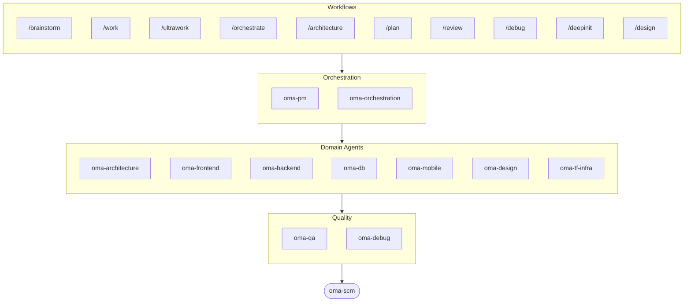

# oh-my-agent: De multi-agent harness die het werk controleert

[](https://www.npmjs.com/package/oh-my-agent) [](https://www.npmjs.com/package/oh-my-agent) [](https://github.com/first-fluke/oh-my-agent) [](https://github.com/first-fluke/oh-my-agent/blob/main/LICENSE) [](https://github.com/first-fluke/oh-my-agent/commits/main)

[English](../README.md) | [한국어](./README.ko.md) | [中文](./README.zh.md) | [Português](./README.pt.md) | [日本語](./README.ja.md) | [Français](./README.fr.md) | [Español](./README.es.md) | [Polski](./README.pl.md) | [Русский](./README.ru.md) | [Deutsch](./README.de.md) | [Tiếng Việt](./README.vi.md) | [ภาษาไทย](./README.th.md)

**Agents vertellen over succes. oh-my-agent controleert de artefacten.**

Parallelle agents spawnen is het makkelijke deel. Het moeilijke deel is weten of ze het werk daadwerkelijk hebben gedaan. "Tests slagen, aan alle criteria voldaan" kost een agent niets om te zeggen, en niets binnen diezelfde sessie kan het tegenspreken.

oh-my-agent maakt die bewering falsifieerbaar. Een Stop-hook weigert je sessie te beëindigen zolang het `typecheck`- / `test`- / `lint`-script van je eigen project niet met exitcode 0 afsluit. Een gate-commando bepaalt of een workflow echt heeft gedraaid door te kijken naar de artefacten die hij moet hebben achtergelaten — en het JSON-oordeel daarvan is het resultaat, niet de samenvatting van de agent. Een onafhankelijke judge met een verse context verifieert elke ronde opnieuw elk criterium, ook de criteria die al geslaagd waren. Elke gate-beslissing komt terecht in een append-only event log dat je achteraf kunt lezen. En diezelfde discipline draait over een tiental agent-runtimes heen, vanuit één draagbare `.agents/`-map.


[Watch the full video (35s)](./assets/video/oh-my-agent-explainer.mp4)

## Snel starten

```bash
# macOS / Linux — installeert bun, uv & serena automatisch als ze ontbreken
curl -fsSL https://raw.githubusercontent.com/first-fluke/oh-my-agent/main/cli/install.sh | bash
```

```powershell
# Windows (PowerShell) — installeert bun, uv & serena automatisch als ze ontbreken
irm https://raw.githubusercontent.com/first-fluke/oh-my-agent/main/cli/install.ps1 | iex
```

```bash
# Of handmatig (elk OS, vereist bun + uv + serena)
bunx oh-my-agent@latest
```

### Installatie via Agent Package Manager

<details>
<summary>Microsofts <a href="https://github.com/microsoft/apm">Agent Package Manager</a> (APM): alleen skills. Klik om uit te klappen.</summary>

> Niet te verwarren met de APM (Application Performance Monitoring) van `oma-observability`.

```bash
# Alle skills, uitgerold naar elke gedetecteerde runtime
# (.claude, .cursor, .codex, .opencode, .github, .agents)
apm install first-fluke/oh-my-agent

# Eén skill
apm install first-fluke/oh-my-agent/.agents/skills/oma-frontend
```

APM levert alleen de skills. Voor workflows, regels, `oma-config.yaml`, keyword-detection-hooks en de `oma agent spawn`-CLI gebruik je `bunx oh-my-agent@latest`. Kies per project één distributie, anders loopt het uit elkaar.

</details>

Kies een preset en je bent klaar:

| Preset | Wat je krijgt |
|--------|-------------|
| **All** | **Alle agents en skills** |
| Backend | architecture + backend + brainstorm + db + debug + dev-workflow + pm + qa + scm |
| Content | academic-writer + design + image + scm + translator + voice |
| DevOps | architecture + brainstorm + debug + dev-workflow + observability + pm + qa + scm + tf-infra |
| Frontend | architecture + brainstorm + debug + design + frontend + pm + qa + scm |
| Fullstack | architecture + backend + brainstorm + db + debug + design + dev-workflow + frontend + mobile + pm + qa + scm + tf-infra |
| Fullstack Mobile | architecture + backend + brainstorm + db + debug + design + dev-workflow + mobile + pm + qa + scm |
| Fullstack Web | architecture + backend + brainstorm + db + debug + design + dev-workflow + frontend + pm + qa + scm |
| Mobile | architecture + brainstorm + debug + mobile + pm + qa + scm |
| Research | academic-writer + hwp + market + pdf + scholar + scm + search + translator |

## Werkt met elke Agent

Verificatie is weinig waard als ze aan één vendor vastzit. `oh-my-agent` houdt `.agents/` als enige bron van waarheid (SSOT) en projecteert het op de native layout van elke runtime. Zo delen alle ondersteunde tools dezelfde skills, workflows, regels en gates — en is wisselen van vendor een configuratiewijziging, geen migratie.

<table>
<colgroup>
<col span="6" style="width:16.67%" />
</colgroup>
<tr>
<td align="center">
<a href="https://claude.com/product/claude-code"></a><br/>
<strong>Claude Code</strong><br/>
<sub>native + adapter</sub>
</td>
<td align="center">
<a href="https://github.com/openai/codex"></a><br/>
<strong>Codex CLI</strong><br/>
<sub>native + adapter</sub>
</td>
<td align="center">
<a href="https://antigravity.google"></a><br/>
<strong>Antigravity</strong><br/>
<sub>native SSOT</sub>
</td>
<td align="center">
<a href="https://cursor.com"></a><br/>
<strong>Cursor</strong><br/>
<sub>native + adapter</sub>
</td>
<td align="center">
<a href="https://github.com/QwenLM/qwen-code"></a><br/>
<strong>Qwen Code</strong><br/>
<sub>native dispatch</sub>
</td>
<td align="center">
<a href="https://github.com/esengine/DeepSeek-Reasonix"></a><br/>
<strong>Reasonix</strong><br/>
<sub>native compatibel</sub>
</td>
</tr>
<tr>
<td align="center">
<a href="https://pi.dev/"></a><br/>
<strong>Pi</strong><br/>
<sub>native compatibel</sub>
</td>
<td align="center">
<a href="https://github.com/anomalyco/opencode"></a><br/>
<strong>OpenCode</strong><br/>
<sub>native compatibel</sub>
</td>
<td align="center">
<a href="https://ampcode.com"></a><br/>
<strong>Amp</strong><br/>
<sub>native compatibel</sub>
</td>
<td align="center">
<a href="https://github.com/features/copilot"></a><br/>
<strong>GitHub Copilot</strong><br/>
<sub>skills via symlink</sub>
</td>
<td align="center">
<a href="https://grok.x.ai"></a><br/>
<strong>Grok Build</strong><br/>
<sub>native hooks</sub>
</td>
<td align="center">
<a href="https://kiro.dev"></a><br/>
<strong>Kiro CLI</strong><br/>
<sub>native hooks + agents</sub>
</td>
</tr>
</table>

<p align="center"><sub><a href="./SUPPORTED_AGENTS.md">& meer</a></sub></p>

## Jouw engineeringteam

In plaats van een enkele AI die alles doet (en halverwege de draad kwijtraakt), verdeelt oh-my-agent het werk over gespecialiseerde agents. Elk van hen kent zijn domein door en door, heeft eigen tools en checklists, en blijft in zijn eigen baan.

| Agent | Wat ze doen |
|-------|-------------|
| **oma-architecture** | Weegt architectuurafwegingen af en bepaalt modulegrenzen met ADR/ATAM/CBAM-analyse |
| **oma-backend** | Bouwt en beveiligt je API's in Python, Node.js of Rust |
| **oma-brainstorm** | Verkent ideeën samen met jou voordat je begint met bouwen |
| **oma-db** | Ontwerpt je schema, migraties, indexes en vector stores |
| **oma-debug** | Zoekt de root cause, lost de bug op en schrijft een regressietest |
| **oma-deepsec** | Scant je code op beveiligingslekken en blokkeert riskante pull requests |
| **oma-design** | Bouwt design systems met tokens, toegankelijkheid en responsive layouts |
| **oma-dev-workflow** | Automatiseert je CI/CD, releases en monorepo-taken |
| **oma-docs** | Controleert je docs op gebroken verwijzingen en markeert wat een codewijziging heeft geraakt |
| **oma-explanation** | Zet een diff, PR of branch om in een zelfstandige interactieve HTML-uitleg met quiz |
| **oma-frontend** | Bouwt je UI met React/Next.js, TypeScript, Tailwind CSS v4 en shadcn/ui |
| **oma-mobile** | Bouwt cross-platform mobiele apps met Flutter |
| **oma-observability** | Routeert observability-werk over metrics, logs, traces, SLO's en incident forensics |
| **oma-orchestration** | Draait meerdere agents parallel via de CLI |
| **oma-pm** | Plant taken, splitst requirements op en definieert API-contracten |
| **oma-qa** | Reviewt je code op OWASP-beveiliging, performance en toegankelijkheid |
| **oma-refactor** | Refactort code zonder gedragsverandering met hotspot-targeting, karakterisatietests als vangnet en refactor-only commits |
| **oma-scm** | Beheert je branches, merges, worktrees en Conventional Commits |
| **oma-search** | Routeert elke zoekopdracht naar de beste bron en geeft een vertrouwensscore |
| **oma-tf-infra** | Provisioneert multi-cloud infrastructuur met Terraform |

<details>
<summary>Interne &amp; meta-tools</summary>

| Agent | Wat ze doen |
|-------|-------------|
| **oma-coordination** | Begeleidt stap voor stap de handmatige coördinatie van PM-, frontend-, backend-, mobile- en QA-agents |
| **oma-skill-creation** | Schrijft en auditeert nieuwe OMA-skills in het SSL-lite-formaat |

</details>

## Voorbij code: content- en researchpijplijnen

Los van het engineeringteam levert oma content- en researchpijplijnen die volgens dezelfde engineeringdiscipline zijn gebouwd: deterministische replay vanuit fixtures, manifesten voor reproduceerbaarheid, en eerlijke rapportage van beperkingen wanneer een bron of vendor-sleutel ontbreekt, in plaats van een stilletjes magerder resultaat.

| Agent | Wat ze doen |
|-------|-------------|
| **oma-academic-writing** | Schrijft, herziet en auditeert academisch proza tot publicatiekwaliteit |
| **oma-hwp** | Converteert HWP-, HWPX- en HWPML-bestanden naar Markdown |
| **oma-image** | Genereert afbeeldingen via meerdere AI-providers tegelijk |
| **oma-market** | Onderzoekt je markt op basis van community-signalen en structureert dit met SWOT, Porter's 5F en PESTEL |
| **oma-pdf** | Converteert PDF-bestanden naar Markdown |
| **oma-recap** | Vat je gespreksgeschiedenis samen in thematische werkoverviews |
| **oma-scholar** | Doorzoekt academische literatuur en helpt je bij peer review |
| **oma-slide** | Genereert onderscheidende, animatierijke HTML-presentatiedecks en exporteert naar PDF/PNG/PPTX |
| **oma-translation** | Vertaalt tussen talen zodat het klinkt alsof een native het heeft geschreven |
| **oma-video** | Genereert korte video's, uitlegvideo's en demo's via een Remotion-pijplijn die ook zonder sleutels werkt |
| **oma-voice** | Genereert voice-overs en transcribeert audio lokaal, zonder cloud |

## Hoe het werkt

Gewoon chatten. Beschrijf wat je wilt en oh-my-agent zoekt uit welke agents nodig zijn.

```
Jij: "Bouw een TODO-app met gebruikersauthenticatie"
→ PM plant het werk
→ Backend bouwt de auth API
→ Frontend bouwt de React UI
→ DB ontwerpt het schema
→ QA reviewt alles
→ Klaar: gecoordineerde, gereviewde code
```

Of gebruik slash commands voor gestructureerde workflows:

| Stap | Commando | Wat het doet |
|------|----------|-------------|
| 0 | `/deepinit` | Brengt je bestaande codebase in kaart in AGENTS.md, ARCHITECTURE.md en docs |
| 1 | `/brainstorm` | Verkent ideeën met je voordat je begint te bouwen |
| 2 | `/architecture` | Weegt je design-trade-offs af en trekt heldere modulegrenzen |
| 2 | `/design` | Bouwt je design system met tokens, toegankelijkheid en responsive layouts |
| 2 | `/plan` | Splitst je feature op in geprioriteerde taken |
| 3 | `/work` | Bouwt je feature stap voor stap over meerdere agents |
| 3 | `/orchestrate` | Draait meerdere agents parallel om je feature sneller te bouwen |
| 3 | `/ultrawork` | Bouwt je feature door vijf gated kwaliteitsfasen; elke review draait in een verse, geïsoleerde reviewer-sessie (cross-context review) |
| 3 | `/ralph` | Herhaalt `/ultrawork` tot een onafhankelijke verificator elk criterium goedkeurt |
| 4 | `/review` | Bekijkt je code op beveiligings-, performance- en toegankelijkheidsproblemen |
| 4 | `/deepsec` | Draait een diepe security scan en blokkeert riskante pull requests |
| 5 | `/debug` | Vindt de root cause, fixt de bug en schrijft een regressietest |
| 5 | `/docs` | Controleert je docs op kapotte verwijzingen en patcht die welke je codewijzigingen raken |
| 6 | `/scm` | Beheert je branches, merges en Conventional Commits |
| - | `/schedule` | Plant een agent-job in om met een terugkerend interval te draaien |

**Autodetectie**: Je hebt de slash commands niet eens nodig. Woorden als "architectuur", "plan", "review" en "debug" in je bericht (in 11 talen!) activeren automatisch de juiste workflow. Detectienauwkeurigheid wordt gemeten, niet aangenomen: `oma verify triggers` scoort de detector tegen een gelabeld corpus van 171 prompts (momenteel **0% missed-fire**, onder de 10% false-fire) en gebruikt dat als CI-gate.

### Modellen per agent

Stel `model_preset` in `.agents/oma-config.yaml` in om te kiezen welke AI-modellen elke agent gebruikt:

```yaml
language: en
model_preset: mixed   # antigravity | claude | codex | cursor | kiro | mixed | qwen

# Optional per-agent overrides
agents:
  backend: { model: openai/gpt-5.5, effort: high }
```

- `oma doctor --profile` — print de per rol opgeloste modelmatrix
- Volledige gids: [`web/docs/guide/per-agent-models.md`](../web/docs/guide/per-agent-models.md)

## Verificatie, geen narratief

Elk mechanisme hieronder is mechanisch: een commando eindigt met exitcode 0 of niet, een bestand staat op schijf of niet. Geen enkele LLM wordt gevraagd of het werk er "correct uitziet".

| Mechanisme | Wat er mechanisch wordt gecontroleerd | Waar het zit |
|------------|----------------------------------------|--------------|
| **Stop-hook-gate** | Blokkeert het beëindigen van de sessie zolang een persistente workflow actief is, en draait het geconfigureerde gate-script voordat stoppen wordt toegestaan. Alleen `typecheck`, `test` en `lint` zijn uitvoerbaar — schrijft een agent iets anders in het state-bestand, dan wordt dat genegeerd en nooit uitgevoerd. Begrensd op 5 reinforcements, zodat een permanent rode gate je niet gevangen houdt. | [`.agents/hooks/core/persistent-mode.ts`](../.agents/hooks/core/persistent-mode.ts) |
| **Anti-Circumvention Gate** | `oma ralph verify --json` controleert vier artefacten die met een shortcut niet te faken zijn: de fase-records van ultrawork, de plan-JSON, het resultaatbestand van een **aparte QA-agent** en dat van een **aparte refactor-agent**. Ontbrekende artefacten betekenen dat de fase niet heeft gedraaid, wat het verhaal ook beweert. | [`.agents/workflows/ralph.md`](../.agents/workflows/ralph.md) |
| **Onafhankelijke judge** | Draait als aparte agent met verse context, uitsluitend gebriefd op de criteria — nooit op wat de implementator beweert te hebben opgelost. Verifieert elke iteratie **elk** criterium opnieuw, ook eerdere PASSes, want C2 repareren is precies hoe C1 stilletjes regresseert. | [`judge-protocol.md`](../.agents/workflows/ralph/resources/judge-protocol.md) |
| **Event-sourced state** | Elke geslaagde gate, elke gefaalde gate en elke beslissing voegt één JSON-regel toe aan `~/.oma/u/0/sessions/{sid}/events.jsonl`, gestempeld met vendor en runtime-sessie-id. Append-only, vendoroverstijgend, achteraf auditeerbaar. | [`event-spec.md`](../.agents/skills/_shared/runtime/event-spec.md) |
| **Check-batterij per agent** | `oma verify <agent>` draait een gedeelde kern (scope violation, charter alignment, hardcoded secrets, TODO-scan, declared outputs) plus type-specifieke checks (TypeScript strict, tests, raw SQL, Flutter analyze, inline styles). | `oma verify <agent>` |
| **Skill-eval-harnas** | `oma skill eval` meet de utility lift op achtergehouden taken — treatment tegenover baseline — in plaats van aan te nemen dat een skill helpt. `oma skill optimize` behoudt alleen wijzigingen die de gemeten lift verbeteren. | [skill-eval-gids](../web/docs/guide/skill-eval.md) |

Budgetten worden op dezelfde manier afgedwongen. `session.quota_cap` begrenst tokens, het aantal spawns en de uitgaven per vendor; de orchestrator weigert de volgende spawn zodra een dimensie wordt overschreden. Loopt het tijdbudget af, dan stopt de Stop-hook eerlijk en legt de deelstatus vast in het event log, in plaats van voltooiing voor te wenden.

## Waarom oh-my-agent?

- **Rolgebaseerd**: agents gemodelleerd als een echt engineeringteam, niet een stapel prompts
- **Token-efficient**: tweelaags skill-ontwerp bespaart ~75% tokens ([hoe het werkt](../web/docs/guide/usage.md))
- **Herstelbaar**: na 2 mislukte retries spawnt `orchestrate` hypothese-varianten parallel en houdt het hoogst scorende resultaat, in plaats van eindeloos een verkeerde aanpak te herhalen
- **Monorepo-bewust**: `detectWorkspace` leest pnpm / nx / turbo / lerna en routeert elke agent naar zijn workspace
- **Multi-vendor**: mix Antigravity, Claude, Codex, Cursor, Kiro en Qwen per agent-type
- **Observeerbaar**: terminal- en webdashboards voor realtime monitoring

## Architectuur



## Meer informatie

- **[Uitgebreide documentatie](./AGENTS_SPEC.md)**: volledige technische spec en architectuur
- **[Ondersteunde agents](./SUPPORTED_AGENTS.md)**: agent-ondersteuningsmatrix per IDE
- **[Benchmarkrapport](../benchmarks/README.md)**: methode, scores, screenshots en kanttekeningen
- **[Webdocs](https://first-fluke.github.io/oh-my-agent/)**: handleidingen, tutorials en CLI-referentie

## Sponsors

Dit project wordt onderhouden dankzij onze gulle sponsors.

> **Vind je dit project leuk?** Geef een ster!
>
> ```bash
> gh api --method PUT /user/starred/first-fluke/oh-my-agent
> ```
>
> Probeer onze geoptimaliseerde startertemplate: [fullstack-starter](https://github.com/first-fluke/fullstack-starter)

<a href="https://github.com/sponsors/first-fluke">
  
</a>
<a href="https://buymeacoffee.com/firstfluke">
  
</a>

### 🚀 Champion

<!-- Champion tier ($100/mo) logos here -->

### 🛸 Booster

<!-- Booster tier ($30/mo) logos here -->

### ☕ Contributor

<!-- Contributor tier ($10/mo) names here -->

[Word sponsor →](https://github.com/sponsors/first-fluke)

Zie [SPONSORS.md](../SPONSORS.md) voor de volledige lijst van supporters.


## Star History

[](https://star-history.dera.page/#first-fluke/oh-my-agent&type=date&legend=bottom-right)


## Referenties

- Li, X., Liu, Y., Chen, W., You, B., Di, Z., He, Y., Zheng, S., Choe, K. W., Sun, J., Wang, S., Tao, C., Li, B., Zhao, X., Geng, H., Wu, X., Zhou, J., Chen, X., Xing, H., Li, Y., … Song, D. (2026). *SkillsBench: Benchmarking how well agent skills work across diverse tasks* (Version 4) [Preprint]. arXiv. https://doi.org/10.48550/arXiv.2602.12670
- Yu, G., & Wang, X. (2026). *Knows: Agent-native structured research representations* (Version 1) [Preprint]. arXiv. https://doi.org/10.48550/arXiv.2604.17309
- Liang, Q., Wang, H., Liang, Z., & Liu, Y. (2026). *From skill text to skill structure: The scheduling-structural-logical representation for agent skills* (Version 4) [Preprint]. arXiv. https://doi.org/10.48550/arXiv.2604.24026
- Chen, C., Yu, Q., Gu, Y., Huang, Z., Li, H., Liu, H., Liu, S., Liu, J., Peng, D., Wang, J., Yan, Z., Meng, F., Qin, E., Che, C., & Hu, M. (2026). *The scaling laws of skills in LLM agent systems* (Version 1) [Preprint]. arXiv. https://doi.org/10.48550/arXiv.2605.16508
- Tang, L., Rashtchian, C., Ferng, C.-S., Tomkins, A., Juan, D.-C., & Vu, T. (2026). *WikiSkill: Compiling agent experience into persistent knowledge for skill evolution* [Preprint]. arXiv. https://doi.org/10.48550/arXiv.2608.27454
- Huang, Z., Xu, J., Yang, Y., Gong, Z., Yang, Q., Tian, M., Wang, X., Lv, C., Gao, X., Dai, Q., Liu, B., Qiu, K., Yang, X., Chen, D., Zheng, X., & Luo, C. (2026). *From raw experience to skill consumption: A systematic study of model-generated agent skills* [Preprint]. arXiv. https://doi.org/10.48550/arXiv.2605.23899
- Hong, D. B., Imani, A., & Ahmed, I. (2026). *From anatomy to smells: An empirical study of SKILL.md in agent skills* (Version 2) [Preprint]. arXiv. https://doi.org/10.48550/arXiv.2607.01456


## Licentie

MIT
