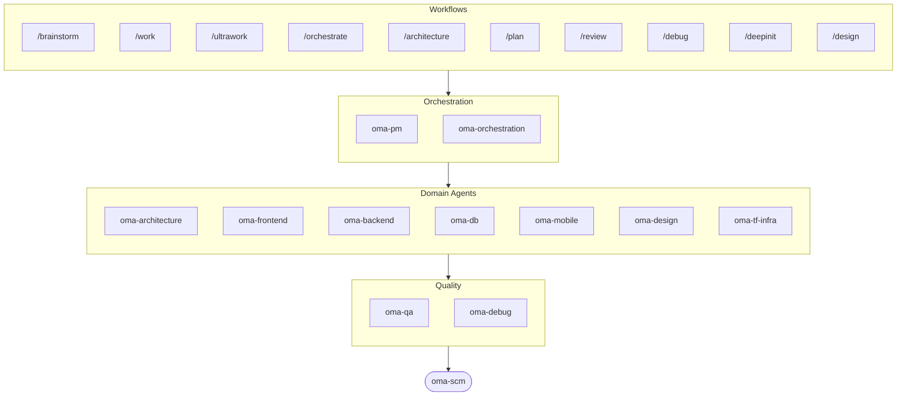

# oh-my-agent: Wieloagentowa uprząż, która sprawdza wykonaną pracę

[](https://www.npmjs.com/package/oh-my-agent) [](https://www.npmjs.com/package/oh-my-agent) [](https://github.com/first-fluke/oh-my-agent) [](https://github.com/first-fluke/oh-my-agent/blob/main/LICENSE) [](https://github.com/first-fluke/oh-my-agent/commits/main)

[English](../README.md) | [한국어](./README.ko.md) | [中文](./README.zh.md) | [Português](./README.pt.md) | [日本語](./README.ja.md) | [Français](./README.fr.md) | [Español](./README.es.md) | [Nederlands](./README.nl.md) | [Русский](./README.ru.md) | [Deutsch](./README.de.md) | [Tiếng Việt](./README.vi.md) | [ภาษาไทย](./README.th.md)

**Agenci opowiadają o sukcesie. oh-my-agent sprawdza artefakty.**

Uruchomienie równoległych agentów to łatwa część. Trudne jest ustalenie, czy naprawdę wykonali pracę. „Testy przechodzą, wszystkie kryteria spełnione" nic agenta nie kosztuje, a w obrębie tej samej sesji nic nie może temu zaprzeczyć.

oh-my-agent czyni tę deklarację falsyfikowalną. Hook Stop odmawia zakończenia sesji, dopóki projektowy skrypt `typecheck` / `test` / `lint` nie zakończy się kodem 0. Komenda bramkująca rozstrzyga, czy workflow faktycznie się wykonał, szukając artefaktów, które musiał po sobie zostawić — i to jej werdykt w JSON jest wynikiem, a nie podsumowanie agenta. Niezależny sędzia ze świeżym kontekstem w każdej rundzie weryfikuje od nowa każde kryterium, także te już zaliczone. Każda decyzja bramki trafia do dziennika zdarzeń tylko do dopisywania, który możesz przeczytać po fakcie. A ta sama dyscyplina działa w kilkunastu środowiskach agentowych z jednego przenośnego katalogu `.agents/`.


[Watch the full video (35s)](./assets/video/oh-my-agent-explainer.mp4)

## Szybki start

```bash
# macOS / Linux — automatycznie zainstaluje bun, uv & serena, jesli brakuje
curl -fsSL https://raw.githubusercontent.com/first-fluke/oh-my-agent/main/cli/install.sh | bash
```

```powershell
# Windows (PowerShell) — automatycznie zainstaluje bun, uv & serena, jesli brakuje
irm https://raw.githubusercontent.com/first-fluke/oh-my-agent/main/cli/install.ps1 | iex
```

```bash
# Lub recznie (dowolny system, wymaga bun + uv + serena)
bunx oh-my-agent@latest
```

### Instalacja przez Agent Package Manager

<details>
<summary><a href="https://github.com/microsoft/apm">Agent Package Manager</a> (APM) od Microsoftu: dystrybucja tylko ze skillami. Kliknij, zeby rozwinac.</summary>

> Nie myl tego z APM (Application Performance Monitoring) z `oma-observability`.

```bash
# Wszystkie skille, wdrazane do kazdego wykrytego runtime
# (.claude, .cursor, .codex, .opencode, .github, .agents)
apm install first-fluke/oh-my-agent

# Pojedynczy skill
apm install first-fluke/oh-my-agent/.agents/skills/oma-frontend
```

APM dostarcza tylko skille. Do workflowow, regul, `oma-config.yaml`, hookow detekcji slow kluczowych i CLI `oma agent spawn` uzyj `bunx oh-my-agent@latest`. W jednym projekcie trzymaj sie jednej dystrybucji, zeby nic sie nie rozjechalo.

</details>

Wybierz preset i gotowe:

| Preset | Co dostajesz |
|--------|-------------|
| **All** | **Wszyscy agenci i umiejetnosci** |
| Backend | architecture + backend + brainstorm + db + debug + dev-workflow + pm + qa + scm |
| Content | academic-writer + design + image + scm + translator + voice |
| DevOps | architecture + brainstorm + debug + dev-workflow + observability + pm + qa + scm + tf-infra |
| Frontend | architecture + brainstorm + debug + design + frontend + pm + qa + scm |
| Fullstack | architecture + backend + brainstorm + db + debug + design + dev-workflow + frontend + mobile + pm + qa + scm + tf-infra |
| Fullstack Mobile | architecture + backend + brainstorm + db + debug + design + dev-workflow + mobile + pm + qa + scm |
| Fullstack Web | architecture + backend + brainstorm + db + debug + design + dev-workflow + frontend + pm + qa + scm |
| Mobile | architecture + brainstorm + debug + mobile + pm + qa + scm |
| Research | academic-writer + hwp + market + pdf + scholar + scm + search + translator |

## Dziala z kazdym agentem

Weryfikacja niewiele znaczy, jeśli jest przywiązana do jednego dostawcy. `oh-my-agent` utrzymuje `.agents/` jako jedyne źródło prawdy (SSOT) i rzutuje je na natywny układ każdego runtime'u. Dzięki temu wszystkie obsługiwane narzędzia korzystają z tych samych skills, workflows, reguł i bramek — a zmiana dostawcy to zmiana konfiguracji, nie migracja.

<table>
<colgroup>
<col span="6" style="width:16.67%" />
</colgroup>
<tr>
<td align="center">
<a href="https://claude.com/product/claude-code"></a><br/>
<strong>Claude Code</strong><br/>
<sub>natywne + adapter</sub>
</td>
<td align="center">
<a href="https://github.com/openai/codex"></a><br/>
<strong>Codex CLI</strong><br/>
<sub>natywne + adapter</sub>
</td>
<td align="center">
<a href="https://antigravity.google"></a><br/>
<strong>Antigravity</strong><br/>
<sub>natywny SSOT</sub>
</td>
<td align="center">
<a href="https://cursor.com"></a><br/>
<strong>Cursor</strong><br/>
<sub>natywne + adapter</sub>
</td>
<td align="center">
<a href="https://github.com/QwenLM/qwen-code"></a><br/>
<strong>Qwen Code</strong><br/>
<sub>natywny dispatch</sub>
</td>
<td align="center">
<a href="https://github.com/esengine/DeepSeek-Reasonix"></a><br/>
<strong>Reasonix</strong><br/>
<sub>natywnie zgodne</sub>
</td>
</tr>
<tr>
<td align="center">
<a href="https://pi.dev/"></a><br/>
<strong>Pi</strong><br/>
<sub>natywnie zgodne</sub>
</td>
<td align="center">
<a href="https://github.com/anomalyco/opencode"></a><br/>
<strong>OpenCode</strong><br/>
<sub>natywnie zgodne</sub>
</td>
<td align="center">
<a href="https://ampcode.com"></a><br/>
<strong>Amp</strong><br/>
<sub>natywnie zgodne</sub>
</td>
<td align="center">
<a href="https://github.com/features/copilot"></a><br/>
<strong>GitHub Copilot</strong><br/>
<sub>skills przez symlink</sub>
</td>
<td align="center">
<a href="https://grok.x.ai"></a><br/>
<strong>Grok Build</strong><br/>
<sub>natywne hooki</sub>
</td>
<td align="center">
<a href="https://kiro.dev"></a><br/>
<strong>Kiro CLI</strong><br/>
<sub>natywne hooki + agenci</sub>
</td>
</tr>
</table>

<p align="center"><sub><a href="./SUPPORTED_AGENTS.md">& wiecej</a></sub></p>

## Twój zespół inżynierski

Zamiast jednego AI, które robi wszystko (i gubi się w połowie), oh-my-agent rozdziela pracę między wyspecjalizowanych agentów. Każdy doskonale zna swoją dziedzinę, ma własne narzędzia i checklisty, i nie wychodzi poza swój zakres.

| Agent | Co robi |
|-------|-------------|
| **oma-architecture** | Waży kompromisy architektoniczne i wyznacza granice modułów z analizą ADR/ATAM/CBAM |
| **oma-backend** | Buduje i zabezpiecza Twoje API w Python, Node.js lub Rust |
| **oma-brainstorm** | Eksploruje pomysły razem z Tobą, zanim cokolwiek zaczniesz budować |
| **oma-db** | Projektuje schematy, migracje, indeksy i vector stores |
| **oma-debug** | Znajduje przyczynę błędu, naprawia go i pisze test regresji |
| **oma-deepsec** | Skanuje kod w poszukiwaniu luk bezpieczeństwa i blokuje ryzykowne pull requesty |
| **oma-design** | Buduje design systemy z tokenami, dostępnością i responsywnymi layoutami |
| **oma-dev-workflow** | Automatyzuje CI/CD, releasy i zadania w monorepo |
| **oma-docs** | Sprawdza dokumentację pod kątem zepsutych referencji i wskazuje miejsca dotknięte zmianami w kodzie |
| **oma-explanation** | Zamienia diff, PR lub gałąź w samodzielny interaktywny objaśniacz HTML z quizem |
| **oma-frontend** | Buduje interfejs użytkownika z React/Next.js, TypeScript, Tailwind CSS v4 i shadcn/ui |
| **oma-mobile** | Buduje wieloplatformowe aplikacje mobilne we Flutter |
| **oma-observability** | Kieruje pracę obserwabilności przez metryki, logi, traces, SLO i analizę incydentów |
| **oma-orchestration** | Uruchamia wiele agentów równolegle z poziomu CLI |
| **oma-pm** | Planuje zadania, rozbija wymagania i definiuje kontrakty API |
| **oma-qa** | Przegląda kod pod kątem bezpieczeństwa OWASP, wydajności i dostępności |
| **oma-refactor** | Refaktoryzuje kod bez zmiany zachowania, wykorzystując hotspoty, testy charakteryzujące i commity zawierające wyłącznie refactor |
| **oma-scm** | Zarządza branchami, mergami, worktrees i Conventional Commits |
| **oma-search** | Kieruje każde zapytanie do najlepszego źródła i ocenia wiarygodność wyniku |
| **oma-tf-infra** | Provisionuje wielochmurową infrastrukturę za pomocą Terraform |

<details>
<summary>Narzędzia wewnętrzne i meta</summary>

| Agent | Co robi |
|-------|-------------|
| **oma-coordination** | Prowadzi krok po kroku ręczną koordynację agentów PM, frontend, backend, mobile i QA |
| **oma-skill-creation** | Pisze i audytuje nowe skille OMA w formacie SSL-lite |

</details>

## Poza kodem: pipeline'y contentowe i badawcze

Niezależnie od zespołu inżynierskiego oma dostarcza pipeline'y contentowe i badawcze zbudowane według tej samej dyscypliny inżynierskiej: deterministyczne odtwarzanie z fixture'ów, manifesty zapewniające powtarzalność i uczciwe raportowanie ograniczeń, gdy źródło albo klucz dostawcy jest niedostępny — zamiast po cichu uboższego wyniku.

| Agent | Co robi |
|-------|-------------|
| **oma-academic-writing** | Pisze, redaguje i audytuje akademicką prozę do jakości publikacyjnej |
| **oma-hwp** | Konwertuje pliki HWP, HWPX i HWPML do Markdown |
| **oma-image** | Generuje obrazy równolegle przez kilku dostawców AI |
| **oma-market** | Bada rynek na podstawie sygnałów społecznościowych i opisuje wyniki przez SWOT, Porter's 5F i PESTEL |
| **oma-pdf** | Konwertuje pliki PDF do Markdown |
| **oma-recap** | Podsumowuje historię rozmów w tematyczne raporty z pracy |
| **oma-scholar** | Przeszukuje literaturę akademicką i pomaga przeprowadzić recenzję naukową |
| **oma-slide** | Generuje charakterystyczne, bogate w animacje decki prezentacji HTML i eksportuje do PDF/PNG/PPTX |
| **oma-translation** | Tłumaczy między językami tak, jakby tekst napisał native speaker |
| **oma-video** | Generuje krótkie filmy, materiały objaśniające i dema przez pipeline Remotion działający także bez kluczy |
| **oma-voice** | Generuje voiceover i transkrybuje audio lokalnie — bez chmury |

## Jak to dziala

Po prostu pisz. Opisz, czego potrzebujesz, a oh-my-agent sam ustali, ktorych agentow uzyc.

```
Ty: "Zbuduj aplikacje TODO z uwierzytelnianiem uzytkownikow"
→ PM planuje prace
→ Backend buduje API uwierzytelniania
→ Frontend buduje UI w React
→ DB projektuje schemat
→ QA przeglada wszystko
→ Gotowe: skoordynowany, sprawdzony kod
```

Lub uzyj slash commands do ustrukturyzowanych workflow:

| Krok | Komenda | Co robi |
|------|---------|-------------|
| 0 | `/deepinit` | Mapuje Twoja istniejaca baze kodu do AGENTS.md, ARCHITECTURE.md i docs |
| 1 | `/brainstorm` | Przeglada z Toba pomysly, zanim zabierzesz sie za budowanie |
| 2 | `/architecture` | Wazy trade-offy Twojego projektu i wyznacza czyste granice modulow |
| 2 | `/design` | Buduje Twoj design system z tokenami, dostepnoscia i responsywnymi ukladami |
| 2 | `/plan` | Rozbija Twoja funkcjonalnosc na zadania z priorytetami |
| 3 | `/work` | Buduje Twoja funkcjonalnosc krok po kroku, korzystajac z wielu agentow |
| 3 | `/orchestrate` | Uruchamia wielu agentow rownolegle, by szybciej zbudowac Twoja funkcjonalnosc |
| 3 | `/ultrawork` | Buduje Twoja funkcjonalnosc przez piec bramkowanych faz jakosci; kazda rewizja dziala w swiezej, izolowanej sesji recenzenta (cross-context review) |
| 3 | `/ralph` | Powtarza `/ultrawork` az niezalezny weryfikator zaliczy wszystkie kryteria |
| 4 | `/review` | Przeglada Twoj kod pod katem bezpieczenstwa, wydajnosci i dostepnosci |
| 4 | `/deepsec` | Wykonuje gleboki skan bezpieczenstwa i blokuje ryzykowne pull requesty |
| 5 | `/debug` | Znajduje przyczyne, naprawia blad i pisze test regresji |
| 5 | `/docs` | Sprawdza Twoja dokumentacje pod katem zepsutych odwolan i lata te, ktorych dotykaja zmiany w kodzie |
| 6 | `/scm` | Zarzadza Twoimi galeziami, scaleniami i Conventional Commits |
| - | `/schedule` | Planuje zadanie agenta do cyklicznego uruchamiania w zadanym interwale |

**Autodetekcja**: Nie musisz nawet uzywac slash commands. Slowa takie jak "architektura", "plan", "review" i "debug" w Twojej wiadomosci (w 11 jezykach!) automatycznie uruchamiaja odpowiedni workflow. Trafnosc detekcji jest mierzona, a nie zakladana: `oma verify triggers` ocenia detektor na oznaczonym korpusie 171 promptow (obecnie **0% missed-fire**, ponizej 10% false-fire) i na tej podstawie blokuje CI.

### Modele per agent

Ustaw `model_preset` w `.agents/oma-config.yaml`, aby wybrac, ktorych modeli AI uzywa kazdy agent:

```yaml
language: en
model_preset: mixed   # antigravity | claude | codex | cursor | kiro | mixed | qwen

# Optional per-agent overrides
agents:
  backend: { model: openai/gpt-5.5, effort: high }
```

- `oma doctor --profile` — wypisuje rozwiazana macierz modeli dla kazdej roli
- Pelny przewodnik: [`web/docs/guide/per-agent-models.md`](../web/docs/guide/per-agent-models.md)

## Weryfikacja zamiast narracji

Każdy z poniższych mechanizmów jest mechaniczny: komenda kończy się kodem 0 albo nie, plik jest na dysku albo go nie ma. Żaden LLM nie jest pytany, czy praca „wygląda poprawnie".

| Mechanizm | Co jest sprawdzane mechanicznie | Gdzie się znajduje |
|-----------|----------------------------------|--------------------|
| **Bramka hooka Stop** | Blokuje zakończenie sesji, dopóki trwa persystentny workflow, i przed zezwoleniem na stop uruchamia skonfigurowany skrypt bramki. Wykonywalne są wyłącznie `typecheck`, `test` i `lint` — jeśli agent wpisze do pliku stanu cokolwiek innego, zostanie to zignorowane i nigdy nie uruchomione. Limit 5 wzmocnień sprawia, że trwale czerwona bramka Cię nie zablokuje. | [`.agents/hooks/core/persistent-mode.ts`](../.agents/hooks/core/persistent-mode.ts) |
| **Anti-Circumvention Gate** | `oma ralph verify --json` sprawdza cztery artefakty, których nie da się podrobić skrótem: zapisy faz ultrawork, JSON planu, plik wyniku **osobnego agenta QA** oraz plik wyniku **osobnego agenta refactor**. Brak artefaktów oznacza, że faza się nie wykonała — cokolwiek twierdzi narracja. | [`.agents/workflows/ralph.md`](../.agents/workflows/ralph.md) |
| **Niezależny sędzia** | Uruchamiany jako osobny agent ze świeżym kontekstem, poinstruowany wyłącznie o kryteriach — nigdy o tym, co implementujący rzekomo naprawił. W każdej iteracji weryfikuje od nowa **każde** kryterium, także wcześniejsze PASS-y, bo naprawa C2 to typowa droga do cichej regresji C1. | [`judge-protocol.md`](../.agents/workflows/ralph/resources/judge-protocol.md) |
| **Stan oparty na zdarzeniach** | Każde zaliczenie bramki, każde jej niepowodzenie i każda decyzja dopisuje jedną linię JSON do `~/.oma/u/0/sessions/{sid}/events.jsonl`, ostemplowaną vendorem i identyfikatorem sesji runtime'u. Tylko do dopisywania, ponad vendorami, audytowalne po zakończeniu biegu. | [`event-spec.md`](../.agents/skills/_shared/runtime/event-spec.md) |
| **Bateria sprawdzeń per agent** | `oma verify <agent>` uruchamia wspólny rdzeń (scope violation, charter alignment, twardo zakodowane sekrety, skan TODO, declared outputs) plus sprawdzenia specyficzne dla typu (TypeScript strict, testy, raw SQL, Flutter analyze, inline styles). | `oma verify <agent>` |
| **Harness ewaluacji skilli** | `oma skill eval` mierzy przyrost użyteczności na zadaniach odłożonych — wariant testowany kontra baseline — zamiast zakładać, że skill pomaga. `oma skill optimize` zachowuje tylko te zmiany, które poprawiają zmierzony przyrost. | [przewodnik skill-eval](../web/docs/guide/skill-eval.md) |

Budżety są egzekwowane tak samo. `session.quota_cap` ogranicza tokeny, liczbę spawnów i wydatki per vendor; orkiestrator odmawia kolejnego spawnu, gdy któryś z wymiarów zostanie przekroczony. Gdy skończy się budżet czasu, hook Stop zatrzymuje się uczciwie i zapisuje status częściowy w dzienniku zdarzeń, zamiast udawać ukończenie.

## Dlaczego oh-my-agent?

- **Oparty na rolach**: agenci zamodelowani jak prawdziwy zespół inżynierski, nie sterta promptów
- **Oszczędny z tokenami**: dwuwarstwowy design umiejętności oszczędza ~75% tokenów ([jak to działa](../web/docs/guide/usage.md))
- **Odporny na zapętlenie**: po 2 nieudanych próbach `orchestrate` uruchamia równolegle warianty hipotez i zachowuje wynik o najwyższej punktacji, zamiast w nieskończoność powtarzać błędne podejście
- **Świadomy monorepo**: `detectWorkspace` czyta pnpm / nx / turbo / lerna i kieruje każdego agenta do jego workspace
- **Multi-vendor**: mieszaj Antigravity, Claude, Codex, Cursor, Kiro i Qwen dla różnych typów agentów
- **Obserwowalny**: dashboardy w terminalu i w przeglądarce do monitoringu w czasie rzeczywistym

## Architektura



## Dowiedz sie wiecej

- **[Szczegolowa dokumentacja](./AGENTS_SPEC.md)**: pelna specyfikacja techniczna i architektura
- **[Wspierani agenci](./SUPPORTED_AGENTS.md)**: macierz wsparcia agentow w roznych IDE
- **[Raport benchmarkowy](../benchmarks/README.md)**: metoda, wyniki, zrzuty ekranu i zastrzeżenia
- **[Dokumentacja webowa](https://first-fluke.github.io/oh-my-agent/)**: poradniki, tutoriale i referencja CLI

## Sponsorzy

Ten projekt jest utrzymywany dzieki naszym hojnym sponsorom.

> **Podoba Ci sie projekt?** Daj gwiazdke!
>
> ```bash
> gh api --method PUT /user/starred/first-fluke/oh-my-agent
> ```
>
> Wyprobuj nasz zoptymalizowany szablon startowy: [fullstack-starter](https://github.com/first-fluke/fullstack-starter)

<a href="https://github.com/sponsors/first-fluke">
  
</a>
<a href="https://buymeacoffee.com/firstfluke">
  
</a>

### 🚀 Champion

<!-- Champion tier ($100/mo) logos here -->

### 🛸 Booster

<!-- Booster tier ($30/mo) logos here -->

### ☕ Contributor

<!-- Contributor tier ($10/mo) names here -->

[Zostan sponsorem →](https://github.com/sponsors/first-fluke)

Zobacz [SPONSORS.md](../SPONSORS.md), aby zobaczyc pelna liste wspierajacych.


## Star History

[](https://star-history.dera.page/#first-fluke/oh-my-agent&type=date&legend=bottom-right)


## Bibliografia

- Li, X., Liu, Y., Chen, W., You, B., Di, Z., He, Y., Zheng, S., Choe, K. W., Sun, J., Wang, S., Tao, C., Li, B., Zhao, X., Geng, H., Wu, X., Zhou, J., Chen, X., Xing, H., Li, Y., … Song, D. (2026). *SkillsBench: Benchmarking how well agent skills work across diverse tasks* (Version 4) [Preprint]. arXiv. https://doi.org/10.48550/arXiv.2602.12670
- Yu, G., & Wang, X. (2026). *Knows: Agent-native structured research representations* (Version 1) [Preprint]. arXiv. https://doi.org/10.48550/arXiv.2604.17309
- Liang, Q., Wang, H., Liang, Z., & Liu, Y. (2026). *From skill text to skill structure: The scheduling-structural-logical representation for agent skills* (Version 4) [Preprint]. arXiv. https://doi.org/10.48550/arXiv.2604.24026
- Chen, C., Yu, Q., Gu, Y., Huang, Z., Li, H., Liu, H., Liu, S., Liu, J., Peng, D., Wang, J., Yan, Z., Meng, F., Qin, E., Che, C., & Hu, M. (2026). *The scaling laws of skills in LLM agent systems* (Version 1) [Preprint]. arXiv. https://doi.org/10.48550/arXiv.2605.16508
- Tang, L., Rashtchian, C., Ferng, C.-S., Tomkins, A., Juan, D.-C., & Vu, T. (2026). *WikiSkill: Compiling agent experience into persistent knowledge for skill evolution* [Preprint]. arXiv. https://doi.org/10.48550/arXiv.2608.27454
- Huang, Z., Xu, J., Yang, Y., Gong, Z., Yang, Q., Tian, M., Wang, X., Lv, C., Gao, X., Dai, Q., Liu, B., Qiu, K., Yang, X., Chen, D., Zheng, X., & Luo, C. (2026). *From raw experience to skill consumption: A systematic study of model-generated agent skills* [Preprint]. arXiv. https://doi.org/10.48550/arXiv.2605.23899
- Hong, D. B., Imani, A., & Ahmed, I. (2026). *From anatomy to smells: An empirical study of SKILL.md in agent skills* (Version 2) [Preprint]. arXiv. https://doi.org/10.48550/arXiv.2607.01456


## Licencja

MIT
