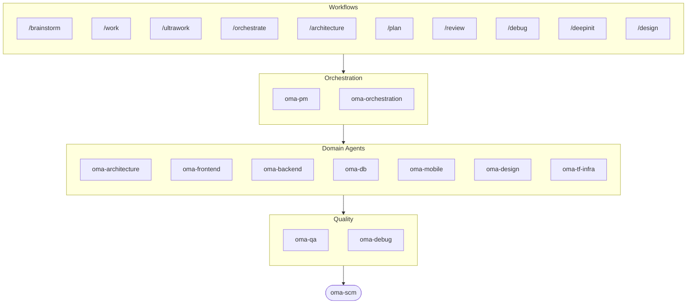

# oh-my-agent: O Harness Multiagente Que Confere o Trabalho

[](https://www.npmjs.com/package/oh-my-agent) [](https://www.npmjs.com/package/oh-my-agent) [](https://github.com/first-fluke/oh-my-agent) [](https://github.com/first-fluke/oh-my-agent/blob/main/LICENSE) [](https://github.com/first-fluke/oh-my-agent/commits/main)

[English](../README.md) | [한국어](./README.ko.md) | [中文](./README.zh.md) | [日本語](./README.ja.md) | [Français](./README.fr.md) | [Español](./README.es.md) | [Nederlands](./README.nl.md) | [Polski](./README.pl.md) | [Русский](./README.ru.md) | [Deutsch](./README.de.md) | [Tiếng Việt](./README.vi.md) | [ภาษาไทย](./README.th.md)

**Agentes narram sucesso. O oh-my-agent confere os artefatos.**

Subir agentes em paralelo é a parte fácil. A parte difícil é saber se eles realmente fizeram o trabalho. Dizer "os testes passam, todos os critérios atendidos" não custa nada para um agente, e nada dentro daquela mesma sessão consegue contradizê-lo.

O oh-my-agent torna essa afirmação falseável. Um Stop hook se recusa a encerrar sua sessão enquanto o script `typecheck` / `test` / `lint` do seu próprio projeto não sair com código 0. Um comando de gate decide se um workflow rodou de verdade procurando os artefatos que ele obrigatoriamente teria deixado para trás — e o veredito em JSON dele, não o resumo do agente, é o resultado. Um juiz independente, com contexto novo, reverifica cada critério a cada rodada, inclusive os que já haviam passado. Toda decisão de gate cai em um event log somente-append que você pode ler depois. E então ele aplica essa mesma disciplina em uma dúzia de runtimes de agente a partir de um único diretório `.agents/` portátil.


[Watch the full video (35s)](./assets/video/oh-my-agent-explainer.mp4)

## Inicio Rapido

```bash
# macOS / Linux — instala bun, uv & serena automaticamente se nao tiver
curl -fsSL https://raw.githubusercontent.com/first-fluke/oh-my-agent/main/cli/install.sh | bash
```

```powershell
# Windows (PowerShell) — instala bun, uv & serena automaticamente se nao tiver
irm https://raw.githubusercontent.com/first-fluke/oh-my-agent/main/cli/install.ps1 | iex
```

```bash
# Ou manualmente (qualquer SO, requer bun + uv + serena)
bunx oh-my-agent@latest
```

### Instalacao via Agent Package Manager

<details>
<summary><a href="https://github.com/microsoft/apm">Agent Package Manager</a> (APM) da Microsoft: distribuicao so com skills. Clique para expandir.</summary>

> Nao confunda com o APM (Application Performance Monitoring) do `oma-observability`.

```bash
# Todos os skills, instalados em cada runtime detectado
# (.claude, .cursor, .codex, .opencode, .github, .agents)
apm install first-fluke/oh-my-agent

# Um unico skill
apm install first-fluke/oh-my-agent/.agents/skills/oma-frontend
```

O APM so entrega os skills. Para workflows, regras, `oma-config.yaml`, hooks de deteccao de palavras-chave e a CLI `oma agent spawn`, use `bunx oh-my-agent@latest`. Escolha so um modo de distribuicao por projeto, senao acaba dando ruim.

</details>

Escolha um preset e pronto:

| Preset | O Que Voce Ganha |
|--------|-------------|
| **All** | **Todos os agentes e skills** |
| Backend | architecture + backend + brainstorm + db + debug + dev-workflow + pm + qa + scm |
| Content | academic-writer + design + image + scm + translator + voice |
| DevOps | architecture + brainstorm + debug + dev-workflow + observability + pm + qa + scm + tf-infra |
| Frontend | architecture + brainstorm + debug + design + frontend + pm + qa + scm |
| Fullstack | architecture + backend + brainstorm + db + debug + design + dev-workflow + frontend + mobile + pm + qa + scm + tf-infra |
| Fullstack Mobile | architecture + backend + brainstorm + db + debug + design + dev-workflow + mobile + pm + qa + scm |
| Fullstack Web | architecture + backend + brainstorm + db + debug + design + dev-workflow + frontend + pm + qa + scm |
| Mobile | architecture + brainstorm + debug + mobile + pm + qa + scm |
| Research | academic-writer + hwp + market + pdf + scholar + scm + search + translator |

## Funciona com Todos os Agentes

Verificação vale pouco se ficar presa a um único vendor. O `oh-my-agent` mantém `.agents/` como única fonte de verdade (SSOT) e o projeta no layout nativo de cada runtime, então todas as ferramentas suportadas compartilham os mesmos skills, workflows, regras e gates — e trocar de vendor é uma mudança de config, não uma migração.

<table>
<colgroup>
<col span="6" style="width:16.67%" />
</colgroup>
<tr>
<td align="center">
<a href="https://claude.com/product/claude-code"></a><br/>
<strong>Claude Code</strong><br/>
<sub>nativo + adaptador</sub>
</td>
<td align="center">
<a href="https://github.com/openai/codex"></a><br/>
<strong>Codex CLI</strong><br/>
<sub>nativo + adaptador</sub>
</td>
<td align="center">
<a href="https://antigravity.google"></a><br/>
<strong>Antigravity</strong><br/>
<sub>SSOT nativo</sub>
</td>
<td align="center">
<a href="https://cursor.com"></a><br/>
<strong>Cursor</strong><br/>
<sub>nativo + adaptador</sub>
</td>
<td align="center">
<a href="https://github.com/QwenLM/qwen-code"></a><br/>
<strong>Qwen Code</strong><br/>
<sub>dispatch nativo</sub>
</td>
<td align="center">
<a href="https://github.com/esengine/DeepSeek-Reasonix"></a><br/>
<strong>Reasonix</strong><br/>
<sub>compatível nativamente</sub>
</td>
</tr>
<tr>
<td align="center">
<a href="https://pi.dev/"></a><br/>
<strong>Pi</strong><br/>
<sub>compatível nativamente</sub>
</td>
<td align="center">
<a href="https://github.com/anomalyco/opencode"></a><br/>
<strong>OpenCode</strong><br/>
<sub>compatível nativamente</sub>
</td>
<td align="center">
<a href="https://ampcode.com"></a><br/>
<strong>Amp</strong><br/>
<sub>compatível nativamente</sub>
</td>
<td align="center">
<a href="https://github.com/features/copilot"></a><br/>
<strong>GitHub Copilot</strong><br/>
<sub>skills via symlink</sub>
</td>
<td align="center">
<a href="https://grok.x.ai"></a><br/>
<strong>Grok Build</strong><br/>
<sub>hooks nativos</sub>
</td>
<td align="center">
<a href="https://kiro.dev"></a><br/>
<strong>Kiro CLI</strong><br/>
<sub>hooks nativos + agentes</sub>
</td>
</tr>
</table>

<p align="center"><sub><a href="./SUPPORTED_AGENTS.md">& mais</a></sub></p>

## Seu Time de Engenharia

Em vez de uma única IA fazendo tudo (e se perdendo no meio do caminho), o oh-my-agent divide o trabalho entre agentes especializados. Cada um conhece bem o seu domínio, tem suas próprias ferramentas e checklists, e não sai da sua área.

| Agente | O Que Faz |
|-------|-------------|
| **oma-architecture** | Avalia trade-offs de arquitetura e define limites de modulos com analise ADR/ATAM/CBAM |
| **oma-backend** | Constroi e protege suas APIs em Python, Node.js ou Rust |
| **oma-brainstorm** | Explora ideias com voce antes de voce se comprometer a construir |
| **oma-db** | Projeta seu schema, migrations, indexes e vector stores |
| **oma-debug** | Encontra a causa raiz, corrige o bug e escreve um teste de regressao |
| **oma-deepsec** | Varre seu codigo em busca de falhas de seguranca e bloqueia pull requests arriscados |
| **oma-design** | Constroi design systems com tokens, acessibilidade e layouts responsivos |
| **oma-dev-workflow** | Automatiza seu CI/CD, releases e tarefas de monorepo |
| **oma-docs** | Verifica referencias quebradas na documentacao e sinaliza o que uma mudanca de codigo afetou |
| **oma-explanation** | Converte um diff, PR ou branch em um explicador HTML interativo autônomo com quiz |
| **oma-frontend** | Constroi sua UI com React/Next.js, TypeScript, Tailwind CSS v4 e shadcn/ui |
| **oma-mobile** | Constroi apps mobile cross-platform com Flutter |
| **oma-observability** | Roteia trabalho de observabilidade entre metricas, logs, traces, SLOs e forense de incidentes |
| **oma-orchestration** | Executa multiplos agentes em paralelo via CLI |
| **oma-pm** | Planeja tarefas, detalha requisitos e define contratos de API |
| **oma-qa** | Revisa seu codigo em busca de problemas de seguranca OWASP, performance e acessibilidade |
| **oma-refactor** | Refatora o codigo sem mudar o comportamento usando hotspots, testes de caracterizacao e commits apenas de refactor |
| **oma-scm** | Gerencia seus branches, merges, worktrees e Conventional Commits |
| **oma-search** | Roteia cada consulta para a melhor fonte e pontua o nivel de confianca do resultado |
| **oma-tf-infra** | Provisiona infraestrutura multi-cloud com Terraform |

<details>
<summary>Ferramentas internas e meta</summary>

| Agente | O Que Faz |
|-------|-------------|
| **oma-coordination** | Orienta passo a passo a coordenacao manual dos agentes de PM, frontend, backend, mobile e QA |
| **oma-skill-creation** | Escreve e audita novos skills OMA no formato SSL-lite |

</details>

## Além do Código: Pipelines de Conteúdo e Pesquisa

Separado do time de engenharia, o oma traz pipelines de conteúdo e pesquisa construídos com a mesma disciplina de engenharia: replay determinístico a partir de fixtures, manifests para reprodutibilidade e relato honesto de degradação quando uma fonte ou uma chave de vendor não está disponível, em vez de um resultado silenciosamente mais pobre.

| Agente | O Que Faz |
|-------|-------------|
| **oma-academic-writing** | Redige, revisa e audita prosa academica ate o nivel de publicacao |
| **oma-hwp** | Converte arquivos HWP, HWPX e HWPML para Markdown |
| **oma-image** | Gera imagens por varios provedores de IA ao mesmo tempo |
| **oma-market** | Pesquisa seu mercado a partir de sinais de comunidade e estrutura os resultados com SWOT, Porter's 5F e PESTEL |
| **oma-pdf** | Converte arquivos PDF para Markdown |
| **oma-recap** | Resume seu historico de conversas em resumos tematicos de trabalho |
| **oma-scholar** | Busca literatura academica e ajuda voce a conduzir revisoes por pares |
| **oma-slide** | Gera decks de apresentacao HTML distintos e ricos em animacoes e exporta para PDF/PNG/PPTX |
| **oma-translation** | Traduz entre idiomas de forma que parece escrito por um falante nativo |
| **oma-video** | Gera videos curtos, explicativos e demos por um pipeline Remotion que funciona mesmo sem chaves |
| **oma-voice** | Gera voiceovers e transcreve audio localmente, sem precisar de nuvem |

## Como Funciona

So conversar. Descreva o que voce quer e o oh-my-agent descobre quais agentes usar.

```
Voce: "Cria um app de TODO com autenticacao de usuario"
→ PM planeja o trabalho
→ Backend constroi a API de auth
→ Frontend constroi a UI em React
→ DB desenha o schema
→ QA revisa tudo
→ Pronto: codigo coordenado e revisado
```

Ou use slash commands para workflows estruturados:

| Etapa | Comando | O Que Faz |
|-------|---------|-------------|
| 0 | `/deepinit` | Mapeia sua base de codigo existente em AGENTS.md, ARCHITECTURE.md e docs |
| 1 | `/brainstorm` | Explora ideias com voce antes de comecar a construir |
| 2 | `/architecture` | Pesa os trade-offs do seu design e traca limites de modulo bem definidos |
| 2 | `/design` | Monta seu design system com tokens, acessibilidade e layouts responsivos |
| 2 | `/plan` | Quebra sua feature em tarefas priorizadas |
| 3 | `/work` | Constroi sua feature passo a passo com varios agentes |
| 3 | `/orchestrate` | Roda varios agentes em paralelo para construir sua feature mais rapido |
| 3 | `/ultrawork` | Constroi sua feature por cinco fases de qualidade com gates; cada revisao roda numa sessao de revisor nova e isolada (revisao de contexto cruzado / cross-context review) |
| 3 | `/ralph` | Repete `/ultrawork` ate um verificador independente aprovar todos os criterios |
| 4 | `/review` | Revisa seu codigo em busca de problemas de seguranca, performance e acessibilidade |
| 4 | `/deepsec` | Roda uma varredura de seguranca profunda e bloqueia pull requests arriscados |
| 5 | `/debug` | Encontra a causa raiz, corrige o bug e escreve um teste de regressao |
| 5 | `/docs` | Confere sua documentacao em busca de referencias quebradas e corrige as que suas mudancas de codigo afetam |
| 6 | `/scm` | Gerencia seus branches, merges e Conventional Commits |
| - | `/schedule` | Agenda um job de agente para rodar em intervalos recorrentes |

**Auto-deteccao**: Voce nem precisa dos slash commands. Palavras como "arquitetura", "plan", "review" e "debug" na sua mensagem (em 11 idiomas!) ativam automaticamente o workflow certo. A precisao da deteccao e medida, nao presumida: `oma verify triggers` avalia o detector contra um corpus rotulado de 171 prompts (atualmente **0% de missed-fire**, menos de 10% de false-fire) e o controla no CI.

### Modelos por agente

Defina `model_preset` em `.agents/oma-config.yaml` para escolher quais modelos de IA cada agente usa:

```yaml
language: en
model_preset: mixed   # antigravity | claude | codex | cursor | kiro | mixed | qwen

# Optional per-agent overrides
agents:
  backend: { model: openai/gpt-5.5, effort: high }
```

- `oma doctor --profile` — imprime a matriz de modelos resolvida por papel
- Guia completo: [`web/docs/guide/per-agent-models.md`](../web/docs/guide/per-agent-models.md)

## Verificação, Não Narração

Cada mecanismo abaixo é mecânico: um comando sai com código 0 ou não sai, um arquivo está no disco ou não está. Nenhum LLM é consultado sobre se o trabalho "parece correto".

| Mecanismo | O que ele confere mecanicamente | Onde fica |
|-----------|------------------------------|----------------|
| **Stop-hook gate** | Bloqueia o encerramento da sessão enquanto um workflow persistente estiver ativo e roda o script de gate configurado antes de liberar a parada. Só `typecheck`, `test` e `lint` são executáveis — se um agente escrever qualquer outra coisa no arquivo de estado, aquilo é ignorado e nunca roda. Limitado a 5 reforços, para que um gate permanentemente vermelho não deixe você preso. | [`.agents/hooks/core/persistent-mode.ts`](../.agents/hooks/core/persistent-mode.ts) |
| **Anti-Circumvention Gate** | `oma ralph verify --json` confere quatro artefatos que um atalho não consegue forjar: os registros de fase do ultrawork, o JSON do plano, o arquivo de resultado de um **agente de QA distinto** e o arquivo de resultado de um **agente de refactor distinto**. Artefato faltando significa que a fase não rodou, não importa o que a narração diga. | [`.agents/workflows/ralph.md`](../.agents/workflows/ralph.md) |
| **Juiz independente** | Sobe como um agente separado com contexto novo, briefado só nos critérios — nunca no que o implementador alega ter corrigido. Reverifica **cada** critério a cada iteração, inclusive os PASS anteriores, porque corrigir o C2 é exatamente como o C1 regride em silêncio. | [`judge-protocol.md`](../.agents/workflows/ralph/resources/judge-protocol.md) |
| **Estado event-sourced** | Todo gate aprovado, todo gate reprovado e toda decisão acrescentam uma linha JSON em `~/.oma/u/0/sessions/{sid}/events.jsonl`, carimbada com o vendor e o id de sessão do runtime. Somente-append, cross-vendor e auditável depois da execução. | [`event-spec.md`](../.agents/skills/_shared/runtime/event-spec.md) |
| **Bateria de checagens por agente** | `oma verify <agent>` roda um núcleo comum (scope violation, charter alignment, segredos hardcoded, varredura de TODOs, declared outputs) mais checagens específicas por tipo (TypeScript strict, tests, raw SQL, Flutter analyze, inline styles). | `oma verify <agent>` |
| **Harness de eval de skills** | `oma skill eval` mede o ganho de utilidade em tarefas held-out — tratamento contra baseline — em vez de presumir que um skill ajuda. `oma skill optimize` mantém só as edições que melhoram esse ganho medido. | [guia de skill-eval](../web/docs/guide/skill-eval.md) |

Orçamentos são aplicados do mesmo jeito. `session.quota_cap` limita tokens, número de spawns e gasto por vendor; o orquestrador recusa o próximo spawn quando alguma dimensão estoura. Quando o orçamento de tempo real acaba, o Stop hook para com honestidade e registra o status parcial no event log, em vez de fingir que concluiu.

## Por Que oh-my-agent?

- **Baseado em papeis**: agentes modelados como um time de engenharia real, nao um amontoado de prompts
- **Eficiente em tokens**: design de skills em duas camadas economiza ~75% de tokens ([como funciona](../web/docs/guide/usage.md))
- **Recuperável**: depois de 2 retries falhos, `orchestrate` faz spawn paralelo de variantes de hipótese e mantém a de maior pontuação, em vez de insistir para sempre numa abordagem errada
- **Ciente de monorepo**: `detectWorkspace` lê pnpm / nx / turbo / lerna e roteia cada agente para seu workspace
- **Multi-vendor**: misture Antigravity, Claude, Codex, Cursor, Kiro e Qwen por tipo de agente
- **Observavel**: dashboards no terminal e na web para monitoramento em tempo real

## Arquitetura



## Saiba Mais

- **[Documentacao Detalhada](./AGENTS_SPEC.md)**: spec tecnica completa e arquitetura
- **[Agentes Suportados](./SUPPORTED_AGENTS.md)**: matriz de suporte de agentes por IDE
- **[Relatório de Benchmark](../benchmarks/README.md)**: método, resultados, capturas e ressalvas
- **[Docs Web](https://first-fluke.github.io/oh-my-agent/)**: guias, tutoriais e referencia da CLI

## Sponsors

Este projeto e mantido gracas aos nossos generosos sponsors.

> **Curtiu o projeto?** Da uma estrela!
>
> ```bash
> gh api --method PUT /user/starred/first-fluke/oh-my-agent
> ```
>
> Experimente nosso template starter otimizado: [fullstack-starter](https://github.com/first-fluke/fullstack-starter)

<a href="https://github.com/sponsors/first-fluke">
  
</a>
<a href="https://buymeacoffee.com/firstfluke">
  
</a>

### 🚀 Champion

<!-- Champion tier ($100/mo) logos here -->

### 🛸 Booster

<!-- Booster tier ($30/mo) logos here -->

### ☕ Contributor

<!-- Contributor tier ($10/mo) names here -->

[Torne-se um sponsor →](https://github.com/sponsors/first-fluke)

Veja [SPONSORS.md](../SPONSORS.md) para a lista completa de apoiadores.


## Star History

[](https://star-history.dera.page/#first-fluke/oh-my-agent&type=date&legend=bottom-right)

## Referências

- Li, X., Liu, Y., Chen, W., You, B., Di, Z., He, Y., Zheng, S., Choe, K. W., Sun, J., Wang, S., Tao, C., Li, B., Zhao, X., Geng, H., Wu, X., Zhou, J., Chen, X., Xing, H., Li, Y., … Song, D. (2026). *SkillsBench: Benchmarking how well agent skills work across diverse tasks* (Version 4) [Preprint]. arXiv. https://doi.org/10.48550/arXiv.2602.12670
- Yu, G., & Wang, X. (2026). *Knows: Agent-native structured research representations* (Version 1) [Preprint]. arXiv. https://doi.org/10.48550/arXiv.2604.17309
- Liang, Q., Wang, H., Liang, Z., & Liu, Y. (2026). *From skill text to skill structure: The scheduling-structural-logical representation for agent skills* (Version 4) [Preprint]. arXiv. https://doi.org/10.48550/arXiv.2604.24026
- Chen, C., Yu, Q., Gu, Y., Huang, Z., Li, H., Liu, H., Liu, S., Liu, J., Peng, D., Wang, J., Yan, Z., Meng, F., Qin, E., Che, C., & Hu, M. (2026). *The scaling laws of skills in LLM agent systems* (Version 1) [Preprint]. arXiv. https://doi.org/10.48550/arXiv.2605.16508
- Tang, L., Rashtchian, C., Ferng, C.-S., Tomkins, A., Juan, D.-C., & Vu, T. (2026). *WikiSkill: Compiling agent experience into persistent knowledge for skill evolution* [Preprint]. arXiv. https://doi.org/10.48550/arXiv.2608.27454
- Huang, Z., Xu, J., Yang, Y., Gong, Z., Yang, Q., Tian, M., Wang, X., Lv, C., Gao, X., Dai, Q., Liu, B., Qiu, K., Yang, X., Chen, D., Zheng, X., & Luo, C. (2026). *From raw experience to skill consumption: A systematic study of model-generated agent skills* [Preprint]. arXiv. https://doi.org/10.48550/arXiv.2605.23899
- Hong, D. B., Imani, A., & Ahmed, I. (2026). *From anatomy to smells: An empirical study of SKILL.md in agent skills* (Version 2) [Preprint]. arXiv. https://doi.org/10.48550/arXiv.2607.01456


## Licenca

MIT
