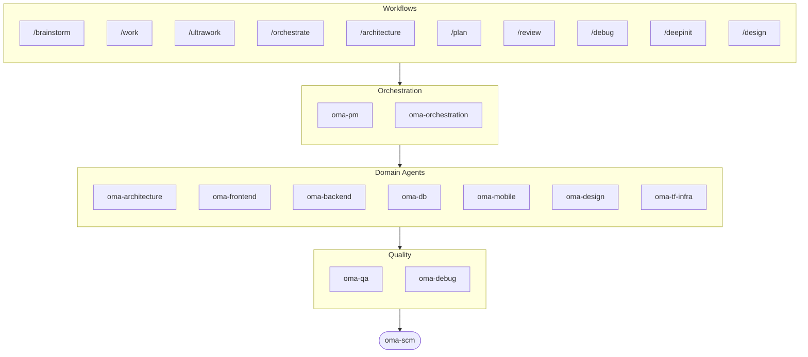

# oh-my-agent: мультиагентный harness, который проверяет работу

[](https://www.npmjs.com/package/oh-my-agent) [](https://www.npmjs.com/package/oh-my-agent) [](https://github.com/first-fluke/oh-my-agent) [](https://github.com/first-fluke/oh-my-agent/blob/main/LICENSE) [](https://github.com/first-fluke/oh-my-agent/commits/main)

[English](../README.md) | [한국어](./README.ko.md) | [中文](./README.zh.md) | [Português](./README.pt.md) | [日本語](./README.ja.md) | [Français](./README.fr.md) | [Español](./README.es.md) | [Nederlands](./README.nl.md) | [Polski](./README.pl.md) | [Deutsch](./README.de.md) | [Tiếng Việt](./README.vi.md) | [ภาษาไทย](./README.th.md)

**Агенты рассказывают об успехе. oh-my-agent проверяет артефакты.**

Запустить агентов параллельно — простая часть. Сложная — понять, действительно ли они сделали работу. Фраза «тесты проходят, все критерии выполнены» ничего не стоит агенту, и ничто внутри той же самой сессии не может её опровергнуть.

oh-my-agent делает это утверждение фальсифицируемым. Stop-хук не даёт завершить сессию, пока скрипт `typecheck` / `test` / `lint` вашего собственного проекта не завершится с кодом 0. Команда-гейт решает, действительно ли workflow был выполнен, по артефактам, которые он обязан был оставить, — и результатом считается её JSON-вердикт, а не резюме агента. Независимый судья со свежим контекстом заново проверяет каждый критерий на каждом круге, включая уже пройденные. Каждое решение гейта попадает в журнал событий, доступный только для добавления, который можно прочитать уже постфактум. И ровно эта дисциплина работает в десятке агентных runtime из одной портативной директории `.agents/`.


[Watch the full video (35s)](./assets/video/oh-my-agent-explainer.mp4)

## Быстрый старт

```bash
# macOS / Linux — автоматически установит bun, uv & serena, если их нет
curl -fsSL https://raw.githubusercontent.com/first-fluke/oh-my-agent/main/cli/install.sh | bash
```

```powershell
# Windows (PowerShell) — автоматически установит bun, uv & serena, если их нет
irm https://raw.githubusercontent.com/first-fluke/oh-my-agent/main/cli/install.ps1 | iex
```

```bash
# Или вручную (любая ОС, требуется bun + uv + serena)
bunx oh-my-agent@latest
```

### Установка через Agent Package Manager

<details>
<summary><a href="https://github.com/microsoft/apm">Agent Package Manager</a> (APM) от Microsoft: дистрибуция только со скилами. Нажмите, чтобы развернуть.</summary>

> Не путайте с APM (Application Performance Monitoring) из `oma-observability`.

```bash
# Все скилы, разворачиваются во все обнаруженные runtime
# (.claude, .cursor, .codex, .opencode, .github, .agents)
apm install first-fluke/oh-my-agent

# Один скил
apm install first-fluke/oh-my-agent/.agents/skills/oma-frontend
```

APM поставляет только скилы. Для workflow, правил, `oma-config.yaml`, хуков детекции ключевых слов и CLI `oma agent spawn` используйте `bunx oh-my-agent@latest`. На один проект выбирайте один способ дистрибуции, иначе всё разъедется.

</details>

Выберите пресет, и готово:

| Пресет | Что получаете |
|--------|-------------|
| **All** | **Все агенты и навыки** |
| Backend | architecture + backend + brainstorm + db + debug + dev-workflow + pm + qa + scm |
| Content | academic-writer + design + image + scm + translator + voice |
| DevOps | architecture + brainstorm + debug + dev-workflow + observability + pm + qa + scm + tf-infra |
| Frontend | architecture + brainstorm + debug + design + frontend + pm + qa + scm |
| Fullstack | architecture + backend + brainstorm + db + debug + design + dev-workflow + frontend + mobile + pm + qa + scm + tf-infra |
| Fullstack Mobile | architecture + backend + brainstorm + db + debug + design + dev-workflow + mobile + pm + qa + scm |
| Fullstack Web | architecture + backend + brainstorm + db + debug + design + dev-workflow + frontend + pm + qa + scm |
| Mobile | architecture + brainstorm + debug + mobile + pm + qa + scm |
| Research | academic-writer + hwp + market + pdf + scholar + scm + search + translator |

## Работает с любым агентом

Проверка мало чего стоит, если она привязана к одному вендору. `oh-my-agent` хранит `.agents/` как единый источник истины (SSOT) и проецирует его в нативный layout каждого runtime, поэтому все поддерживаемые инструменты используют одни и те же skills, workflows, правила и гейты, — а смена вендора становится изменением конфига, а не миграцией.

<table>
<colgroup>
<col span="6" style="width:16.67%" />
</colgroup>
<tr>
<td align="center">
<a href="https://claude.com/product/claude-code"></a><br/>
<strong>Claude Code</strong><br/>
<sub>нативный + адаптер</sub>
</td>
<td align="center">
<a href="https://github.com/openai/codex"></a><br/>
<strong>Codex CLI</strong><br/>
<sub>нативный + адаптер</sub>
</td>
<td align="center">
<a href="https://antigravity.google"></a><br/>
<strong>Antigravity</strong><br/>
<sub>нативный SSOT</sub>
</td>
<td align="center">
<a href="https://cursor.com"></a><br/>
<strong>Cursor</strong><br/>
<sub>нативный + адаптер</sub>
</td>
<td align="center">
<a href="https://github.com/QwenLM/qwen-code"></a><br/>
<strong>Qwen Code</strong><br/>
<sub>нативный dispatch</sub>
</td>
<td align="center">
<a href="https://github.com/esengine/DeepSeek-Reasonix"></a><br/>
<strong>Reasonix</strong><br/>
<sub>нативная совместимость</sub>
</td>
</tr>
<tr>
<td align="center">
<a href="https://pi.dev/"></a><br/>
<strong>Pi</strong><br/>
<sub>нативная совместимость</sub>
</td>
<td align="center">
<a href="https://github.com/anomalyco/opencode"></a><br/>
<strong>OpenCode</strong><br/>
<sub>нативная совместимость</sub>
</td>
<td align="center">
<a href="https://ampcode.com"></a><br/>
<strong>Amp</strong><br/>
<sub>нативная совместимость</sub>
</td>
<td align="center">
<a href="https://github.com/features/copilot"></a><br/>
<strong>GitHub Copilot</strong><br/>
<sub>skills через symlink</sub>
</td>
<td align="center">
<a href="https://grok.x.ai"></a><br/>
<strong>Grok Build</strong><br/>
<sub>нативные hooks</sub>
</td>
<td align="center">
<a href="https://kiro.dev"></a><br/>
<strong>Kiro CLI</strong><br/>
<sub>нативные hooks + agents</sub>
</td>
</tr>
</table>

<p align="center"><sub><a href="./SUPPORTED_AGENTS.md">& ещё</a></sub></p>

## Ваша инженерная команда

Вместо того чтобы один ИИ делал все (и терялся на полпути), oh-my-agent распределяет работу между специализированными агентами. Каждый глубоко знает свою область, имеет свои инструменты и чеклисты и не лезет в чужую зону.

| Агент | Что делает |
|-------|-------------|
| **oma-architecture** | Анализирует архитектурные компромиссы и определяет границы модулей с помощью ADR/ATAM/CBAM |
| **oma-backend** | Строит и защищает ваши API на Python, Node.js или Rust |
| **oma-brainstorm** | Помогает обдумать идеи до того, как вы приступите к реализации |
| **oma-db** | Проектирует схемы, миграции, индексы и векторные хранилища |
| **oma-debug** | Находит корневую причину, исправляет баг и пишет регрессионный тест |
| **oma-deepsec** | Сканирует код на уязвимости и блокирует рискованные pull request'ы |
| **oma-design** | Строит дизайн-системы с токенами, доступностью и адаптивными макетами |
| **oma-dev-workflow** | Автоматизирует CI/CD, релизы и задачи в monorepo |
| **oma-docs** | Проверяет документацию на битые ссылки и выявляет страницы, затронутые изменениями кода |
| **oma-explanation** | Превращает diff, PR или ветку в автономный интерактивный HTML-разбор с квизом |
| **oma-frontend** | Строит интерфейс на React/Next.js, TypeScript, Tailwind CSS v4 и shadcn/ui |
| **oma-mobile** | Разрабатывает кроссплатформенные мобильные приложения на Flutter |
| **oma-observability** | Маршрутизирует задачи наблюдаемости по метрикам, логам, трейсам, SLO и форензике инцидентов |
| **oma-orchestration** | Запускает несколько агентов параллельно через CLI |
| **oma-pm** | Планирует задачи, декомпозирует требования и определяет API-контракты |
| **oma-qa** | Проверяет код на уязвимости OWASP, проблемы производительности и доступности |
| **oma-refactor** | Рефакторит код без изменения поведения, используя горячие точки, характеризационные тесты и отдельные refactor-коммиты |
| **oma-scm** | Управляет ветками, слияниями, worktree и Conventional Commits |
| **oma-search** | Направляет каждый запрос к лучшему источнику и оценивает степень доверия к результату |
| **oma-tf-infra** | Разворачивает мультиоблачную инфраструктуру с помощью Terraform |

<details>
<summary>Внутренние и мета-инструменты</summary>

| Агент | Что делает |
|-------|-------------|
| **oma-coordination** | Пошагово направляет ручную координацию агентов PM, фронтенда, бэкенда, мобильной разработки и QA |
| **oma-skill-creation** | Пишет и проверяет новые OMA-скилы в формате SSL-lite |

</details>

## За пределами кода: пайплайны контента и исследований

Отдельно от инженерной команды oma поставляет пайплайны для контента и исследований, построенные по той же инженерной дисциплине: детерминированное воспроизведение из фикстур, манифесты для повторяемости и честный отчёт о деградации, когда источник или ключ вендора недоступен, — вместо молча урезанного результата.

| Агент | Что делает |
|-------|-------------|
| **oma-academic-writing** | Пишет, редактирует и проверяет академические тексты до уровня публикации |
| **oma-hwp** | Конвертирует файлы HWP, HWPX и HWPML в Markdown |
| **oma-image** | Генерирует изображения через несколько AI-провайдеров одновременно |
| **oma-market** | Исследует рынок по сигналам сообществ и структурирует результаты через SWOT, Porter's 5F и PESTEL |
| **oma-pdf** | Конвертирует PDF-файлы в Markdown |
| **oma-recap** | Преобразует историю диалогов в тематические сводки о проделанной работе |
| **oma-scholar** | Ищет академическую литературу и помогает проводить рецензирование |
| **oma-slide** | Генерирует характерные HTML-презентационные деки с богатой анимацией и экспортирует в PDF/PNG/PPTX |
| **oma-translation** | Переводит между языками так, будто текст изначально написан носителем |
| **oma-video** | Создаёт короткие, обучающие и демонстрационные видео через пайплайн Remotion, работающий и без ключей |
| **oma-voice** | Генерирует озвучку и транскрибирует аудио на устройстве — без облака |

## Как это работает

Просто пишите. Опишите, что вам нужно, и oh-my-agent сам разберется, каких агентов подключить.

```
Вы: "Собери TODO-приложение с аутентификацией пользователей"
→ PM планирует работу
→ Backend строит API аутентификации
→ Frontend строит UI на React
→ DB проектирует схему
→ QA проверяет все
→ Готово: скоординированный, проверенный код
```

Или используйте slash-команды для структурированных воркфлоу:

| Шаг | Команда | Что делает |
|-----|---------|-------------|
| 0 | `/deepinit` | Разбирает вашу кодовую базу в AGENTS.md, ARCHITECTURE.md и docs |
| 1 | `/brainstorm` | Прорабатывает идеи вместе с вами, пока вы не решили строить |
| 2 | `/architecture` | Взвешивает компромиссы дизайна и проводит чёткие границы модулей |
| 2 | `/design` | Строит вашу дизайн-систему с токенами, доступностью и адаптивной вёрсткой |
| 2 | `/plan` | Разбивает вашу фичу на приоритизированные задачи |
| 3 | `/work` | Строит вашу фичу шаг за шагом силами нескольких агентов |
| 3 | `/orchestrate` | Запускает несколько агентов параллельно, чтобы быстрее собрать вашу фичу |
| 3 | `/ultrawork` | Строит вашу фичу через пять фаз качества с гейтами; каждое ревью выполняется в свежей изолированной сессии ревьюера (cross-context review) |
| 3 | `/ralph` | Повторяет `/ultrawork`, пока независимый проверяющий не пройдёт все критерии |
| 4 | `/review` | Проверяет ваш код на проблемы безопасности, производительности и доступности |
| 4 | `/deepsec` | Проводит глубокое сканирование безопасности и блокирует рискованные pull request'ы |
| 5 | `/debug` | Находит корневую причину, чинит баг и пишет регрессионный тест |
| 5 | `/docs` | Проверяет вашу документацию на битые ссылки и правит те, что затронуты изменениями кода |
| 6 | `/scm` | Управляет вашими ветками, слияниями и Conventional Commits |
| - | `/schedule` | Планирует задание агента на запуск по повторяющемуся интервалу |

**Автодетекция**: Slash-команды не обязательны. Слова вроде «архитектура», «plan», «review» и «debug» в сообщении (на 11 языках!) автоматически активируют нужный воркфлоу. Точность детекции измеряется, а не предполагается: `oma verify triggers` оценивает детектор на размеченном корпусе из 171 промпта (сейчас **0% missed-fire**, меньше 10% false-fire) и делает это гейтом CI.

### Модели по агенту

Задайте `model_preset` в `.agents/oma-config.yaml`, чтобы выбрать, какие AI-модели использует каждый агент:

```yaml
language: en
model_preset: mixed   # antigravity | claude | codex | cursor | kiro | mixed | qwen

# Optional per-agent overrides
agents:
  backend: { model: openai/gpt-5.5, effort: high }
```

- `oma doctor --profile` — выводит итоговую матрицу моделей по ролям
- Полное руководство: [`web/docs/guide/per-agent-models.md`](../web/docs/guide/per-agent-models.md)

## Проверка, а не рассказ

Каждый механизм ниже — механический: команда либо завершается с кодом 0, либо нет; файл либо есть на диске, либо нет. Ни одну LLM не спрашивают, «выглядит ли работа правильной».

| Механизм | Что проверяется механически | Где живёт |
|----------|------------------------------|-----------|
| **Stop-hook gate** | Блокирует завершение сессии, пока активен persistent workflow, и запускает настроенный gate-скрипт, прежде чем разрешить остановку. Исполняемыми считаются только `typecheck`, `test` и `lint` — всё остальное, что агент запишет в файл состояния, игнорируется и никогда не запускается. Ограничен 5 напоминаниями, чтобы навсегда красный гейт не запер вас. | [`.agents/hooks/core/persistent-mode.ts`](../.agents/hooks/core/persistent-mode.ts) |
| **Anti-Circumvention Gate** | `oma ralph verify --json` проверяет четыре артефакта, которые не подделать срезанием углов: записи фаз ultrawork, JSON плана, файл результата **отдельного QA-агента** и файл результата **отдельного refactor-агента**. Отсутствие артефактов означает, что фаза не выполнялась, что бы ни рассказывал агент. | [`.agents/workflows/ralph.md`](../.agents/workflows/ralph.md) |
| **Независимый судья** | Запускается как отдельный агент со свежим контекстом и знает только критерии — но никогда не то, что исполнитель считает исправленным. Перепроверяет **каждый** критерий на каждой итерации, включая уже пройденные, потому что именно при починке C2 тихо ломается C1. | [`judge-protocol.md`](../.agents/workflows/ralph/resources/judge-protocol.md) |
| **Event-sourced состояние** | Каждое прохождение гейта, каждый провал и каждое решение добавляют одну JSON-строку в `~/.oma/u/0/sessions/{sid}/events.jsonl` с отметкой вендора и id сессии runtime. Только на добавление, кросс-вендорно, проверяемо после запуска. | [`event-spec.md`](../.agents/skills/_shared/runtime/event-spec.md) |
| **Батарея проверок на агента** | `oma verify <agent>` запускает общее ядро (нарушение scope, charter alignment, захардкоженные секреты, скан TODO, declared outputs) плюс проверки по типу (TypeScript strict, тесты, raw SQL, Flutter analyze, inline styles). | `oma verify <agent>` |
| **Harness оценки скилов** | `oma skill eval` измеряет прирост пользы на отложенных задачах — treatment против baseline — вместо того чтобы просто верить, что скил помогает. `oma skill optimize` оставляет только те правки, которые улучшают измеренный прирост. | [гайд по skill-eval](../web/docs/guide/skill-eval.md) |

Бюджеты работают так же. `session.quota_cap` ограничивает токены, число spawn и расходы по вендору; оркестратор отказывает в следующем spawn, как только одно из измерений превышено. Когда заканчивается бюджет по времени, Stop-хук честно останавливается и записывает частичный статус в журнал событий, а не изображает завершение.

## Почему oh-my-agent?

- **Ролевой**: агенты смоделированы как настоящая инженерная команда, а не куча промптов
- **Экономит токены**: двухуровневый дизайн навыков экономит ~75% токенов ([как это работает](../web/docs/guide/usage.md))
- **Восстанавливаемый**: после 2 неудачных retry `orchestrate` параллельно spawn'ит варианты гипотез и оставляет результат с лучшим скором, вместо того чтобы бесконечно повторять неверный подход
- **Знает монорепо**: `detectWorkspace` читает pnpm / nx / turbo / lerna и направляет каждого агента в его workspace
- **Мультивендорный**: комбинируйте Antigravity, Claude, Codex, Cursor, Kiro и Qwen для разных типов агентов
- **Наблюдаемый**: дашборды в терминале и в вебе для мониторинга в реальном времени

## Архитектура



## Узнать больше

- **[Подробная документация](./AGENTS_SPEC.md)**: полная техническая спецификация и архитектура
- **[Поддерживаемые агенты](./SUPPORTED_AGENTS.md)**: матрица поддержки агентов по IDE
- **[Отчёт о бенчмарках](../benchmarks/README.md)**: методика, оценки, скриншоты и оговорки
- **[Веб-документация](https://first-fluke.github.io/oh-my-agent/)**: гайды, туториалы и справочник CLI

## Спонсоры

Этот проект поддерживается благодаря нашим щедрым спонсорам.

> **Нравится проект?** Поставьте звезду!
>
> ```bash
> gh api --method PUT /user/starred/first-fluke/oh-my-agent
> ```
>
> Попробуйте наш оптимизированный стартовый шаблон: [fullstack-starter](https://github.com/first-fluke/fullstack-starter)

<a href="https://github.com/sponsors/first-fluke">
  
</a>
<a href="https://buymeacoffee.com/firstfluke">
  
</a>

### 🚀 Champion

<!-- Champion tier ($100/mo) logos here -->

### 🛸 Booster

<!-- Booster tier ($30/mo) logos here -->

### ☕ Contributor

<!-- Contributor tier ($10/mo) names here -->

[Стать спонсором →](https://github.com/sponsors/first-fluke)

Полный список поддерживающих доступен в [SPONSORS.md](../SPONSORS.md).


## Star History

[](https://star-history.dera.page/#first-fluke/oh-my-agent&type=date&legend=bottom-right)


## Список литературы

- Li, X., Liu, Y., Chen, W., You, B., Di, Z., He, Y., Zheng, S., Choe, K. W., Sun, J., Wang, S., Tao, C., Li, B., Zhao, X., Geng, H., Wu, X., Zhou, J., Chen, X., Xing, H., Li, Y., … Song, D. (2026). *SkillsBench: Benchmarking how well agent skills work across diverse tasks* (Version 4) [Preprint]. arXiv. https://doi.org/10.48550/arXiv.2602.12670
- Yu, G., & Wang, X. (2026). *Knows: Agent-native structured research representations* (Version 1) [Preprint]. arXiv. https://doi.org/10.48550/arXiv.2604.17309
- Liang, Q., Wang, H., Liang, Z., & Liu, Y. (2026). *From skill text to skill structure: The scheduling-structural-logical representation for agent skills* (Version 4) [Preprint]. arXiv. https://doi.org/10.48550/arXiv.2604.24026
- Chen, C., Yu, Q., Gu, Y., Huang, Z., Li, H., Liu, H., Liu, S., Liu, J., Peng, D., Wang, J., Yan, Z., Meng, F., Qin, E., Che, C., & Hu, M. (2026). *The scaling laws of skills in LLM agent systems* (Version 1) [Preprint]. arXiv. https://doi.org/10.48550/arXiv.2605.16508
- Tang, L., Rashtchian, C., Ferng, C.-S., Tomkins, A., Juan, D.-C., & Vu, T. (2026). *WikiSkill: Compiling agent experience into persistent knowledge for skill evolution* [Preprint]. arXiv. https://doi.org/10.48550/arXiv.2608.27454
- Huang, Z., Xu, J., Yang, Y., Gong, Z., Yang, Q., Tian, M., Wang, X., Lv, C., Gao, X., Dai, Q., Liu, B., Qiu, K., Yang, X., Chen, D., Zheng, X., & Luo, C. (2026). *From raw experience to skill consumption: A systematic study of model-generated agent skills* [Preprint]. arXiv. https://doi.org/10.48550/arXiv.2605.23899
- Hong, D. B., Imani, A., & Ahmed, I. (2026). *From anatomy to smells: An empirical study of SKILL.md in agent skills* (Version 2) [Preprint]. arXiv. https://doi.org/10.48550/arXiv.2607.01456


## Лицензия

MIT
