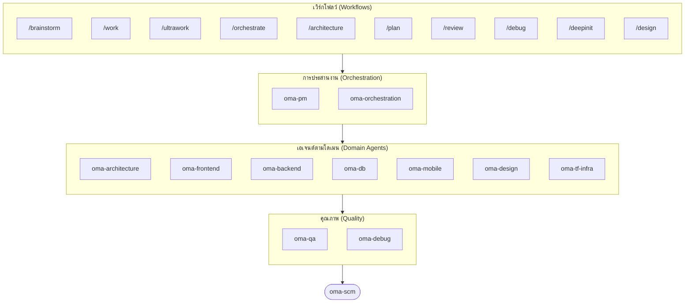

# oh-my-agent: เครื่องมือจัดการชุดเอเจนต์ที่ตรวจสอบงานจริง (The Multi-Agent Harness That Checks the Work)

[](https://www.npmjs.com/package/oh-my-agent) [](https://www.npmjs.com/package/oh-my-agent) [](https://github.com/first-fluke/oh-my-agent) [](https://github.com/first-fluke/oh-my-agent/blob/main/LICENSE) [](https://github.com/first-fluke/oh-my-agent/commits/main)

[English](../README.md) | [한국어](./README.ko.md) | [中文](./README.zh.md) | [Português](./README.pt.md) | [日本語](./README.ja.md) | [Français](./README.fr.md) | [Español](./README.es.md) | [Nederlands](./README.nl.md) | [Polski](./README.pl.md) | [Русский](./README.ru.md) | [Deutsch](./README.de.md) | [Tiếng Việt](./README.vi.md)

**เอเจนต์เล่าว่างานสำเร็จ ส่วน oh-my-agent ตรวจสอบอาร์ติแฟกต์**

การรันเอเจนต์แบบขนานคือส่วนที่ง่าย ส่วนที่ยากคือการรู้ว่าพวกมันลงมือทำงานนั้นจริงหรือไม่ ประโยค "เทสต์ผ่าน ครบทุกเกณฑ์แล้ว" ไม่มีต้นทุนอะไรเลยสำหรับเอเจนต์ และไม่มีอะไรภายในเซสชันเดียวกันนั้นที่จะโต้แย้งได้

oh-my-agent ทำให้คำกล่าวอ้างนั้นพิสูจน์ผิดได้ Stop hook จะไม่ยอมให้จบเซสชันจนกว่าสคริปต์ `typecheck` / `test` / `lint` ของโปรเจกต์คุณเองจะจบด้วย exit code 0 คำสั่ง gate ตัดสินว่าเวิร์กโฟลว์ได้รันจริงหรือไม่ ด้วยการมองหาอาร์ติแฟกต์ที่มันต้องทิ้งไว้ — และผลลัพธ์คือคำตัดสิน JSON ของคำสั่งนั้น ไม่ใช่บทสรุปของเอเจนต์ ผู้ตัดสินอิสระที่มีคอนเท็กซ์ใหม่จะตรวจสอบทุกเกณฑ์ซ้ำในทุกรอบ รวมถึงเกณฑ์ที่ผ่านไปแล้วด้วย ทุกการตัดสินของ gate จะถูกบันทึกลง event log แบบเพิ่มได้อย่างเดียวที่คุณย้อนอ่านได้ภายหลัง จากนั้นก็ใช้วินัยชุดเดียวกันนี้กับ agent runtime อีกนับสิบตัว จากไดเรกทอรี `.agents/` ที่พกพาไปได้เพียงชุดเดียว


[Watch the full video (35s)](./assets/video/oh-my-agent-explainer.mp4)

## Quick Start

```bash
# macOS / Linux — ติดตั้ง bun, uv และ serena ให้อัตโนมัติหากยังไม่ได้ install ไว้
curl -fsSL https://raw.githubusercontent.com/first-fluke/oh-my-agent/main/cli/install.sh | bash
```

```powershell
# Windows (PowerShell) — ติดตั้ง bun, uv และ serena ให้อัตโนมัติหากยังไม่ได้ install ไว้
irm https://raw.githubusercontent.com/first-fluke/oh-my-agent/main/cli/install.ps1 | iex
```

```bash
# หรือรันด้วยตนเอง (ทุก OS, ต้องการ bun + uv + serena)
bunx oh-my-agent@latest
```

### ติดตั้งผ่าน Agent Package Manager

<details>
<summary><a href="https://github.com/microsoft/apm">Agent Package Manager</a> (APM) จาก Microsoft แจกเฉพาะ skill เท่านั้น คลิกเพื่อขยาย</summary>

> อย่าสับสนกับ APM (Application Performance Monitoring) ของ `oma-observability`

```bash
# ทุก skill ติดตั้งลงทุก runtime ที่ตรวจพบ
# (.claude, .cursor, .codex, .opencode, .github, .agents)
apm install first-fluke/oh-my-agent

# Skill เดี่ยว
apm install first-fluke/oh-my-agent/.agents/skills/oma-frontend
```

APM แจกแค่ skill เท่านั้น ส่วน workflow, rules, `oma-config.yaml`, hook สำหรับตรวจจับคำสำคัญ และ CLI `oma agent spawn` ให้ใช้ `bunx oh-my-agent@latest` แทน เลือกใช้แค่วิธีเดียวต่อโปรเจกต์ จะได้ไม่ตีกัน

</details>

เลือก Preset ที่ต้องการ แล้วคุณก็พร้อมใช้งาน:

| Preset | สิ่งที่คุณจะได้รับ |
|--------|-------------|
| **All** | **Agents และ skills ทั้งหมด** |
| Backend | architecture + backend + brainstorm + db + debug + dev-workflow + pm + qa + scm |
| Content | academic-writer + design + image + scm + translator + voice |
| DevOps | architecture + brainstorm + debug + dev-workflow + observability + pm + qa + scm + tf-infra |
| Frontend | architecture + brainstorm + debug + design + frontend + pm + qa + scm |
| Fullstack | architecture + backend + brainstorm + db + debug + design + dev-workflow + frontend + mobile + pm + qa + scm + tf-infra |
| Fullstack Mobile | architecture + backend + brainstorm + db + debug + design + dev-workflow + mobile + pm + qa + scm |
| Fullstack Web | architecture + backend + brainstorm + db + debug + design + dev-workflow + frontend + pm + qa + scm |
| Mobile | architecture + brainstorm + debug + mobile + pm + qa + scm |
| Research | academic-writer + hwp + market + pdf + scholar + scm + search + translator |

## ใช้งานได้กับทุก Agent

การตรวจสอบจะมีค่าน้อยมากถ้ามันถูกล็อกไว้กับผู้ให้บริการรายเดียว `oh-my-agent` รักษา `.agents/` ไว้เป็นแหล่งความจริงเพียงแหล่งเดียว (SSOT) แล้วฉายไปยัง layout เนทีฟของแต่ละ runtime เครื่องมือที่รองรับทุกตัวจึงใช้ skills, workflows, กฎ และ gate ร่วมกัน — และการเปลี่ยนผู้ให้บริการก็เป็นแค่การแก้คอนฟิก ไม่ใช่การย้ายระบบ

<table>
<colgroup>
<col span="6" style="width:16.67%" />
</colgroup>
<tr>
<td align="center">
<a href="https://claude.com/product/claude-code"></a><br/>
<strong>Claude Code</strong><br/>
<sub>เนทีฟ + อะแดปเตอร์</sub>
</td>
<td align="center">
<a href="https://github.com/openai/codex"></a><br/>
<strong>Codex CLI</strong><br/>
<sub>เนทีฟ + อะแดปเตอร์</sub>
</td>
<td align="center">
<a href="https://antigravity.google"></a><br/>
<strong>Antigravity</strong><br/>
<sub>SSOT เนทีฟ</sub>
</td>
<td align="center">
<a href="https://cursor.com"></a><br/>
<strong>Cursor</strong><br/>
<sub>เนทีฟ + อะแดปเตอร์</sub>
</td>
<td align="center">
<a href="https://github.com/QwenLM/qwen-code"></a><br/>
<strong>Qwen Code</strong><br/>
<sub>dispatch เนทีฟ</sub>
</td>
<td align="center">
<a href="https://github.com/esengine/DeepSeek-Reasonix"></a><br/>
<strong>Reasonix</strong><br/>
<sub>เข้ากันได้แบบเนทีฟ</sub>
</td>
</tr>
<tr>
<td align="center">
<a href="https://pi.dev/"></a><br/>
<strong>Pi</strong><br/>
<sub>เข้ากันได้แบบเนทีฟ</sub>
</td>
<td align="center">
<a href="https://github.com/anomalyco/opencode"></a><br/>
<strong>OpenCode</strong><br/>
<sub>เข้ากันได้แบบเนทีฟ</sub>
</td>
<td align="center">
<a href="https://ampcode.com"></a><br/>
<strong>Amp</strong><br/>
<sub>เข้ากันได้แบบเนทีฟ</sub>
</td>
<td align="center">
<a href="https://github.com/features/copilot"></a><br/>
<strong>GitHub Copilot</strong><br/>
<sub>skills ผ่าน symlink</sub>
</td>
<td align="center">
<a href="https://grok.x.ai"></a><br/>
<strong>Grok Build</strong><br/>
<sub>native hooks</sub>
</td>
<td align="center">
<a href="https://kiro.dev"></a><br/>
<strong>Kiro CLI</strong><br/>
<sub>native hooks + agents</sub>
</td>
</tr>
</table>

<p align="center"><sub><a href="./SUPPORTED_AGENTS.md">& อื่นๆ</a></sub></p>

## ทีมวิศวกรของคุณ

แทนที่จะให้ AI ตัวเดียวทำทุกอย่าง (และเริ่มสับสนระหว่างทำงาน) oh-my-agent จะแบ่งงานให้เอเจนต์เฉพาะทาง แต่ละตัวจะมีความเข้าใจในโดเมนของตัวเองอย่างลึกซึ้ง มีเครื่องมือและรายการตรวจสอบ (checklists) ของตัวเอง และมุ่งเน้นเฉพาะงานในหน้าที่ของตน

| Agent | หน้าที่ |
|-------|-------------|
| **oma-architecture** | ชั่งน้ำหนัก tradeoffs ด้านสถาปัตยกรรม กำหนดขอบเขตโมดูล พร้อมวิเคราะห์ด้วย ADR/ATAM/CBAM |
| **oma-backend** | สร้างและเสริมความปลอดภัยให้ API ด้วย Python, Node.js หรือ Rust |
| **oma-brainstorm** | สำรวจแนวคิดร่วมกับคุณก่อนตัดสินใจลงมือสร้างจริง |
| **oma-db** | ออกแบบ schema, migration, indexes และ vector stores ให้กับโปรเจกต์ของคุณ |
| **oma-debug** | ค้นหาสาเหตุต้นตอ แก้ไขบัค และเขียน regression test ไว้กันซ้ำ |
| **oma-deepsec** | สแกนโค้ดหาช่องโหว่ด้านความปลอดภัย และบล็อก pull request ที่มีความเสี่ยง |
| **oma-design** | สร้างระบบการออกแบบพร้อม tokens, accessibility และ responsive layouts |
| **oma-dev-workflow** | ทำให้ CI/CD, releases และงานใน monorepo เป็นระบบอัตโนมัติ |
| **oma-docs** | ตรวจสอบเอกสารว่ามีการอ้างอิงที่ผิดหรือไม่ และระบุส่วนที่ได้รับผลกระทบจากการเปลี่ยนแปลงโค้ด |
| **oma-explanation** | แปลง diff/PR/สาขาเป็นเอกสารอธิบาย HTML แบบอินเทอร์แอกทีฟพร้อมแบบทดสอบในไฟล์เดียว |
| **oma-frontend** | สร้าง UI ด้วย React/Next.js, TypeScript, Tailwind CSS v4 และ shadcn/ui |
| **oma-mobile** | สร้างแอปพลิเคชัน cross-platform ด้วย Flutter |
| **oma-observability** | กระจายงานด้าน observability ครอบคลุม metrics, logs, traces, SLOs และการวิเคราะห์เหตุการณ์ |
| **oma-orchestration** | รันเอเจนต์หลายตัวพร้อมกันแบบ parallel ผ่าน CLI |
| **oma-pm** | วางแผนงาน ย่อย requirements และกำหนด API contracts |
| **oma-qa** | ตรวจสอบโค้ดตามมาตรฐาน OWASP ด้านความปลอดภัย ประสิทธิภาพ และ accessibility |
| **oma-refactor** | รีแฟกเตอร์โค้ดโดยไม่เปลี่ยนพฤติกรรม ด้วยการเลือก hotspot ใช้ characterization test เป็นตาข่ายนิรภัย และคอมมิตเฉพาะ refactor |
| **oma-scm** | จัดการ branches, merges, worktrees และ Conventional Commits |
| **oma-search** | ส่งคำค้นหาแต่ละรายการไปยังแหล่งที่ดีที่สุด พร้อมให้คะแนนความน่าเชื่อถือของผลลัพธ์ |
| **oma-tf-infra** | จัดเตรียม multi-cloud infrastructure ด้วย Terraform |

<details>
<summary>เครื่องมือภายในและเมตา</summary>

| Agent | หน้าที่ |
|-------|-------------|
| **oma-coordination** | แนะนำการประสานงานเอเจนต์ PM, frontend, backend, mobile และ QA ทีละขั้นตอนแบบแมนวล |
| **oma-skill-creation** | เขียนและตรวจสอบ OMA skills ใหม่ในรูปแบบ SSL-lite |

</details>

## นอกเหนือจากโค้ด: ไปป์ไลน์คอนเทนต์และงานวิจัย

แยกออกจากทีมวิศวกร oma ยังมีไปป์ไลน์สำหรับคอนเทนต์และงานวิจัยที่สร้างขึ้นด้วยวินัยทางวิศวกรรมชุดเดียวกัน ได้แก่ การเล่นซ้ำแบบกำหนดผลได้จาก fixture, manifest สำหรับการทำซ้ำผลลัพธ์ และการรายงานอย่างตรงไปตรงมาเมื่อคุณภาพลดลงเพราะขาดแหล่งข้อมูลหรือคีย์ของผู้ให้บริการ แทนที่จะให้ผลลัพธ์ที่บางลงอย่างเงียบๆ

| Agent | หน้าที่ |
|-------|-------------|
| **oma-academic-writing** | ร่าง แก้ไข และตรวจสอบงานเขียนเชิงวิชาการให้ได้มาตรฐานระดับตีพิมพ์ |
| **oma-hwp** | แปลงไฟล์ HWP, HWPX และ HWPML ให้เป็น Markdown |
| **oma-image** | สร้างภาพผ่าน AI หลายผู้ให้บริการพร้อมกันในคราวเดียว |
| **oma-market** | วิจัยตลาดจากสัญญาณคอมมิวนิตี้ และวิเคราะห์ด้วยกรอบ SWOT, Porter's 5F และ PESTEL |
| **oma-pdf** | แปลงไฟล์ PDF ให้เป็น Markdown |
| **oma-recap** | สรุปประวัติการสนทนาของคุณออกมาเป็น work summaries ตามธีม |
| **oma-scholar** | ค้นหาวรรณกรรมเชิงวิชาการ และช่วยดำเนินการทบทวนโดยผู้เชี่ยวชาญ |
| **oma-slide** | สร้าง HTML presentation deck ที่มีเอกลักษณ์และแอนิเมชันสมบูรณ์ รวมถึงส่งออกเป็น PDF/PNG/PPTX |
| **oma-translation** | แปลระหว่างภาษาต่างๆ ให้อ่านแล้วรู้สึกเหมือนเจ้าของภาษาเขียนเอง |
| **oma-video** | สร้างวิดีโอสั้น วิดีโออธิบาย และวิดีโอเดโมผ่านไปป์ไลน์ Remotion ที่ใช้ได้แม้ไม่มีคีย์ |
| **oma-voice** | สร้างเสียงพากย์และถอดเสียงบนเครื่อง โดยไม่ต้องพึ่ง cloud |

## วิธีการทำงาน

เพียงแค่แชท อธิบายสิ่งที่คุณต้องการ แล้ว oh-my-agent จะคิดเองว่าควรใช้เอเจนต์ตัวไหน

```
คุณ: "สร้างแอป TODO พร้อมระบบล็อกอินผู้ใช้"
→ PM วางแผนงาน
→ Backend สร้าง API สำหรับ authentication
→ Frontend สร้าง UI ด้วย React
→ DB ออกแบบ schema
→ QA ตรวจสอบความเรียบร้อยทั้งหมด
→ เสร็จสิ้น: โค้ดที่ผ่านการประสานงานและตรวจสอบแล้ว
```

หรือใช้คำสั่ง Slash commands สำหรับเวิร์กโฟลว์ที่มีโครงสร้าง:

| ขั้นตอน | คำสั่ง | หน้าที่ |
|------|---------|-------------|
| 0 | `/deepinit` | จับคู่โค้ดเบสที่มีอยู่ของคุณลงใน AGENTS.md, ARCHITECTURE.md และ docs |
| 1 | `/brainstorm` | สำรวจไอเดียไปกับคุณก่อนตัดสินใจลงมือสร้าง |
| 2 | `/architecture` | ชั่งน้ำหนักความคุ้มค่า (tradeoffs) ของดีไซน์ และวางขอบเขตโมดูลให้ชัดเจน |
| 2 | `/design` | สร้างระบบการออกแบบของคุณพร้อม tokens, accessibility และเลย์เอาต์แบบ responsive |
| 2 | `/plan` | ย่อยฟีเจอร์ของคุณออกเป็นงานย่อย (tasks) ที่จัดลำดับความสำคัญแล้ว |
| 3 | `/work` | สร้างฟีเจอร์ของคุณทีละขั้นตอนข้ามเอเจนต์หลายตัว |
| 3 | `/orchestrate` | รันเอเจนต์หลายตัวแบบขนานเพื่อสร้างฟีเจอร์ของคุณให้เร็วขึ้น |
| 3 | `/ultrawork` | สร้างฟีเจอร์ของคุณผ่าน 5 ระยะคุณภาพที่มีจุดตรวจ (gate); ทุกการรีวิวจะรันในเซสชันผู้รีวิวใหม่ที่แยกอิสระ (cross-context review) |
| 3 | `/ralph` | ทำ `/ultrawork` ซ้ำจนกว่าผู้ตรวจสอบอิสระจะผ่านทุกเกณฑ์ |
| 4 | `/review` | ตรวจสอบโค้ดของคุณหาปัญหาด้านความปลอดภัย ประสิทธิภาพ และ accessibility |
| 4 | `/deepsec` | สแกนความปลอดภัยเชิงลึกและบล็อก pull request ที่มีความเสี่ยง |
| 5 | `/debug` | หาสาเหตุต้นตอ แก้บัค และเขียน regression test |
| 5 | `/docs` | ตรวจสอบเอกสารของคุณหา reference ที่เสีย และปะส่วนที่ได้รับผลจากการเปลี่ยนแปลงโค้ด |
| 6 | `/scm` | จัดการ branch, การ merge และ Conventional Commits ของคุณ |
| - | `/schedule` | ตั้งเวลางานเอเจนต์ให้รันซ้ำตามรอบเวลาที่กำหนด |

**การตรวจจับอัตโนมัติ**: คุณไม่จำเป็นต้องใช้คำสั่ง slash ตลอดเวลา คำสำคัญเช่น "architecture", "plan", "review", และ "debug" ในข้อความของคุณ (รองรับ 11 ภาษา!) จะเปิดใช้งานเวิร์กโฟลว์ที่ถูกต้องโดยอัตโนมัติ ความแม่นยำในการตรวจจับนั้นวัดผลได้จริง ไม่ใช่แค่สมมติเอา: `oma verify triggers` ให้คะแนนตัวตรวจจับกับชุดข้อมูล 171 prompt ที่ติดป้ายกำกับไว้ (ปัจจุบัน **0% missed-fire** และ false-fire ต่ำกว่า 10%) และใช้เป็นเกณฑ์ gate ของ CI

### โมเดลต่อเอเจนต์

ตั้งค่า `model_preset` ใน `.agents/oma-config.yaml` เพื่อเลือกว่าแต่ละเอเจนต์จะใช้ AI โมเดลตัวไหน:

```yaml
language: en
model_preset: mixed   # antigravity | claude | codex | cursor | kiro | mixed | qwen

# Optional per-agent overrides
agents:
  backend: { model: openai/gpt-5.5, effort: high }
```

- `oma doctor --profile` — แสดงเมทริกซ์โมเดลที่ resolve แล้วตามแต่ละ role
- คู่มือฉบับเต็ม: [`web/docs/guide/per-agent-models.md`](../web/docs/guide/per-agent-models.md)

## ตรวจสอบ ไม่ใช่เล่าเรื่อง

กลไกทุกข้อด้านล่างเป็นเชิงกลไกล้วน: คำสั่งจบด้วย exit code 0 หรือไม่ก็ไม่จบ ไฟล์อยู่บนดิสก์หรือไม่ก็ไม่มี ไม่มีการถาม LLM ว่างาน "ดูถูกต้องแล้วหรือยัง"

| กลไก | ตรวจสอบอะไรเชิงกลไก | อยู่ที่ไหน |
|------|---------------------|-----------|
| **Stop-hook gate** | บล็อกการจบเซสชันขณะที่ persistent workflow ยังทำงานอยู่ และรัน gate script ที่ตั้งค่าไว้ก่อนจะอนุญาตให้หยุด มีเพียง `typecheck`, `test` และ `lint` เท่านั้นที่รันได้ — สิ่งอื่นที่เอเจนต์เขียนลงไฟล์สถานะจะถูกเพิกเฉย ไม่มีวันถูกรัน จำกัดการย้ำเตือนไว้ที่ 5 ครั้ง เพื่อไม่ให้ gate ที่แดงถาวรกักคุณไว้ | [`.agents/hooks/core/persistent-mode.ts`](../.agents/hooks/core/persistent-mode.ts) |
| **Anti-Circumvention Gate** | `oma ralph verify --json` ตรวจอาร์ติแฟกต์ 4 อย่างที่การลัดขั้นตอนปลอมไม่ได้ ได้แก่ บันทึกเฟสของ ultrawork, ไฟล์ JSON ของแผน, ไฟล์ผลลัพธ์จาก **QA agent คนละตัว** และไฟล์ผลลัพธ์จาก **refactor agent คนละตัว** อาร์ติแฟกต์ที่หายไปหมายความว่าเฟสนั้นไม่ได้รันจริง ไม่ว่าจะเล่ามาอย่างไรก็ตาม | [`.agents/workflows/ralph.md`](../.agents/workflows/ralph.md) |
| **ผู้ตัดสินอิสระ** | ถูก spawn เป็นเอเจนต์แยกที่มีคอนเท็กซ์ใหม่หมด รับรู้เพียงเกณฑ์เท่านั้น — ไม่เคยรู้ว่าฝ่ายลงมือทำอ้างว่าแก้อะไรไปบ้าง ตรวจสอบซ้ำ **ทุก** เกณฑ์ในทุก iteration รวมถึงเกณฑ์ที่ PASS ไปแล้ว เพราะการแก้ C2 คือวิธีที่ C1 พังแบบเงียบๆ | [`judge-protocol.md`](../.agents/workflows/ralph/resources/judge-protocol.md) |
| **สถานะแบบ event-sourced** | ทุกครั้งที่ gate ผ่าน gate ไม่ผ่าน และทุกการตัดสินใจ จะเพิ่ม JSON หนึ่งบรรทัดลงใน `~/.oma/u/0/sessions/{sid}/events.jsonl` พร้อมประทับ vendor และ session id ของ runtime เพิ่มได้อย่างเดียว ข้ามผู้ให้บริการได้ และตรวจสอบย้อนหลังได้หลังรันเสร็จ | [`event-spec.md`](../.agents/skills/_shared/runtime/event-spec.md) |
| **ชุดตรวจสอบรายเอเจนต์** | `oma verify <agent>` รัน core ที่ใช้ร่วมกัน (scope violation, charter alignment, secret ที่ hardcode, สแกน TODO, declared outputs) บวกกับการตรวจสอบเฉพาะประเภท (TypeScript strict, tests, raw SQL, Flutter analyze, inline styles) | `oma verify <agent>` |
| **ชุดวัดผล skill** | `oma skill eval` วัดว่า skill ช่วยเพิ่มประโยชน์ได้จริงแค่ไหนบนงานที่กันไว้ — treatment เทียบกับ baseline — แทนที่จะเดาเอาว่า skill นั้นช่วยได้ ส่วน `oma skill optimize` จะเก็บไว้เฉพาะการแก้ไขที่ทำให้ค่าที่วัดได้ดีขึ้น | [คู่มือ skill-eval](../web/docs/guide/skill-eval.md) |

งบประมาณก็บังคับใช้ด้วยวิธีเดียวกัน `session.quota_cap` จำกัดจำนวน token, จำนวน spawn และค่าใช้จ่ายต่อผู้ให้บริการ ออร์เคสเตรเตอร์จะปฏิเสธการ spawn ครั้งถัดไปทันทีที่มิติใดมิติหนึ่งเกินเพดาน และเมื่องบประมาณเวลาหมดลง Stop hook จะหยุดอย่างตรงไปตรงมาพร้อมบันทึกสถานะที่ทำได้บางส่วนลง event log แทนที่จะแกล้งทำเป็นว่างานเสร็จแล้ว

## ทำไมต้อง oh-my-agent?

- **Role-based**: เอเจนต์ถูกจำลองตามทีมวิศวกรจริง ไม่ใช่แค่กลุ่มของ prompt
- **ประหยัด Token**: การออกแบบ Two layer skill ช่วยประหยัด token ได้ประมาณ 75% ([วิธีการทำงาน](../web/docs/guide/usage.md))
- **กู้คืนได้ (Recoverable)**: หลังจาก retry ล้มเหลว 2 ครั้ง `orchestrate` จะ spawn variant ของ hypothesis แบบขนานและเก็บผลที่ได้คะแนนสูงสุด แทนที่จะวนซ้ำแนวทางที่ผิดอยู่ไม่จบสิ้น
- **เข้าใจ Monorepo**: `detectWorkspace` อ่าน pnpm / nx / turbo / lerna และส่งแต่ละ agent ไปยัง workspace ของตัวเอง
- **รองรับหลายผู้ให้บริการ (Multi-vendor)**: ผสมผสานการใช้ Antigravity, Claude, Codex, Cursor, Kiro และ Qwen ตามประเภทของเอเจนต์
- **ตรวจสอบได้ (Observable)**: มีหน้าจอ Dashboard ทั้งใน Terminal และ Web เพื่อดูสถานะแบบเรียลไทม์

## สถาปัตยกรรม (Architecture)



## เรียนรู้เพิ่มเติม

- **[รายละเอียดสเปก (Docs)](./AGENTS_SPEC.md)**: รายละเอียดทางเทคนิคและสถาปัตยกรรมฉบับเต็ม
- **[เอเจนต์ที่รองรับ](./SUPPORTED_AGENTS.md)**: ตารางเปรียบเทียบเอเจนต์ใน IDE ต่างๆ
- **[รายงานเบนช์มาร์ก](../benchmarks/README.md)**: วิธีการวัดผล คะแนน ภาพหน้าจอ และข้อควรระวัง
- **[เอกสารบนเว็บ](https://first-fluke.github.io/oh-my-agent/)**: คู่มือ บทเรียน และการอ้างอิง CLI

## ผู้สนับสนุน (Sponsors)

โปรเจกต์นี้ได้รับการดูแลรักษาขอบคุณผู้สนับสนุนที่ใจดีทุกท่าน
Project นี้ได้รับการสนับสนุนจาก sponsor ใจดีทุกๆท่าน

> **หากชอบ Project นี้?** ติดดาวให้เราได้นะค้าบบ !
>
> ```bash
> gh api --method PUT /user/starred/first-fluke/oh-my-agent
> ```
>
> ลองใช้ template เริ่มต้นที่ปรับแต่งมาแล้วได้ที่: [fullstack-starter](https://github.com/first-fluke/fullstack-starter)

<a href="https://github.com/sponsors/first-fluke">
  
</a>
<a href="https://buymeacoffee.com/firstfluke">
  
</a>

### 🚀 Champion
### 🛸 Booster
### ☕ Contributor

[เป็นผู้สนับสนุน →](https://github.com/sponsors/first-fluke)

ดูรายชื่อผู้สนับสนุนทั้งหมดที่ [SPONSORS.md](../SPONSORS.md)

## ประวัติการติดดาว (Star History)

[](https://star-history.dera.page/#first-fluke/oh-my-agent&type=date&legend=bottom-right)

## เอกสารอ้างอิง

- Li, X., Liu, Y., Chen, W., You, B., Di, Z., He, Y., Zheng, S., Choe, K. W., Sun, J., Wang, S., Tao, C., Li, B., Zhao, X., Geng, H., Wu, X., Zhou, J., Chen, X., Xing, H., Li, Y., … Song, D. (2026). *SkillsBench: Benchmarking how well agent skills work across diverse tasks* (Version 4) [Preprint]. arXiv. https://doi.org/10.48550/arXiv.2602.12670
- Yu, G., & Wang, X. (2026). *Knows: Agent-native structured research representations* (Version 1) [Preprint]. arXiv. https://doi.org/10.48550/arXiv.2604.17309
- Liang, Q., Wang, H., Liang, Z., & Liu, Y. (2026). *From skill text to skill structure: The scheduling-structural-logical representation for agent skills* (Version 4) [Preprint]. arXiv. https://doi.org/10.48550/arXiv.2604.24026
- Chen, C., Yu, Q., Gu, Y., Huang, Z., Li, H., Liu, H., Liu, S., Liu, J., Peng, D., Wang, J., Yan, Z., Meng, F., Qin, E., Che, C., & Hu, M. (2026). *The scaling laws of skills in LLM agent systems* (Version 1) [Preprint]. arXiv. https://doi.org/10.48550/arXiv.2605.16508
- Tang, L., Rashtchian, C., Ferng, C.-S., Tomkins, A., Juan, D.-C., & Vu, T. (2026). *WikiSkill: Compiling agent experience into persistent knowledge for skill evolution* [Preprint]. arXiv. https://doi.org/10.48550/arXiv.2608.27454
- Huang, Z., Xu, J., Yang, Y., Gong, Z., Yang, Q., Tian, M., Wang, X., Lv, C., Gao, X., Dai, Q., Liu, B., Qiu, K., Yang, X., Chen, D., Zheng, X., & Luo, C. (2026). *From raw experience to skill consumption: A systematic study of model-generated agent skills* [Preprint]. arXiv. https://doi.org/10.48550/arXiv.2605.23899
- Hong, D. B., Imani, A., & Ahmed, I. (2026). *From anatomy to smells: An empirical study of SKILL.md in agent skills* (Version 2) [Preprint]. arXiv. https://doi.org/10.48550/arXiv.2607.01456

## License

MIT
