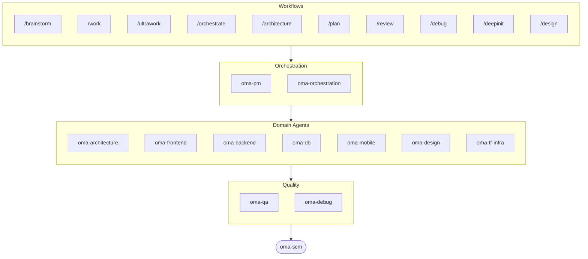

# oh-my-agent: Bộ khung đa tác nhân biết kiểm chứng công việc

[](https://www.npmjs.com/package/oh-my-agent) [](https://www.npmjs.com/package/oh-my-agent) [](https://github.com/first-fluke/oh-my-agent) [](https://github.com/first-fluke/oh-my-agent/blob/main/LICENSE) [](https://github.com/first-fluke/oh-my-agent/commits/main)

[English](../README.md) | [한국어](./README.ko.md) | [中文](./README.zh.md) | [Português](./README.pt.md) | [日本語](./README.ja.md) | [Français](./README.fr.md) | [Español](./README.es.md) | [Nederlands](./README.nl.md) | [Polski](./README.pl.md) | [Русский](./README.ru.md) | [Deutsch](./README.de.md) | [ภาษาไทย](./README.th.md)

**Agent kể chuyện thành công. oh-my-agent kiểm chứng artifact.**

Chạy song song nhiều agent là phần dễ. Phần khó là biết được chúng có thực sự làm việc hay không. Câu "test đã pass, mọi tiêu chí đều đạt" chẳng tốn gì của một agent, và không có gì bên trong chính phiên đó phản bác lại được.

oh-my-agent làm cho tuyên bố ấy có thể bị bác bỏ. Một Stop hook không cho kết thúc phiên làm việc cho đến khi script `typecheck` / `test` / `lint` của chính dự án bạn thoát với mã 0. Một lệnh gate quyết định workflow có thực sự chạy hay không bằng cách tìm những artifact mà nó bắt buộc phải để lại — và kết quả chính là phán quyết JSON của lệnh đó, không phải bản tóm tắt của agent. Một trọng tài độc lập với ngữ cảnh hoàn toàn mới kiểm chứng lại mọi tiêu chí ở từng vòng, kể cả những tiêu chí đã đạt. Mọi quyết định của gate đều được ghi vào một nhật ký sự kiện chỉ-thêm mà bạn có thể đọc lại sau. Rồi oh-my-agent áp dụng đúng kỷ luật đó trên cả chục agent runtime, từ một thư mục `.agents/` di động duy nhất.


[Watch the full video (35s)](./assets/video/oh-my-agent-explainer.mp4)

## Bắt đầu nhanh

```bash
# macOS / Linux — tự động cài bun, uv & serena nếu chưa có
curl -fsSL https://raw.githubusercontent.com/first-fluke/oh-my-agent/main/cli/install.sh | bash
```

```powershell
# Windows (PowerShell) — tự động cài bun, uv & serena nếu chưa có
irm https://raw.githubusercontent.com/first-fluke/oh-my-agent/main/cli/install.ps1 | iex
```

```bash
# Hoặc chạy trực tiếp (mọi OS, cần bun + uv + serena)
bunx oh-my-agent@latest
```

### Cài đặt qua Agent Package Manager

<details>
<summary><a href="https://github.com/microsoft/apm">Agent Package Manager</a> (APM) của Microsoft: bản phân phối chỉ có skill. Click để mở rộng.</summary>

> Đừng nhầm với APM (Application Performance Monitoring) của `oma-observability`.

```bash
# Toàn bộ skill, triển khai vào mọi runtime được phát hiện
# (.claude, .cursor, .codex, .opencode, .github, .agents)
apm install first-fluke/oh-my-agent

# Một skill duy nhất
apm install first-fluke/oh-my-agent/.agents/skills/oma-frontend
```

APM chỉ phân phối skill. Còn workflow, rule, `oma-config.yaml`, hook phát hiện từ khóa và CLI `oma agent spawn` thì dùng `bunx oh-my-agent@latest`. Mỗi dự án chỉ chọn một cách phân phối thôi, không thì lệch nhau.

</details>

Chọn một preset và bạn đã sẵn sàng:

| Preset | Bạn nhận được |
|--------|--------------|
| **All** | **Tất cả agent và skill** |
| Backend | architecture + backend + brainstorm + db + debug + dev-workflow + pm + qa + scm |
| Content | academic-writer + design + image + scm + translator + voice |
| DevOps | architecture + brainstorm + debug + dev-workflow + observability + pm + qa + scm + tf-infra |
| Frontend | architecture + brainstorm + debug + design + frontend + pm + qa + scm |
| Fullstack | architecture + backend + brainstorm + db + debug + design + dev-workflow + frontend + mobile + pm + qa + scm + tf-infra |
| Fullstack Mobile | architecture + backend + brainstorm + db + debug + design + dev-workflow + mobile + pm + qa + scm |
| Fullstack Web | architecture + backend + brainstorm + db + debug + design + dev-workflow + frontend + pm + qa + scm |
| Mobile | architecture + brainstorm + debug + mobile + pm + qa + scm |
| Research | academic-writer + hwp + market + pdf + scholar + scm + search + translator |

## Tương thích với mọi Agent

Việc kiểm chứng chẳng có mấy giá trị nếu nó bị khóa vào một nhà cung cấp. `oh-my-agent` giữ `.agents/` làm nguồn sự thật duy nhất (SSOT) và chiếu vào layout gốc của từng runtime, nhờ đó mọi công cụ được hỗ trợ đều dùng chung skills, workflows, rules và gate — và đổi nhà cung cấp chỉ là thay đổi cấu hình, không phải một cuộc di trú.

<table>
<colgroup>
<col span="6" style="width:16.67%" />
</colgroup>
<tr>
<td align="center">
<a href="https://claude.com/product/claude-code"></a><br/>
<strong>Claude Code</strong><br/>
<sub>nguyên bản + adapter</sub>
</td>
<td align="center">
<a href="https://github.com/openai/codex"></a><br/>
<strong>Codex CLI</strong><br/>
<sub>nguyên bản + adapter</sub>
</td>
<td align="center">
<a href="https://antigravity.google"></a><br/>
<strong>Antigravity</strong><br/>
<sub>SSOT nguyên bản</sub>
</td>
<td align="center">
<a href="https://cursor.com"></a><br/>
<strong>Cursor</strong><br/>
<sub>nguyên bản + adapter</sub>
</td>
<td align="center">
<a href="https://github.com/QwenLM/qwen-code"></a><br/>
<strong>Qwen Code</strong><br/>
<sub>dispatch nguyên bản</sub>
</td>
<td align="center">
<a href="https://github.com/esengine/DeepSeek-Reasonix"></a><br/>
<strong>Reasonix</strong><br/>
<sub>tương thích nguyên bản</sub>
</td>
</tr>
<tr>
<td align="center">
<a href="https://pi.dev/"></a><br/>
<strong>Pi</strong><br/>
<sub>tương thích nguyên bản</sub>
</td>
<td align="center">
<a href="https://github.com/anomalyco/opencode"></a><br/>
<strong>OpenCode</strong><br/>
<sub>tương thích nguyên bản</sub>
</td>
<td align="center">
<a href="https://ampcode.com"></a><br/>
<strong>Amp</strong><br/>
<sub>tương thích nguyên bản</sub>
</td>
<td align="center">
<a href="https://github.com/features/copilot"></a><br/>
<strong>GitHub Copilot</strong><br/>
<sub>skills qua symlink</sub>
</td>
<td align="center">
<a href="https://grok.x.ai"></a><br/>
<strong>Grok Build</strong><br/>
<sub>native hooks</sub>
</td>
<td align="center">
<a href="https://kiro.dev"></a><br/>
<strong>Kiro CLI</strong><br/>
<sub>native hooks + agents</sub>
</td>
</tr>
</table>

<p align="center"><sub><a href="./SUPPORTED_AGENTS.md">& thêm</a></sub></p>

## Đội ngũ kỹ thuật của bạn

Thay vì một AI làm tất cả mọi thứ (rồi bị lạc hướng giữa chừng), oh-my-agent phân chia công việc cho các agent chuyên biệt. Mỗi agent hiểu sâu lĩnh vực của mình, có công cụ và checklist riêng, và chỉ tập trung vào phần việc được giao.

| Agent | Chức năng |
|-------|----------|
| **oma-architecture** | Phân tích đánh đổi kiến trúc và vạch ranh giới module theo hướng ADR/ATAM/CBAM |
| **oma-backend** | Xây dựng và bảo mật API bằng Python, Node.js hoặc Rust |
| **oma-brainstorm** | Cùng bạn khám phá ý tưởng trước khi bắt tay vào xây dựng |
| **oma-db** | Thiết kế schema, migration, index và vector store cho dự án của bạn |
| **oma-debug** | Tìm nguyên nhân gốc rễ, sửa lỗi và viết regression test |
| **oma-deepsec** | Quét lỗ hổng bảo mật trong code và chặn pull request rủi ro |
| **oma-design** | Xây dựng hệ thống thiết kế với token, accessibility và responsive layout |
| **oma-dev-workflow** | Tự động hóa CI/CD, release và các tác vụ monorepo |
| **oma-docs** | Kiểm tra tài liệu có tham chiếu bị hỏng và đánh dấu những tài liệu bị ảnh hưởng bởi thay đổi code |
| **oma-explanation** | Chuyển diff, PR hoặc nhánh thành tài liệu giải thích HTML tương tác độc lập kèm quiz |
| **oma-frontend** | Xây dựng giao diện với React/Next.js, TypeScript, Tailwind CSS v4 và shadcn/ui |
| **oma-mobile** | Xây dựng ứng dụng di động đa nền tảng với Flutter |
| **oma-observability** | Định tuyến công việc observability qua metrics, logs, traces, SLO và điều tra sự cố |
| **oma-orchestration** | Chạy nhiều agent song song từ CLI |
| **oma-pm** | Lập kế hoạch tác vụ, phân tích yêu cầu và định nghĩa API contract |
| **oma-qa** | Rà soát code theo tiêu chuẩn bảo mật OWASP, hiệu suất và accessibility |
| **oma-refactor** | Tái cấu trúc mã mà không đổi hành vi, dùng hotspot, characterization test làm lưới an toàn và commit chỉ chứa refactor |
| **oma-scm** | Quản lý nhánh, merge, worktree và Conventional Commits |
| **oma-search** | Định tuyến mỗi truy vấn đến nguồn tốt nhất và chấm điểm độ tin cậy của kết quả |
| **oma-tf-infra** | Triển khai hạ tầng đa đám mây bằng Terraform |

<details>
<summary>Công cụ nội bộ & meta</summary>

| Agent | Chức năng |
|-------|----------|
| **oma-coordination** | Hướng dẫn phối hợp thủ công từng bước các agent PM, frontend, backend, mobile và QA |
| **oma-skill-creation** | Soạn và kiểm tra skill OMA mới theo định dạng SSL-lite |

</details>

## Ngoài code: Pipeline nội dung & nghiên cứu

Tách khỏi đội ngũ kỹ thuật, oma còn cung cấp các pipeline nội dung và nghiên cứu được xây theo đúng kỷ luật kỹ thuật đó: chạy lại xác định từ fixture, manifest để tái lập kết quả, và báo cáo suy giảm một cách trung thực khi thiếu nguồn dữ liệu hoặc khóa nhà cung cấp, thay vì âm thầm trả về kết quả mỏng hơn.

| Agent | Chức năng |
|-------|----------|
| **oma-academic-writing** | Soạn, chỉnh sửa và kiểm tra văn xuôi học thuật đạt chuẩn xuất bản |
| **oma-hwp** | Chuyển đổi file HWP, HWPX và HWPML sang Markdown |
| **oma-image** | Tạo ảnh qua nhiều nhà cung cấp AI cùng lúc |
| **oma-market** | Nghiên cứu thị trường từ tín hiệu cộng đồng và trình bày theo khung SWOT, Porter's 5F và PESTEL |
| **oma-pdf** | Chuyển đổi file PDF sang Markdown |
| **oma-recap** | Tóm tắt lịch sử hội thoại thành báo cáo công việc theo chủ đề |
| **oma-scholar** | Tìm kiếm tài liệu học thuật và hỗ trợ bình duyệt khoa học |
| **oma-slide** | Tạo các deck trình bày HTML đặc trưng giàu hoạt hình và xuất sang PDF/PNG/PPTX |
| **oma-translation** | Dịch giữa các ngôn ngữ tự nhiên như thể bản ngữ viết |
| **oma-video** | Tạo video ngắn, video giải thích và video demo qua pipeline Remotion dùng được cả khi không có khóa |
| **oma-voice** | Tạo lồng tiếng và gỡ băng âm thanh ngay trên thiết bị, không cần đám mây |

## Cách hoạt động

Chỉ cần trò chuyện. Mô tả điều bạn muốn và oh-my-agent sẽ tự tìm ra agent phù hợp.

```
You: "Xây dựng ứng dụng TODO có xác thực người dùng"
→ PM lập kế hoạch công việc
→ Backend xây dựng API xác thực
→ Frontend xây dựng giao diện React
→ DB thiết kế schema
→ QA đánh giá toàn bộ
→ Hoàn thành: mã nguồn được phối hợp và đánh giá
```

Hoặc sử dụng slash command cho các workflow có cấu trúc:

| Bước | Lệnh | Chức năng |
|------|------|----------|
| 0 | `/deepinit` | Lập bản đồ codebase hiện có của bạn vào AGENTS.md, ARCHITECTURE.md và docs |
| 1 | `/brainstorm` | Cùng bạn khám phá ý tưởng trước khi bắt tay xây dựng |
| 2 | `/architecture` | Cân nhắc trade-off thiết kế và vạch ranh giới module gọn gàng cho bạn |
| 2 | `/design` | Dựng hệ thống thiết kế cho bạn với token, accessibility và layout responsive |
| 2 | `/plan` | Phân tách tính năng của bạn thành các task được ưu tiên |
| 3 | `/work` | Xây dựng tính năng của bạn từng bước qua nhiều agent |
| 3 | `/orchestrate` | Chạy nhiều agent song song để xây tính năng của bạn nhanh hơn |
| 3 | `/ultrawork` | Xây dựng tính năng của bạn qua năm giai đoạn chất lượng có cổng kiểm soát; mọi lượt đánh giá đều chạy trong một phiên đánh giá mới, tách biệt (cross-context review) |
| 3 | `/ralph` | Lặp lại `/ultrawork` cho đến khi một trình kiểm chứng độc lập đạt mọi tiêu chí |
| 4 | `/review` | Rà soát code của bạn về các vấn đề bảo mật, hiệu suất và accessibility |
| 4 | `/deepsec` | Quét bảo mật chuyên sâu và chặn các pull request rủi ro |
| 5 | `/debug` | Tìm nguyên nhân gốc, sửa lỗi và viết regression test |
| 5 | `/docs` | Kiểm tra tài liệu của bạn về tham chiếu hỏng và vá những phần mà thay đổi code chạm tới |
| 6 | `/scm` | Quản lý branch, merge và Conventional Commits của bạn |
| - | `/schedule` | Lên lịch một job agent chạy theo chu kỳ lặp lại |

**Tự động phát hiện**: Bạn không nhất thiết cần slash command. Các từ khóa như "kiến trúc", "kế hoạch", "đánh giá", "debug" trong tin nhắn (hỗ trợ 11 ngôn ngữ!) sẽ tự động kích hoạt workflow phù hợp. Độ chính xác phát hiện được đo lường chứ không phải phỏng đoán: `oma verify triggers` chấm điểm bộ phát hiện dựa trên một corpus 171 prompt đã gán nhãn (hiện tại **0% bỏ sót**, dưới 10% kích hoạt nhầm) và dùng nó làm cổng gác CI.

### Model theo từng agent

Đặt `model_preset` trong `.agents/oma-config.yaml` để chọn AI model mà mỗi agent sẽ dùng:

```yaml
language: en
model_preset: mixed   # antigravity | claude | codex | cursor | kiro | mixed | qwen

# Optional per-agent overrides
agents:
  backend: { model: openai/gpt-5.5, effort: high }
```

- `oma doctor --profile` — in ra ma trận model đã resolve theo từng vai trò
- Hướng dẫn đầy đủ: [`web/docs/guide/per-agent-models.md`](../web/docs/guide/per-agent-models.md)

## Kiểm chứng, không phải kể chuyện

Mọi cơ chế dưới đây đều mang tính máy móc: một lệnh hoặc thoát với mã 0 hoặc không, một file hoặc có trên đĩa hoặc không. Không LLM nào bị hỏi rằng công việc "trông có vẻ đúng" hay chưa.

| Cơ chế | Kiểm tra máy móc điều gì | Nằm ở đâu |
|--------|--------------------------|-----------|
| **Stop-hook gate** | Chặn việc kết thúc phiên khi còn một persistent workflow đang chạy, và chạy gate script đã cấu hình trước khi cho phép dừng. Chỉ `typecheck`, `test` và `lint` mới được thực thi — agent ghi bất cứ thứ gì khác vào file trạng thái thì thứ đó bị bỏ qua, không bao giờ được chạy. Giới hạn 5 lần nhắc lại để một gate đỏ vĩnh viễn không giam bạn lại. | [`.agents/hooks/core/persistent-mode.ts`](../.agents/hooks/core/persistent-mode.ts) |
| **Anti-Circumvention Gate** | `oma ralph verify --json` kiểm tra bốn artifact mà việc đi tắt không thể giả mạo: bản ghi các phase của ultrawork, file JSON kế hoạch, file kết quả của **một QA agent riêng biệt** và file kết quả của **một refactor agent riêng biệt**. Thiếu artifact nghĩa là phase đó không hề chạy, bất kể lời kể ra sao. | [`.agents/workflows/ralph.md`](../.agents/workflows/ralph.md) |
| **Trọng tài độc lập** | Được spawn như một agent riêng với ngữ cảnh mới tinh, chỉ biết các tiêu chí — không bao giờ biết bên thực thi tuyên bố đã sửa những gì. Kiểm chứng lại **mọi** tiêu chí ở từng iteration, kể cả những tiêu chí đã PASS, vì sửa C2 chính là cách C1 âm thầm regression. | [`judge-protocol.md`](../.agents/workflows/ralph/resources/judge-protocol.md) |
| **Trạng thái event-sourced** | Mỗi lần gate pass, gate fail và mỗi quyết định đều thêm một dòng JSON vào `~/.oma/u/0/sessions/{sid}/events.jsonl`, kèm dấu vendor và session id của runtime. Chỉ-thêm, xuyên vendor, kiểm toán được sau khi chạy xong. | [`event-spec.md`](../.agents/skills/_shared/runtime/event-spec.md) |
| **Bộ kiểm tra theo từng agent** | `oma verify <agent>` chạy phần core dùng chung (scope violation, charter alignment, secret hardcode, quét TODO, declared outputs) cộng thêm các kiểm tra theo loại (TypeScript strict, tests, raw SQL, Flutter analyze, inline styles). | `oma verify <agent>` |
| **Bộ đo hiệu quả skill** | `oma skill eval` đo mức cải thiện hữu ích trên các task giữ riêng — treatment so với baseline — thay vì mặc định tin rằng một skill có ích. `oma skill optimize` chỉ giữ lại những chỉnh sửa làm tăng mức cải thiện đo được. | [hướng dẫn skill-eval](../web/docs/guide/skill-eval.md) |

Ngân sách cũng được thực thi theo đúng cách đó. `session.quota_cap` giới hạn token, số lần spawn và chi phí theo từng vendor; orchestrator từ chối lần spawn kế tiếp khi một chiều vượt hạn mức. Khi hết ngân sách thời gian thực, Stop hook dừng một cách trung thực và ghi trạng thái dở dang vào nhật ký sự kiện, thay vì giả vờ đã hoàn thành.

## Tại sao chọn oh-my-agent?

- **Dựa trên vai trò**: agent được mô hình hóa như đội kỹ thuật thực, không phải một đống prompt
- **Tiết kiệm token**: thiết kế skill 2 lớp tiết kiệm ~75% token ([cách hoạt động](../web/docs/guide/usage.md))
- **Phục hồi được**: sau 2 lần retry thất bại, `orchestrate` spawn các biến thể hypothesis song song và giữ kết quả điểm cao nhất, thay vì lặp mãi một hướng đi sai
- **Hiểu monorepo**: `detectWorkspace` đọc pnpm / nx / turbo / lerna và route mỗi agent đến workspace của nó
- **Đa nhà cung cấp**: kết hợp Antigravity, Claude, Codex, Cursor, Kiro và Qwen theo loại agent
- **Có thể quan sát**: dashboard terminal và web để giám sát thời gian thực

## Kiến trúc



## Tìm hiểu thêm

- **[Tài liệu chi tiết](./AGENTS_SPEC.md)**: đặc tả kỹ thuật và kiến trúc đầy đủ
- **[Agent được hỗ trợ](./SUPPORTED_AGENTS.md)**: ma trận hỗ trợ agent theo IDE
- **[Báo cáo benchmark](../benchmarks/README.md)**: phương pháp, điểm số, ảnh chụp màn hình và các lưu ý
- **[Tài liệu web](https://first-fluke.github.io/oh-my-agent/)**: hướng dẫn, tutorial và CLI reference

## Nhà tài trợ

Dự án này được duy trì nhờ sự hỗ trợ hào phóng của các nhà tài trợ.

> **Thích dự án này?** Hãy tặng một ngôi sao!
>
> ```bash
> gh api --method PUT /user/starred/first-fluke/oh-my-agent
> ```
>
> Thử template starter tối ưu của chúng tôi: [fullstack-starter](https://github.com/first-fluke/fullstack-starter)

<a href="https://github.com/sponsors/first-fluke">
  
</a>
<a href="https://buymeacoffee.com/firstfluke">
  
</a>

### 🚀 Champion

<!-- Champion tier ($100/mo) logos here -->

### 🛸 Booster

<!-- Booster tier ($30/mo) logos here -->

### ☕ Contributor

<!-- Contributor tier ($10/mo) names here -->

[Trở thành nhà tài trợ →](https://github.com/sponsors/first-fluke)

Xem danh sách đầy đủ người ủng hộ tại [SPONSORS.md](../SPONSORS.md).


## Star History

[](https://star-history.dera.page/#first-fluke/oh-my-agent&type=date&legend=bottom-right)


## Tài liệu tham khảo

- Li, X., Liu, Y., Chen, W., You, B., Di, Z., He, Y., Zheng, S., Choe, K. W., Sun, J., Wang, S., Tao, C., Li, B., Zhao, X., Geng, H., Wu, X., Zhou, J., Chen, X., Xing, H., Li, Y., … Song, D. (2026). *SkillsBench: Benchmarking how well agent skills work across diverse tasks* (Version 4) [Preprint]. arXiv. https://doi.org/10.48550/arXiv.2602.12670
- Yu, G., & Wang, X. (2026). *Knows: Agent-native structured research representations* (Version 1) [Preprint]. arXiv. https://doi.org/10.48550/arXiv.2604.17309
- Liang, Q., Wang, H., Liang, Z., & Liu, Y. (2026). *From skill text to skill structure: The scheduling-structural-logical representation for agent skills* (Version 4) [Preprint]. arXiv. https://doi.org/10.48550/arXiv.2604.24026
- Chen, C., Yu, Q., Gu, Y., Huang, Z., Li, H., Liu, H., Liu, S., Liu, J., Peng, D., Wang, J., Yan, Z., Meng, F., Qin, E., Che, C., & Hu, M. (2026). *The scaling laws of skills in LLM agent systems* (Version 1) [Preprint]. arXiv. https://doi.org/10.48550/arXiv.2605.16508
- Tang, L., Rashtchian, C., Ferng, C.-S., Tomkins, A., Juan, D.-C., & Vu, T. (2026). *WikiSkill: Compiling agent experience into persistent knowledge for skill evolution* [Preprint]. arXiv. https://doi.org/10.48550/arXiv.2608.27454
- Huang, Z., Xu, J., Yang, Y., Gong, Z., Yang, Q., Tian, M., Wang, X., Lv, C., Gao, X., Dai, Q., Liu, B., Qiu, K., Yang, X., Chen, D., Zheng, X., & Luo, C. (2026). *From raw experience to skill consumption: A systematic study of model-generated agent skills* [Preprint]. arXiv. https://doi.org/10.48550/arXiv.2605.23899
- Hong, D. B., Imani, A., & Ahmed, I. (2026). *From anatomy to smells: An empirical study of SKILL.md in agent skills* (Version 2) [Preprint]. arXiv. https://doi.org/10.48550/arXiv.2607.01456


## Giấy phép

MIT
