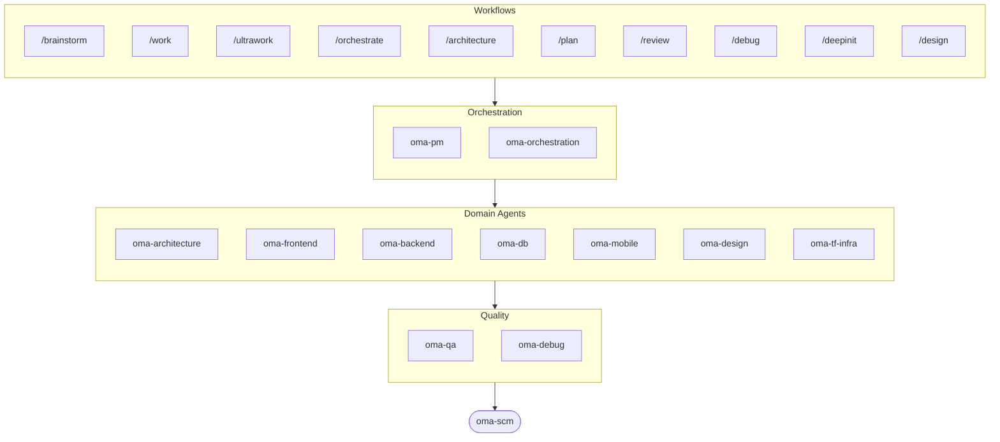

# oh-my-agent：会核查成果的多智能体控制套件

[](https://www.npmjs.com/package/oh-my-agent) [](https://www.npmjs.com/package/oh-my-agent) [](https://github.com/first-fluke/oh-my-agent) [](https://github.com/first-fluke/oh-my-agent/blob/main/LICENSE) [](https://github.com/first-fluke/oh-my-agent/commits/main)

[English](../README.md) | [한국어](./README.ko.md) | [Português](./README.pt.md) | [日本語](./README.ja.md) | [Français](./README.fr.md) | [Español](./README.es.md) | [Nederlands](./README.nl.md) | [Polski](./README.pl.md) | [Русский](./README.ru.md) | [Deutsch](./README.de.md) | [Tiếng Việt](./README.vi.md) | [ภาษาไทย](./README.th.md) 

**agent 会讲述自己成功了。oh-my-agent 会核查产出物。**

并行拉起一堆 agent 是容易的那部分，难的是判断它们到底有没有把活干完。“测试全过，所有标准达标”这句话对 agent 来说毫无成本，而同一个会话里也没有任何东西能反驳它。

oh-my-agent 让这类说法变得可证伪。Stop hook 会拒绝结束会话，直到项目自己的 `typecheck` / `test` / `lint` 脚本以 0 退出为止。门禁命令判断某个工作流是否真的跑过，靠的是它跑过就必然留下的产出物；最终结果以这条命令给出的 JSON 判定为准，而不是 agent 的自述。独立的 judge 每一轮都会在全新上下文里重新校验每一条标准，包括那些已经通过的。每一次门禁判定都会落到一份只追加的事件日志上，事后可以逐条翻看。同一套纪律，再从一个可移植的 `.agents/` 目录铺到十几种 agent 运行时上。


[Watch the full video (35s)](./assets/video/oh-my-agent-explainer.mp4)

## 快速开始

```bash
# macOS / Linux — 自动安装 bun、uv & serena
curl -fsSL https://raw.githubusercontent.com/first-fluke/oh-my-agent/main/cli/install.sh | bash
```

```powershell
# Windows (PowerShell) — 自动安装 bun、uv & serena
irm https://raw.githubusercontent.com/first-fluke/oh-my-agent/main/cli/install.ps1 | iex
```

```bash
# 或者手动运行（任意系统，需要 bun + uv + serena）
bunx oh-my-agent@latest
```

### 通过 Agent Package Manager 安装

<details>
<summary>Microsoft 的 <a href="https://github.com/microsoft/apm">Agent Package Manager</a>（APM）：只分发 skill。点击展开。</summary>

> 别和 `oma-observability` 的 APM（Application Performance Monitoring）搞混。

```bash
# 所有 skill，部署到检测到的每个 runtime
# (.claude, .cursor, .codex, .opencode, .github, .agents)
apm install first-fluke/oh-my-agent

# 单个 skill
apm install first-fluke/oh-my-agent/.agents/skills/oma-frontend
```

APM 只分发 skill。workflow、规则、`oma-config.yaml`、关键词检测 hook 和 `oma agent spawn` CLI 还是用 `bunx oh-my-agent@latest`。一个项目挑一种分发方式就好，免得跑偏。

</details>

选个预设就能开始：

| 预设 | 包含内容 |
|------|---------|
| **All** | **所有 agent 和 skill** |
| Backend | architecture + backend + brainstorm + db + debug + dev-workflow + pm + qa + scm |
| Content | academic-writer + design + image + scm + translator + voice |
| DevOps | architecture + brainstorm + debug + dev-workflow + observability + pm + qa + scm + tf-infra |
| Frontend | architecture + brainstorm + debug + design + frontend + pm + qa + scm |
| Fullstack | architecture + backend + brainstorm + db + debug + design + dev-workflow + frontend + mobile + pm + qa + scm + tf-infra |
| Fullstack Mobile | architecture + backend + brainstorm + db + debug + design + dev-workflow + mobile + pm + qa + scm |
| Fullstack Web | architecture + backend + brainstorm + db + debug + design + dev-workflow + frontend + pm + qa + scm |
| Mobile | architecture + brainstorm + debug + mobile + pm + qa + scm |
| Research | academic-writer + hwp + market + pdf + scholar + scm + search + translator |

## 适配所有 Agent

验证要是只能绑定在一家厂商上，那价值就有限了。`oh-my-agent` 始终把 `.agents/` 作为唯一信源（SSOT），并按每个运行时的原生布局生成对应文件，所有受支持的工具因此共享同一套技能、工作流、规则和门禁，换厂商也就成了改配置，而不是做迁移。

<table>
<colgroup>
<col span="6" style="width:16.67%" />
</colgroup>
<tr>
<td align="center">
<a href="https://claude.com/product/claude-code"></a><br/>
<strong>Claude Code</strong><br/>
<sub>原生 + 适配器</sub>
</td>
<td align="center">
<a href="https://github.com/openai/codex"></a><br/>
<strong>Codex CLI</strong><br/>
<sub>原生 + 适配器</sub>
</td>
<td align="center">
<a href="https://antigravity.google"></a><br/>
<strong>Antigravity</strong><br/>
<sub>原生 SSOT</sub>
</td>
<td align="center">
<a href="https://cursor.com"></a><br/>
<strong>Cursor</strong><br/>
<sub>原生 + 适配器</sub>
</td>
<td align="center">
<a href="https://github.com/QwenLM/qwen-code"></a><br/>
<strong>Qwen Code</strong><br/>
<sub>原生派发</sub>
</td>
<td align="center">
<a href="https://github.com/esengine/DeepSeek-Reasonix"></a><br/>
<strong>Reasonix</strong><br/>
<sub>原生兼容</sub>
</td>
</tr>
<tr>
<td align="center">
<a href="https://pi.dev/"></a><br/>
<strong>Pi</strong><br/>
<sub>原生兼容</sub>
</td>
<td align="center">
<a href="https://github.com/anomalyco/opencode"></a><br/>
<strong>OpenCode</strong><br/>
<sub>原生兼容</sub>
</td>
<td align="center">
<a href="https://ampcode.com"></a><br/>
<strong>Amp</strong><br/>
<sub>原生兼容</sub>
</td>
<td align="center">
<a href="https://github.com/features/copilot"></a><br/>
<strong>GitHub Copilot</strong><br/>
<sub>符号链接技能</sub>
</td>
<td align="center">
<a href="https://grok.x.ai"></a><br/>
<strong>Grok Build</strong><br/>
<sub>原生钩子</sub>
</td>
<td align="center">
<a href="https://kiro.dev"></a><br/>
<strong>Kiro CLI</strong><br/>
<sub>原生钩子 + 代理</sub>
</td>
</tr>
</table>

<p align="center"><sub><a href="./SUPPORTED_AGENTS.md">& 更多</a></sub></p>

## 工程团队

与其让一个 AI 包揽一切（然后做到一半就迷路），oh-my-agent 把工作分配给专业 agent。每个 agent 深耕自己的领域，拥有专属工具和检查清单，各司其职。

| Agent | 职责 |
|-------|------|
| **oma-architecture** | 权衡架构方案、划定模块边界，提供 ADR/ATAM/CBAM 分析 |
| **oma-backend** | 用 Python、Node.js 或 Rust 构建并加固你的 API |
| **oma-brainstorm** | 在动手之前，先和你一起把想法探索清楚 |
| **oma-db** | 设计 schema、迁移、索引与 vector store |
| **oma-debug** | 找到根因、修复 bug，并补上回归测试 |
| **oma-deepsec** | 扫描代码中的安全漏洞，拦截高风险 pull request |
| **oma-design** | 构建含 token、无障碍支持与响应式布局的设计系统 |
| **oma-dev-workflow** | 自动化 CI/CD、发布流程与 monorepo 任务 |
| **oma-docs** | 检查文档中的失效引用，并标出被代码变更波及的内容 |
| **oma-explanation** | 将 diff/PR/分支转换为带测验的自包含交互式 HTML 讲解文档 |
| **oma-frontend** | 用 React/Next.js、TypeScript、Tailwind CSS v4 与 shadcn/ui 构建 UI |
| **oma-mobile** | 用 Flutter 构建跨平台移动应用 |
| **oma-observability** | 统一路由可观测性工作，覆盖指标、日志、追踪、SLO 与事故取证 |
| **oma-orchestration** | 通过 CLI 并行调度多个 agent |
| **oma-pm** | 规划任务、拆解需求、定义 API 契约 |
| **oma-qa** | 审查代码的 OWASP 安全性、性能与无障碍合规 |
| **oma-refactor** | 借助热点定位与特性化测试安全网，在不改变行为的前提下重构代码 |
| **oma-scm** | 管理分支、合并、worktree 与 Conventional Commits |
| **oma-search** | 将每条查询路由至最优来源，并标注结果的可信度评分 |
| **oma-tf-infra** | 使用 Terraform 完成多云基础设施的自动化编排 |

<details>
<summary>内部与元工具</summary>

| Agent | 职责 |
|-------|------|
| **oma-coordination** | 指导你逐步手动协调 PM、前端、后端、移动端与 QA 代理 |
| **oma-skill-creation** | 以 SSL-lite 格式编写和审计 OMA skill |

</details>

## 代码之外：内容与研究流水线

在工程团队之外，oma 还提供一批按同样工程纪律打造的内容与研究流水线：可从 fixture 确定性重放、带 manifest 保证可复现，以及在某个来源或厂商密钥不可用时如实上报降级，而不是悄悄给出一份缩水的结果。

| Agent | 职责 |
|-------|------|
| **oma-academic-writing** | 将学术文章写到发表级别，涵盖起草、修订与审稿 |
| **oma-hwp** | 将 HWP、HWPX 和 HWPML 文件转换为 Markdown |
| **oma-image** | 同时调用多家 AI 供应商生成图像 |
| **oma-market** | 从社区信号中挖掘市场洞察，并套用 SWOT、Porter's 5F 和 PESTEL 框架呈现结论 |
| **oma-pdf** | 将 PDF 文件转换为 Markdown |
| **oma-recap** | 将会话历史整理成有主题分类的工作摘要 |
| **oma-scholar** | 检索学术文献，协助开展同行评审 |
| **oma-slide** | 生成特色鲜明、动画丰富的 HTML 演示文稿卡片，并导出至 PDF/PNG/PPTX |
| **oma-translation** | 将内容翻译成目标语言，读来如同母语写就 |
| **oma-video** | 通过可免密钥的 Remotion 流水线生成短视频、讲解视频和演示视频 |
| **oma-voice** | 在本地完成语音合成与转写，无需任何云服务 |

## 工作原理

直接聊就行。描述你想要什么，oh-my-agent 会自动选择合适的 agent。

```
You: "做一个带用户认证的 TODO 应用"
→ PM 规划任务
→ Backend 构建认证 API
→ Frontend 构建 React UI
→ DB 设计 schema
→ QA 审查全部代码
→ 完成：协调一致、经过审查的代码
```

也可以用斜杠命令执行结构化工作流：

| 步骤 | 命令 | 说明 |
|------|------|------|
| 0 | `/deepinit` | 把你现有的代码库梳理成 AGENTS.md、ARCHITECTURE.md 和 docs |
| 1 | `/brainstorm` | 在你动手开发前，先陪你一起探索想法 |
| 2 | `/architecture` | 帮你权衡设计取舍，划出清晰的模块边界 |
| 2 | `/design` | 帮你构建设计系统，涵盖设计令牌、无障碍和响应式布局 |
| 2 | `/plan` | 把你的功能拆解成按优先级排好的任务 |
| 3 | `/work` | 跨多个 agent，一步步帮你把功能做出来 |
| 3 | `/orchestrate` | 并行调度多个 agent，更快地把你的功能做出来 |
| 3 | `/ultrawork` | 用五个带门禁的质量阶段把你的功能做扎实；每次审查都在全新、隔离的审查者会话中进行（cross-context review） |
| 3 | `/ralph` | 反复跑 `/ultrawork`，直到一个独立校验器确认每条标准都过关 |
| 4 | `/review` | 审查你的代码，排查安全、性能和无障碍问题 |
| 4 | `/deepsec` | 运行深度安全扫描，拦下有风险的 pull request |
| 5 | `/debug` | 找到根因、修好 bug，再补上一条回归测试 |
| 5 | `/docs` | 检查你的文档有没有失效引用，并修补代码改动牵涉到的那些 |
| 6 | `/scm` | 管理你的分支、合并和 Conventional Commits |
| - | `/schedule` | 安排一个 agent 任务，按固定周期反复运行 |

**自动检测**：不用斜杠命令也行，消息里出现“架构”“计划”“审查”“调试”等关键词（支持 11 种语言！）就会自动激活对应工作流。检测准确率是实测的，不是假设的：`oma verify triggers` 会用一个带标注的 171 条提示语料给检测器打分（当前 **漏检 0%**，误检低于 10%），并以此作为 CI 门禁。

### 按 agent 配置模型

在 `.agents/oma-config.yaml` 里设置 `model_preset`，即可选择每个 agent 使用哪些 AI 模型：

```yaml
language: en
model_preset: mixed   # antigravity | claude | codex | cursor | kiro | mixed | qwen

# Optional per-agent overrides
agents:
  backend: { model: openai/gpt-5.5, effort: high }
```

- `oma doctor --profile` — 输出按角色解析后的模型矩阵
- 完整指南：[`web/docs/guide/per-agent-models.md`](../web/docs/guide/per-agent-models.md)

## 只看验证，不听自述

下面这些机制都是机械的：命令要么以 0 退出，要么没有；文件要么在磁盘上，要么不在。没有任何一步会去问 LLM 这活儿“看起来对不对”。

| 机制 | 机械核查的内容 | 位置 |
|------|---------------|------|
| **Stop hook 门禁** | persistent workflow 处于激活状态时阻止会话终止，并在放行前运行配置好的门禁脚本。可执行的只有 `typecheck`、`test`、`lint` 三个；agent 往状态文件里写别的东西只会被忽略，绝不会被执行。加固次数上限为 5 次，因此一个始终飘红的门禁不会把你困住。 | [`.agents/hooks/core/persistent-mode.ts`](../.agents/hooks/core/persistent-mode.ts) |
| **Anti-Circumvention 门禁** | `oma ralph verify --json` 会核查四样抄近路伪造不了的产出物：ultrawork 的 phase 记录、plan JSON、一个**独立 QA agent** 的 result 文件，以及一个**独立 refactor agent** 的 result 文件。产出物缺失就说明这个 phase 没跑过，自述里怎么写都不算数。 | [`.agents/workflows/ralph.md`](../.agents/workflows/ralph.md) |
| **独立 judge** | 作为拥有全新上下文的独立 agent 启动，只告知标准本身，绝不告知实现方声称自己修好了什么。每次 iteration 都会重新校验**每一条**标准，已经 PASS 的也不例外，因为 C1 悄悄回退往往正是修 C2 时发生的。 | [`judge-protocol.md`](../.agents/workflows/ralph/resources/judge-protocol.md) |
| **事件溯源状态** | 每一次门禁通过、门禁失败和判定，都会向 `~/.oma/u/0/sessions/{sid}/events.jsonl` 追加一行 JSON，并盖上厂商与运行时会话 id。只追加、跨厂商、跑完之后仍可审计。 | [`event-spec.md`](../.agents/skills/_shared/runtime/event-spec.md) |
| **按 agent 的检查组合** | `oma verify <agent>` 会运行共享核心检查（scope 越界、charter alignment、硬编码密钥、TODO 扫描、declared outputs），再加上按类型的检查（TypeScript strict、tests、raw SQL、Flutter analyze、inline styles）。 | `oma verify <agent>` |
| **skill 评测框架** | `oma skill eval` 不去假定某个 skill 有用，而是在留出任务上对比 treatment 与 baseline，测出实际的效用增益。`oma skill optimize` 只保留那些能提高实测增益的改动。 | [skill-eval 指南](../web/docs/guide/skill-eval.md) |

预算也用同一套办法约束。`session.quota_cap` 会限定 token 数、spawn 次数和单厂商开销，任何一个维度超标，编排器都会拒绝下一次 spawn。当挂钟时间预算耗尽时，Stop hook 也会诚实地停下来，把部分完成状态记入事件日志，而不是假装已经收工。

## 为什么选 oh-my-agent？

- **角色化**：像真正的工程团队一样建模，而不是一堆 prompt 的堆砌
- **省 token**：双层 skill 设计节省约 75% 的 token（[原理](../web/docs/guide/usage.md)）
- **可挽回**：重试 2 次仍失败后，`orchestrate` 会并行 spawn 多个 hypothesis 变体并保留得分最高的，而不是抱着一条错路无限重试
- **识别单仓**：`detectWorkspace` 读取 pnpm / nx / turbo / lerna 并把每个 agent 路由到自己的 workspace
- **多厂商**：按 agent 类型混用 Antigravity、Claude、Codex、Cursor、Kiro、Qwen
- **可观测**：终端和 Web 仪表盘实时监控

## 架构



## 了解更多

- **[详细文档](./AGENTS_SPEC.md)**：完整技术规格和架构
- **[支持的 Agent](./SUPPORTED_AGENTS.md)**：各 IDE 的 agent 支持情况
- **[基准测试报告](../benchmarks/README.md)**：方法、分数、截图与注意事项
- **[Web 文档](https://first-fluke.github.io/oh-my-agent/)**：指南、教程和 CLI 参考

## 赞助

本项目由慷慨的赞助者们支持维护。

> **喜欢这个项目？** 给个 star 吧！
>
> ```bash
> gh api --method PUT /user/starred/first-fluke/oh-my-agent
> ```
>
> 试试我们优化过的入门模板：[fullstack-starter](https://github.com/first-fluke/fullstack-starter)

<a href="https://github.com/sponsors/first-fluke">
  
</a>
<a href="https://buymeacoffee.com/firstfluke">
  
</a>

### 🚀 Champion

<!-- Champion tier ($100/mo) logos here -->

### 🛸 Booster

<!-- Booster tier ($30/mo) logos here -->

### ☕ Contributor

<!-- Contributor tier ($10/mo) names here -->

[成为赞助者 →](https://github.com/sponsors/first-fluke)

完整赞助者列表请查看 [SPONSORS.md](../SPONSORS.md)。


## Star History

[](https://star-history.dera.page/#first-fluke/oh-my-agent&type=date&legend=bottom-right)


## 参考文献

- Li, X., Liu, Y., Chen, W., You, B., Di, Z., He, Y., Zheng, S., Choe, K. W., Sun, J., Wang, S., Tao, C., Li, B., Zhao, X., Geng, H., Wu, X., Zhou, J., Chen, X., Xing, H., Li, Y., … Song, D. (2026). *SkillsBench: Benchmarking how well agent skills work across diverse tasks* (Version 4) [Preprint]. arXiv. https://doi.org/10.48550/arXiv.2602.12670
- Yu, G., & Wang, X. (2026). *Knows: Agent-native structured research representations* (Version 1) [Preprint]. arXiv. https://doi.org/10.48550/arXiv.2604.17309
- Liang, Q., Wang, H., Liang, Z., & Liu, Y. (2026). *From skill text to skill structure: The scheduling-structural-logical representation for agent skills* (Version 4) [Preprint]. arXiv. https://doi.org/10.48550/arXiv.2604.24026
- Chen, C., Yu, Q., Gu, Y., Huang, Z., Li, H., Liu, H., Liu, S., Liu, J., Peng, D., Wang, J., Yan, Z., Meng, F., Qin, E., Che, C., & Hu, M. (2026). *The scaling laws of skills in LLM agent systems* (Version 1) [Preprint]. arXiv. https://doi.org/10.48550/arXiv.2605.16508
- Tang, L., Rashtchian, C., Ferng, C.-S., Tomkins, A., Juan, D.-C., & Vu, T. (2026). *WikiSkill: Compiling agent experience into persistent knowledge for skill evolution* [Preprint]. arXiv. https://doi.org/10.48550/arXiv.2608.27454
- Huang, Z., Xu, J., Yang, Y., Gong, Z., Yang, Q., Tian, M., Wang, X., Lv, C., Gao, X., Dai, Q., Liu, B., Qiu, K., Yang, X., Chen, D., Zheng, X., & Luo, C. (2026). *From raw experience to skill consumption: A systematic study of model-generated agent skills* [Preprint]. arXiv. https://doi.org/10.48550/arXiv.2605.23899
- Hong, D. B., Imani, A., & Ahmed, I. (2026). *From anatomy to smells: An empirical study of SKILL.md in agent skills* (Version 2) [Preprint]. arXiv. https://doi.org/10.48550/arXiv.2607.01456


## 许可证

MIT
